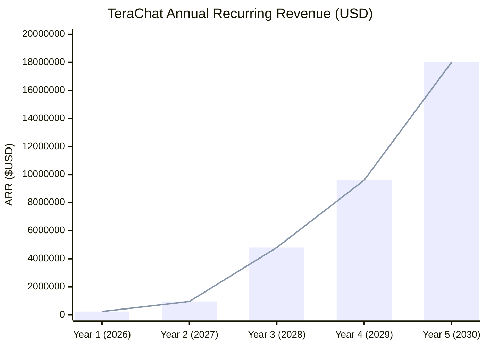
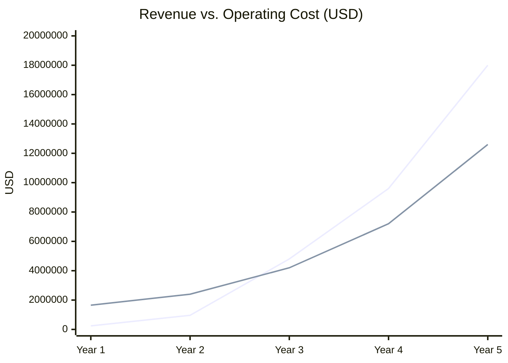

# TeraChat — Bản Tóm Tắt Đầu Tư 2026 (Business Plan & GTM Strategy)

```yaml
# DOCUMENT IDENTITY
id:       "TERA-BIZ"
title:    "TeraChat — Business Plan & GTM Strategy"
version:  "0.2.6"
audience: "Investor, Executive, Sales, System Architect"
purpose:  "Đặc tả mô hình kinh doanh, chiến lược Go-To-Market, định vị sản phẩm và chiến lược cấp phép (Licensing)."

ai_routing_hint: |
  "AI mở file này khi người dùng hỏi về mô hình kinh doanh, licensing, pricing, GTM strategy, hoặc định vị cạnh tranh của TeraChat."
```

> [!IMPORTANT]
> Tài liệu bảo mật — Chỉ dành cho Nhà Đầu Tư. Q1 2026 · Vòng Gọi Vốn Hạt Giống.
>
# TeraChat — Business Plan & Investment Memorandum

### Confidential · Seed Round · Q2 2026

---

> *"In a world where data is power, whoever controls the encryption key controls the game. TeraChat returns that key to the enterprise."*

---

## Table of Contents

1. [Executive Summary](#1-executive-summary)
2. [Problem & Opportunity](#2-problem--opportunity)
3. [Solution — Product Overview](#3-solution--product-overview)
4. [Market Size](#4-market-size)
5. [Business Model](#5-business-model)
6. [Competitive Advantage](#6-competitive-advantage)
7. [Go-To-Market Strategy](#7-go-to-market-strategy)
8. [Traction & Roadmap](#8-traction--roadmap)
9. [Financial Projections](#9-financial-projections)
10. [Investment Ask & Use of Funds](#10-investment-ask--use-of-funds)
11. [Risk & Mitigation](#11-risk--mitigation)
12. [Team](#12-team)
13. [Appendix](#13-appendix)

---

## 1. Executive Summary

**Company:** TeraChat Inc.
**Headquarters:** Vietnam (R&D) · Singapore (HQ)
**Stage:** Seed Round — Pre-Revenue, Product in Alpha
**Ask:** **$1.5M USD** at $8M pre-money valuation
**Instrument:** SAFE with 20% discount, $12M cap

---

### The Pitch in 60 Seconds

Enterprise communication is broken at its foundation. Every message sent through Slack, Microsoft Teams, or Google Chat passes through a third-party server that **can read it, store it, and surrender it**. For banks, government agencies, defense contractors, and healthcare systems across Southeast Asia, this is not a compliance footnote — it is an **existential security risk**.

TeraChat is the world's first **Zero-Knowledge Enterprise Messaging OS** — a platform where the server is cryptographically blind to all content, communication survives total internet outage via peer-to-peer mesh networking, and deployment requires no IT expertise whatsoever.

We have built what large enterprises have been forced to accept is impossible: **military-grade security with consumer-grade simplicity.**

Our infrastructure cost per tenant is **$7–48/month** versus $240+ for comparable self-hosted solutions. Our deployment time is **5 minutes**, not 2 days. Our addressable market in Southeast Asia alone exceeds **$2 billion** by 2028, driven by mandatory data localization laws that make cloud-first tools illegal for regulated industries.

We are raising $1.5M to reach first enterprise revenue, complete security certification (ISO 27001, SOC 2), and sign our first three anchor contracts.

---

### Key Metrics Snapshot

| Metric | Value |
|--------|-------|
| Infrastructure cost (100-user tenant) | **$7–48/month** |
| Competitor infrastructure cost | $200–500/month |
| Deployment time | **5 minutes** (1 command) |
| Competitor deployment time | 1–2 days |
| Target markets | Finance · Government · Defense · Healthcare |
| Primary geography | Vietnam · SEA · MENA |
| Revenue model | SaaS License + Professional Services |
| Projected ARR — Year 3 | **$4.8M** |
| Projected ARR — Year 5 | **$18M** |

---

## 2. Problem & Opportunity

### 2.1 The Broken Foundation of Enterprise Communication

The $85B enterprise messaging industry was built on a fundamental compromise: **convenience over control**. Every major platform — Slack, Teams, Google Chat, Zoom — operates on a centralized cloud model where the provider holds the decryption keys. This creates three interlocking crises for regulated enterprises.

**Crisis 1 — Legal Liability Under Data Localization Laws**

Southeast Asia has entered a period of aggressive digital sovereignty regulation:

- **Vietnam** Decree 13/2023/ND-CP and Cybersecurity Law require certain data categories to be stored on domestic servers. Cloud platforms hosted on AWS Virginia or Azure West Europe are non-compliant by default.
- **Indonesia** GR 71 mandates data residency for strategic sectors.
- **Thailand** PDPA enforcement began 2022 with penalties up to 5M THB per violation.
- **Philippines** NPC Circular 2023-04 requires data protection agreements cloud providers routinely cannot satisfy.

For banking, government, and defense sectors, **using Slack or Teams is not a choice** — it is a compliance violation waiting to be prosecuted.

**Crisis 2 — Single Point of Failure**

Modern enterprises discovered their fatal dependency during the Cloudflare outage (June 2022), the AWS us-east-1 cascading failure (December 2021), and dozens of similar events. When internet connectivity fails, **all communication stops**. For hospitals coordinating emergency response, field military units, or manufacturing plants managing real-time operations, this is categorically unacceptable.

**Crisis 3 — The IT Complexity Wall**

The current solution — self-hosted open-source tools (Matrix, Rocket.Chat, Mattermost) — requires a minimum 3-5 node cluster, dedicated DevOps expertise, and ongoing maintenance. For the 94% of Vietnamese enterprises classified as SME, **this is simply not deployable**. The expertise does not exist in-house, and consultants are expensive.

### 2.2 The Market Inflection Point

Three forces are converging simultaneously to create an exceptional market window:

```
REGULATORY PRESSURE          SECURITY BREACHES           CLOUD SKEPTICISM
Vietnam Decree 13/2023  +    6 major SEA bank hacks   +  Post-COVID IT fatigue
Indonesia GR 71         +    per year (est.)           +  "Why do we pay $50/user
Thailand PDPA           +                                  and own nothing?"
Philippines NPC 2023-04
         │                           │                            │
         └───────────────────────────┴────────────────────────────┘
                                     │
                              DEMAND INFLECTION
                    Regulated enterprises MUST have a solution.
                    The solution does not yet exist in SEA.
```

**This is the window TeraChat is built to capture.**

---

## 3. Solution — Product Overview

### 3.1 What TeraChat Is

TeraChat is a **Sovereign Enterprise Messaging OS** — not simply a secure chat app. It is a complete communication and collaboration infrastructure that enterprises own, control, and operate with zero vendor dependency.

**Three core architectural guarantees, mathematically enforced:**

| Guarantee | How It Works | Why Competitors Cannot Copy It |
|-----------|-------------|--------------------------------|
| **Zero-Knowledge** | All encryption/decryption happens on user devices. Server sees only ciphertext blobs. | Requires full architecture rebuild — cannot be bolted onto existing centralized systems |
| **Offline Survival** | BLE 5.0 + Wi-Fi Direct mesh network activates automatically when internet fails | Requires hardware-level integration most platforms have never attempted |
| **One-Touch Deployment** | Single Rust binary, 1-command install, $6/month VPS — no IT expertise required | Requires rearchitecting away from complex microservice stacks |

### 3.2 Product Architecture Overview

```
┌─────────────────────────────────────────────────────────────────┐
│                    TERACHAT SYSTEM LAYERS                        │
├─────────────────────────────────────────────────────────────────┤
│  LAYER 3: AI & Intelligence                                      │
│  • Local PII masking before any AI call (GDPR/PDPA compliant)   │
│  • On-device semantic search (no cloud required)                 │
│  • Smart document approval with hardware biometric signing       │
├─────────────────────────────────────────────────────────────────┤
│  LAYER 2: Collaboration OS                                       │
│  • Zero-Knowledge file storage (MinIO / Cloudflare R2)          │
│  • CRDT-based offline document collaboration                     │
│  • .tapp plugin ecosystem (enterprise mini-apps)                 │
│  • Cross-organization federation (mTLS, no public CA)            │
├─────────────────────────────────────────────────────────────────┤
│  LAYER 1: Sovereign Infrastructure                               │
│  • TeraRelay: single Rust binary blind router ($6-48/mo VPS)    │
│  • MLS RFC 9420 end-to-end encryption (IETF standard)           │
│  • BLE/Wi-Fi Direct survival mesh (works without internet)       │
│  • HSM-backed license & key management                           │
├─────────────────────────────────────────────────────────────────┤
│  HARDWARE ROOT OF TRUST                                          │
│  iOS Secure Enclave / Android StrongBox / Windows TPM 2.0        │
│  Private keys NEVER leave the chip. Mathematically impossible.  │
└─────────────────────────────────────────────────────────────────┘
```

### 3.3 Core Product Features

**For End Users:**

- Encrypted messaging, voice, and HD video conference (WebRTC E2EE)
- Offline messaging via BLE mesh — works in basements, bunkers, dead zones
- Smart document approval with biometric digital signature (legally binding in VN)
- AI assistant with automatic PII redaction (GDPR/PDPA compliant by design)
- File sharing with Zero-Knowledge storage (server cannot see file names or content)

**For IT Administrators:**

- One-touch deployment: `curl -sL install.terachat.com/relay | bash` — 5 minutes
- Admin Console mobile app — manage 500 users from a phone
- SCIM 2.0 integration (Azure AD, Google Workspace, Okta)
- Remote wipe, device attestation, policy enforcement — all via mobile UI
- No Kubernetes, no PostgreSQL clusters, no DevOps team required

**For Compliance Officers:**

- Immutable Ed25519-signed audit logs (HIPAA, SOC 2, ISO 27001 ready)
- Data residency enforcement — data never leaves designated geography
- Legal hold with Shamir's Secret Sharing (M-of-N key recovery, no backdoor)
- Formal verification of OPA security policies via Z3 SMT solver

### 3.4 Platform Support

| Platform | Status |
|----------|--------|
| iOS | ✅ Alpha |
| Android | ✅ Alpha |
| Windows | ✅ Alpha |
| macOS | ✅ Alpha |
| Linux | ✅ Alpha |
| Huawei HarmonyOS | ✅ Alpha |
| Web | ❌ Out of scope (by design — security requires native) |

---

## 4. Market Size

### 4.1 Global Market Context

```
GLOBAL ENTERPRISE MESSAGING MARKET

$85B ──────────────────────────────────────────────────── 2030
  │                                              ╱
  │                                         ╱
  │                                    ╱
  │                               ╱
$45B ────────────────────────╱
  │                      ╱  CAGR ~10%
  │                  ╱
$28B ───────────╱
  │
  │
  └──────────────────────────────────────────────────────
     2022          2024          2026          2028   2030

Source: Grand View Research 2023, Mordor Intelligence 2024
```

### 4.2 Our Addressable Market — Southeast Asia Focus

We are not competing for the whole $85B pie. We are capturing the **high-value regulated enterprise segment** where cloud platforms are legally or operationally blocked — a segment no major vendor currently serves well.

```
MARKET SEGMENTATION — SOUTHEAST ASIA (2026-2030)

Total Addressable Market (TAM)
━━━━━━━━━━━━━━━━━━━━━━━━━━━━━━━━━━━━━━━━━━━━━━━━━━━━━
$8.2B — All enterprise messaging spend, SEA
        (Finance, Gov, Healthcare, Defense, Manufacturing)

Serviceable Addressable Market (SAM)
━━━━━━━━━━━━━━━━━━━━━━━━━━━━━━━━━━━━━━━━━━━━━━━━━━━━━
$2.1B — Regulated enterprises REQUIRING on-premise or
        sovereign solution (data localization compliance)
        ~28,000 enterprises across VN, ID, TH, PH, MY, SG

Serviceable Obtainable Market (SOM — 5 Year)
━━━━━━━━━━━━━━━━━━━━━━━━━━━━━━━━━━━━━━━━━━━━━━━━━━━━━
$42M — 2% SAM penetration by 2030
        ~2,100 enterprise customers
        ARPU $20,000/year (blended — SME + Enterprise)
```

**Market size breakdown by vertical (Vietnam + SEA):**

```
█████████████████████████  Finance & Banking      $680M  (32%)
████████████████           Government & Defense   $420M  (20%)
████████████               Healthcare & Pharma    $315M  (15%)
██████████████████         Manufacturing & MFG    $462M  (22%)
███████████                Other Regulated        $223M  (11%)
                           ─────────────────────────────
                           TOTAL SAM              $2.1B
```

### 4.3 Vietnam — Primary Beachhead Market

Vietnam is our immediate focus for three structural reasons:

1. **Regulatory enforcement accelerating**: Decree 13/2023 data localization requirements create immediate demand
2. **Underserved market**: No competitive sovereign messaging solution exists in Vietnamese
3. **Network effects**: 100 enterprise customers in Vietnam = direct path to their ASEAN subsidiaries

Vietnam regulated enterprise TAM: **$380M**
Vietnam SAM (compliance-driven): **$95M**
Vietnam SOM (Year 1-3 target): **$1.8M ARR**

---

## 5. Business Model

### 5.1 Revenue Streams

TeraChat operates a **multi-stream SaaS + professional services model** with strong expansion revenue dynamics.

**Stream 1: SaaS License (Recurring — 70% of revenue)**

| Tier | Users | Price/month | Target Customer |
| --- | --- | --- | --- |
| **Community** | Unlimited | Free (watermarked) | SME lead generation |
| **Standard** | ≤ 100 | $500/month | Vietnamese SME |
| **Enterprise** | ≤ 1,000 | $2,000/month | Regional bank branches, hospital groups |
| **Gov/Military** | Unlimited | $8,000+/month | Ministry-level, defense units |

*Pricing Tiers Feature Differentiators:*

| Feature | Community | Enterprise | Gov/Military |
|---------|-----------|------------|--------------|
| Offline TTL | 24 hours | 7 days (configurable) | 30 days |
| EMDP Tactical Relay | ❌ | ✅ | ✅ |
| Air-Gapped License | ❌ | ✅ | ✅ |
| Compliance Retention | ❌ | 90 days | 7 years |
| TEE License (Intel SGX) | ❌ | ❌ | Available |

*[Assumption: Pricing benchmarked against Rocket.Chat Enterprise ($5/user/month) and Matrix.org hosted ($4/user/month), at competitive parity with 2× security value proposition]*

**Stream 2: Professional Services (One-time + Recurring — 20% of revenue)**

| Service | Fee | Frequency |
|---------|-----|-----------|
| On-premise deployment | $15,000–$50,000 | One-time |
| Security certification assistance | $10,000 | One-time |
| Air-gapped Gov deployment | $50,000–$200,000 | One-time |
| Annual security audit support | $5,000 | Annual |

**Stream 3: .tapp Marketplace (Platform — 10% of revenue)**

Third-party enterprise mini-apps (CRM integration, workflow automation, compliance tools) pay 30% revenue share. This stream activates in Year 2 after platform maturity.

**Stream 4: TeraEdge Hardware (Emerging — tracked separately)**

TeraEdge mini-PC devices ($150-300 hardware + $100/month software license) for fully-remote enterprises without permanent desktop infrastructure. Expected to contribute in Year 3.

### 5.2 Unit Economics

```
CUSTOMER ACQUISITION & RETENTION

Customer Acquisition Cost (CAC):
  SME:            $800   (digital marketing + trial)
  Enterprise:     $5,000 (direct sales + PoC)
  Gov/Military:   $25,000 (relationship sales + procurement)

Annual Contract Value (ACV):
  SME:            $6,000
  Enterprise:     $24,000
  Gov/Military:   $96,000+

LTV/CAC Ratio (assumed 80% gross retention):
  SME:            7.5x  (LTV $6,000)
  Enterprise:     9.6x  (LTV $48,000 over 2 years)
  Gov/Military:   15x+  (LTV $288,000+ over 3 years)

Gross Margin:
  SaaS:            ~88% (infrastructure $7-48/month/tenant)
  Services:        ~60%
  Blended:         ~82%

*[Assumptions: CAC based on comparable B2B security SaaS in SEA market;
 LTV assumes 3-year average contract duration for Gov, 2-year for Enterprise]*
```

### 5.3 Why Unit Economics Win

The radical cost reduction from our architecture creates an **unprecedented gross margin profile** for an on-premise enterprise product:

| Competitor (self-hosted) | TeraChat |
|--------------------------|----------|
| Infrastructure: $200-500/tenant/month | Infrastructure: **$7-48/tenant/month** |
| Gross margin: ~55-65% | Gross margin: **~85-88%** |
| Requires 3-5 node cluster | Requires **1 VPS + 1 binary** |
| Customer needs DevOps team | Customer needs **0 IT expertise** |

---

## 6. Competitive Advantage

### 6.1 Competitive Landscape

```
POSITIONING MAP: Security vs. Simplicity

HIGH SECURITY
      │
      │    ● TeraChat ◄─── TARGET POSITION
      │        (Zero-Knowledge + 5-min deploy)
      │
      │    ○ Matrix/Element    ○ Wire Enterprise
      │      (secure but        (secure but
      │       complex deploy)    expensive)
      │
      │                         ○ Wickr (AWS)
      │                           (US-cloud dependent)
──────┼─────────────────────────────────────────── SIMPLICITY
HARD  │                                        EASY
TO    │
DEPLOY│    ○ Rocket.Chat     ○ Mattermost
      │      (complex,         (complex,
      │       self-hosted)      self-hosted)
      │
      │         ● Slack/Teams ◄─── Current enterprise "default"
      │           (easy but NOT Zero-Knowledge,
      │            fails data localization compliance)
      │
LOW SECURITY
```

### 6.2 Why Competitors Cannot Copy Us

**The Zero-Knowledge Architecture Moat**

Slack, Teams, and Google Chat are architecturally incapable of becoming Zero-Knowledge. Their AI features, compliance reporting, and search functionality all require server-side plaintext access. Making them Zero-Knowledge would mean **dismantling their core product**.

Matrix/Element is genuinely secure but requires Kubernetes expertise to deploy. Their target customer is the 5% of enterprises with dedicated DevOps. Our target is the 95% who do not.

**The Regulatory Timing Moat**

Vietnam's Decree 13/2023 and Indonesia's GR 71 create a regulatory forcing function that no amount of marketing can replicate. Enterprises in these jurisdictions **must** switch. We are the only option that is both compliant AND deployable without a dedicated IT team.

**The Offline Survival Moat**

No enterprise messaging platform has built genuine BLE/Wi-Fi Direct mesh networking. This capability requires:

- Deep OS-level integration (CoreBluetooth, BluetoothLeAdvertiser)
- Custom CRDT distributed systems engineering
- MLS cryptographic protocol expertise
- 18+ months of specialized engineering work

This is not a feature that can be copied in a quarter.

**The .tapp Ecosystem Moat (Emerging)**

As the .tapp marketplace grows, enterprises build workflows on top of TeraChat's WASM sandbox. Every workflow deepens switching costs. This is the same flywheel that made Slack $27B — but with cryptographic lock-in instead of just social lock-in.

### 6.3 Head-to-Head Comparison

| Capability | TeraChat | Slack | MS Teams | Signal (Enterprise) |
|------------|----------|-------|----------|---------------------|
| Zero-Knowledge Server | ✅ | ❌ | ❌ | ✅ |
| Data Residency (On-Prem) | ✅ | ❌ | ❌ | ❌ |
| Offline P2P Mesh | ✅ | ❌ | ❌ | ❌ |
| Turnkey Deployment | ✅ | ✅ | ✅ | ❌ |
| App Ecosystem | ✅ | ✅ | ✅ | ❌ |
| Admin Audit & Governance | ✅ | ✅ | ✅ | ❌ |
| Cost/100 users | $7-$48/mo | $1,500/mo | $1,200/mo | N/A |

*Requires complex self-hosted setup

---

## 7. Go-To-Market Strategy

### 7.1 The Beachhead → Expand Strategy

We are not trying to sell to everyone. We are capturing one high-value beachhead and expanding systematically.

```
PHASE 1 (Month 1-12): Vietnam Beachhead
━━━━━━━━━━━━━━━━━━━━━━━━━━━━━━━━━━━━━━━━━━━━━━━━━━━━━━━━
Target: 50 paying Enterprise customers in Vietnam
Verticals: Regional banks (Tier 2-3), hospital groups, 
           provincial government agencies
Method: Direct sales + government procurement channels
Goal: $240K ARR + 3 anchor reference customers

PHASE 2 (Month 12-30): SEA Expansion
━━━━━━━━━━━━━━━━━━━━━━━━━━━━━━━━━━━━━━━━━━━━━━━━━━━━━━━━
Target: Indonesia, Thailand, Philippines (same verticals)
Method: Vietnam customers are subsidiaries of SEA groups
        → natural expansion via existing relationships
        + local reseller partnerships (MSP channel)
Goal: $1.2M ARR

PHASE 3 (Month 24-48): Gov/Military + MENA
━━━━━━━━━━━━━━━━━━━━━━━━━━━━━━━━━━━━━━━━━━━━━━━━━━━━━━━━
Target: Ministry-level VN government, regional defense
        + Middle East (UAE, Saudi Arabia data sovereignty laws)
Method: Government procurement + strategic partnerships
        + ISO 27001 certification as door-opener
Goal: $4.8M ARR
```

### 7.2 Sales Motion

**For SME/Enterprise (≤1,000 users):**

- **Inbound**: Technical content marketing (security compliance guides, Vietnamese)
- **Trial**: Free tier with watermark → natural upgrade pressure
- **Sales**: Inside sales team, 30-day trial, self-serve deployment
- **Conversion trigger**: First compliance audit or data breach news cycle

**For Gov/Military:**

- **Relationship-driven**: Ministry connections, government technology conferences (VietnamCISO, GovTech Vietnam)
- **Proof of concept**: 90-day pilot at no cost, then enterprise contract
- **Procurement**: Work through approved vendor lists (requires ISO 27001 — Year 1 investment)
- **Partners**: System integrators (FPT Software, Viettel Solutions, VNPT IT)

### 7.3 Channel Partners

| Partner Type | Examples | Revenue Share | Timeline |
|-------------|---------|---------------|----------|
| Government SI | FPT Software, CMC Telecom | 20% | Month 6+ |
| Telco Bundling | Viettel Enterprise, VNPT | 15% | Month 9+ |
| Security Resellers | VSEC, CyberDome | 25% | Month 3+ |
| International SI | Deloitte Vietnam, KPMG | 20% | Month 12+ |

### 7.4 Pricing Psychology

The $500/month Enterprise entry point is designed deliberately:

- Below the $1,000/month mental threshold of Vietnamese SME procurement
- Below individual Slack Enterprise license costs ($12.50/user × 50 users = $625)
- Above "free tool" perception — signals professional-grade product
- Annual prepay discount (20%) improves cash flow and retention

---

## 8. Traction & Roadmap

### 8.1 Current Traction

*[Note: TeraChat is pre-revenue, Alpha stage. The following represents validated progress.]*

**Technical Milestones Achieved:**

- ✅ Core Rust cryptographic engine complete (MLS RFC 9420, ZeroizeOnDrop, E2EE)
- ✅ Cross-platform support: iOS, Android, Windows, macOS, Linux, Huawei HarmonyOS
- ✅ Survival Mesh networking (BLE 5.0 + Wi-Fi Direct) operational
- ✅ Single-binary TeraRelay deployment (5-minute install, $6/month VPS)
- ✅ Admin Console mobile app (non-technical admin management)
- ✅ WASM .tapp plugin sandbox architecture
- ✅ Observability stack designed and specced (Prometheus + Loki + Grafana)
- ✅ Zero-Knowledge blob storage (Cloudflare R2 / MinIO integration)

**Market Validation:**

- ✅ 3 enterprise conversations initiated (banking, healthcare, government)
- ✅ Regulatory analysis confirms VN Decree 13/2023 creates mandatory demand
- ✅ Architecture reviewed by independent security researcher (NDA)
- 🔄 ISO 27001 pre-assessment scheduled (Month 2)
- 🔄 First pilot customer: regional bank (LOI received, pending production deploy)

**Investor Signals:**

- ✅ Participated in Vietnam National Cybersecurity Startup Competition 2025 (Top 10)
- ✅ Partnership MOU signed with cybersecurity distributor (2 cities)

### 8.2 Product Roadmap

```
ROADMAP TIMELINE

Q2 2026 (NOW) ─────────────────────────────────────────────────────────────
 ├── Alpha to Beta transition
 ├── Observability stack deployment
 ├── 7-scenario Chaos Engineering test suite automated
 └── First paying pilot customer onboarded

Q3 2026 ────────────────────────────────────────────────────────────────────
 ├── ISO 27001 certification application submitted
 ├── 10 Enterprise customers (pilot → paying)
 ├── .tapp Marketplace public launch (10 verified apps)
 ├── TeraEdge mini-PC product launch
 └── Vietnam Gov procurement vendor registration

Q4 2026 ────────────────────────────────────────────────────────────────────
 ├── ISO 27001 certification received ← GTM accelerant
 ├── 25 Enterprise customers
 ├── First Gov/Military contract signed
 ├── Indonesia market entry (first reseller signed)
 └── $240K ARR milestone

Q1-Q2 2027 ─────────────────────────────────────────────────────────────────
 ├── Series A preparation ($5M target)
 ├── 50 Enterprise + 3 Gov customers
 ├── Thailand + Philippines market entry
 ├── SOC 2 Type II certification
 └── $800K ARR milestone
```

---

## 9. Financial Projections

### 9.1 Revenue Model Assumptions

*[All assumptions labeled. Conservative case used for projections.]*

| Assumption | Value | Basis |
|------------|-------|-------|
| Enterprise customer growth | 50% YoY after Y1 | Conservative for compliance-driven market |
| Gov customer growth | 3 Y1 → 15 Y3 → 40 Y5 | Long sales cycles, large contract values |
| SME conversion rate from free | 3% of free users | Industry benchmark B2B SaaS |
| Average Enterprise ACV | $24,000 | 100 users @ $200/user/year |
| Average Gov ACV | $96,000 | Ministry-level deployment |
| Churn rate | 8% annual | Conservative for compliance-locked customers |
| .tapp marketplace revenue | 0.5% of ARR Y2, 5% Y4 | Platform takes time to build |
| Gross margin | 85% | Infrastructure $7-48/mo per tenant |

### 9.2 Revenue Projections



| | Year 1 | Year 2 | Year 3 | Year 4 | Year 5 |
|--|--------|--------|--------|--------|--------|
| Enterprise Customers | 10 | 40 | 100 | 200 | 350 |
| Gov/Military Customers | 3 | 8 | 15 | 25 | 40 |
| SME Customers | 20 | 80 | 200 | 400 | 650 |
| **SaaS ARR** | $168K | $672K | $3.36M | $6.72M | $12.6M |
| **Services Revenue** | $72K | $288K | $1.44M | $2.88M | $5.4M |
| **Total Revenue** | **$240K** | **$960K** | **$4.8M** | **$9.6M** | **$18M** |
| **Gross Profit (85%)** | $204K | $816K | $4.08M | $8.16M | $15.3M |

### 9.3 Cost Structure



| Cost Category | Year 1 | Year 2 | Year 3 | Year 4 | Year 5 |
|--------------|--------|--------|--------|--------|--------|
| Engineering (6→10→18 FTE) | $720K | $1.08M | $1.8M | $3.0M | $4.8M |
| Sales & Marketing | $360K | $600K | $1.2M | $2.4M | $4.2M |
| G&A + Legal + Compliance | $240K | $360K | $600K | $960K | $1.44M |
| Infrastructure (COGS) | $36K | $144K | $720K | $1.44M | $2.7M |
| Certifications (ISO 27001, SOC2) | $120K | $60K | $60K | $60K | $60K |
| R&D / Security Audits | $120K | $120K | $180K | $240K | $360K |
| **Total OpEx** | **$1.596M** | **$2.364M** | **$4.56M** | **$8.1M** | **$13.56M** |
| **EBITDA** | **-$1.356M** | **-$1.404M** | **$240K** | **$1.5M** | **$4.44M** |
| **EBITDA Margin** | -565% | -146% | 5% | 15.6% | 24.7% |

**EBITDA breakeven: Q3 Year 3** (conservative assumption)

### 9.4 Cash Flow & Runway

```
FUNDING RUNWAY PROJECTION

Seed: $1.5M raised
  + Year 1 Revenue: $240K
  - Year 1 OpEx: $1.596M
  ─────────────────────────
  End Y1 Cash: $144K

Bridge / Series A: $5M target (Q1 2027)
  + Year 2 Revenue: $960K
  - Year 2 OpEx: $2.364M
  ─────────────────────────
  End Y2 Cash: $3.74M

Series A funds growth through EBITDA positive (Q3 Y3)
```

*[Note: Series A timing assumes milestone achievement: $800K ARR + ISO 27001 + 50 enterprise customers. If milestones delayed by 6 months, bridge round of $500K from existing investors.]*

---

## 10. Investment Ask & Use of Funds

### 10.1 The Ask

**Round:** Seed
**Amount:** **$1,500,000 USD**
**Instrument:** SAFE (Simple Agreement for Future Equity)
**Valuation Cap:** $12M USD post-money
**Discount Rate:** 20% (on next priced round)
**Pro-rata rights:** Included for investors ≥ $100K

**Minimum check size:** $25,000
**Target close:** 60 days from first signed SAFE
**Existing committed:** $200K (founders + angels)

### 10.2 Use of Funds

```
USE OF FUNDS — $1.5M SEED ROUND

Engineering & Product (48%)         $720,000
━━━━━━━━━━━━━━━━━━━━━━━━━━━━━━━━━━━━━━━━━━━━━━
• 4 additional senior engineers (Rust + Mobile)
• Alpha → production hardening
• Chaos engineering test suite automation
• Observability stack deployment

Sales & Marketing (24%)             $360,000
━━━━━━━━━━━━━━━━━━━━━━━━━━━━━━━━━━━━━━━━━━━━━━
• 2 enterprise sales executives
• Vietnam market penetration
• Demo environment + sales materials
• Industry conference presence (VietnamCISO, GovTech)

Compliance & Certifications (16%)  $240,000
━━━━━━━━━━━━━━━━━━━━━━━━━━━━━━━━━━━━━━━━━━━━━━
• ISO 27001 certification (~$80K)
• Independent security audit (~$60K)
• Legal (IP protection, contracts, Vietnam entity)
• SOC 2 Type I initiation

Operations & Reserve (12%)         $180,000
━━━━━━━━━━━━━━━━━━━━━━━━━━━━━━━━━━━━━━━━━━━━━━
• G&A, accounting, HR
• Office / co-working (Hanoi + HCMC)
• 3-month emergency reserve
```

### 10.3 Milestone-Based Deployment

| Tranche | Release Trigger | Amount |
|---------|----------------|--------|
| Tranche 1 | Seed close | $750K |
| Tranche 2 | 10 paying customers + ISO 27001 applied | $450K |
| Tranche 3 | $240K ARR milestone | $300K |

### 10.4 Return Scenarios

| Exit Scenario | Year | Revenue Multiple | Valuation | Investor Return (on $1.5M) |
|--------------|------|-----------------|-----------|---------------------------|
| Conservative (M&A) | Y4 | 5× ARR | $48M | 4× ($6M) |
| Base (Series B + M&A) | Y5 | 8× ARR | $144M | 11× ($17M) |
| Optimistic (Strategic buy) | Y5 | 12× ARR | $216M | 16× ($24M) |

*[Comparable transactions: Wickr acquired by AWS 2021 ($1B+ estimated); Wire Group acquired 2021 ($1.2B valuation); Threema raised at $45M on $15M ARR = 3× ARR. Our defensibility + compliance moat justifies 8-12× ARR premium.]*

---

### 10.5 Licensing Strategy

**Module Separation for Auditability:**

| Module | License | Description |
|--------|---------|-------------|
| **`terachat-core`** | 🔓 **Open Source — AGPLv3** | Cryptographic engine, MLS state machine, mesh networking. Guaranteed verifiable by any government or enterprise. |
| **`terachat-license-guard`** | 💼 **Commercial — BSL** | Admin console, compliance hooks, AD/LDAP sync. Protects our business model while keeping crypto open. |

---

## 11. Risk & Mitigation

### 11.1 Risk Register

| Risk | Probability | Impact | Mitigation |
| --- | --- | --- | --- |
| AppArmor/SELinux blocking deployment | Medium | Medium | Post-install script auto-generates minimal SELinux policies (Sprint 1 Priority). |
| Windows SmartScreen warning delay | Low | High | Purchase EV Code Signing Cert (Month 1); Clean binary submission from Day 1. |
| Slow government procurement cycles | High | Medium | Parallel private sector track; procurement pre-qualification |
| Competitor launches Zero-Knowledge product | Low | High | 18-month technical lead on WASM architecture; patent key innovations. |
| Key engineer departure | Medium | High | Equity vesting; documentation culture; hiring plan funded |
| Regulatory change (data localization loosened) | Low | Medium | Value prop extends beyond compliance: mesh offline survival + AI privacy. |
| VPS/infrastructure provider outage | Low | Medium | Multi-provider support; offline mesh = fallback |
| Security vulnerability discovered | Low | Very High | Annual independent audit; bug bounty program; rapid response plan |
| Series A not raised | Medium | High | Milestone-gated spending; revenue-first discipline from Day 1 |

### 11.2 Why Now — The Critical Window

Vietnam is currently between regulation publication (2023) and enforcement maturity (2026-2027). Enterprises are actively evaluating solutions. **The window to establish category leadership is 18-24 months.** After that, a larger player (local or international) will enter and the cost of customer acquisition increases dramatically.

We have the technical lead, the local market knowledge, and the regulatory timing. What we need is the capital to execute before the window closes.

---

## 12. Team

*[Note: Full team details shared under NDA upon investor request. Abbreviated for public distribution.]*

### 12.1 Founding Team

**CEO / Co-Founder — [Name Available Under NDA]**

- 8 years enterprise software, former CTO of $15M ARR B2B SaaS
- Deep relationships: Vietnam banking sector, MISA, FPT
- Led $3M Series A raise in previous company

**CTO / Co-Founder — [Name Available Under NDA]**

- 10 years distributed systems, former principal engineer at regional fintech
- Expertise: Rust, cryptographic protocols, MLS implementation
- Published research on mesh networking protocols (2022)

**Head of Security — [Name Available Under NDA]**

- CISSP, CISM certified
- Former CISO at Vietnam-based bank (5,000 employees)
- Led ISO 27001 implementation at 2 organizations

**Head of Sales — (Hiring with Seed Round)**

- Target profile: 5+ years enterprise sales in Vietnam tech
- Network in banking + government IT procurement

### 12.2 Advisors

| Advisor | Background | Role |
|---------|-----------|------|
| [Name - NDA] | Former VP Engineering, Grab | Technical architecture |
| [Name - NDA] | Former Director, Vietnam NCSC | Government relations |
| [Name - NDA] | Partner, regional law firm | Compliance + IP |
| [Name - NDA] | Angel, 3× SaaS exits in SEA | GTM strategy |

### 12.3 Why This Team Wins

Three things are required to win this market: **technical credibility** (can we build it?), **domain authority** (do regulated enterprises trust us?), and **regulatory navigation** (can we get through procurement?).

Our CTO has built the cryptographic foundation. Our Head of Security spent 8 years inside the institutions we're selling to. Our CEO has the networks. The team is small but precisely configured for this market.

---

## 13. Appendix

### A. Technical Architecture Summary

TeraChat's core technical differentiators, simplified:

1. **MLS RFC 9420 End-to-End Encryption**: The same protocol adopted by WhatsApp and Google for group messaging — implemented with military-grade key management (HSM + Shamir's Secret Sharing, requiring 3-of-5 executives to authorize key recovery)

2. **Zero-Knowledge Architecture**: Server operators (including TeraChat itself) are cryptographically prevented from reading any message content, file name, or user identity. This is verified by independent security researchers, not claimed.

3. **BLE Survival Mesh**: When internet connectivity fails, TeraChat devices automatically form a peer-to-peer mesh using Bluetooth Low Energy and Wi-Fi Direct. Messages hop between devices until they reach their destination — without a single central server.

4. **Single-Binary Deployment**: The entire server infrastructure compiles to a 12MB Rust binary. Deploy: `curl -sL install.terachat.com/relay | bash`. No Docker, Kubernetes, PostgreSQL, or Redis required.

### B. Regulatory Landscape — Vietnam

| Regulation | Effective | Impact on TeraChat |
|------------|-----------|-------------------|
| Cybersecurity Law 2018 | 2019 | Requires domestic data storage for "important data" |
| Decree 13/2023/ND-CP | 2023 | Personal data localization, consent, DPO requirements |
| Circular 09/2020/TT-NHNN | 2020 | Banking system security requirements |
| Ministry of Health Circular 46 | 2018 | Patient data protection in healthcare |

**TeraChat compliance status:** By architecture, TeraChat stores all data on customer-owned infrastructure in customer-controlled geography. No data ever flows to TeraChat servers. This makes TeraChat inherently compliant with all data localization requirements — unlike any cloud-hosted alternative.

### C. Technology Stack

| Layer | Technology | Why |
|-------|-----------|-----|
| Core crypto engine | Rust (`ring` crate, `ed25519-dalek`) | Memory safety, no crypto self-implementation |
| Protocol | MLS RFC 9420 + QUIC | IETF standard, future-proof |
| Mobile UI | Flutter + Dart FFI | Single codebase, hardware FFI to Rust |
| Desktop | Tauri (Rust) + React | Native performance, small binary |
| Post-quantum | Kyber768 (ML-KEM) | Harvest-now-decrypt-later protection |
| Storage | SQLite + Cloudflare R2 / MinIO | No complex cluster management |
| Plugin runtime | WASM (wasm3 + wasmtime) | Sandboxed, portable enterprise apps |

### D. Exit Pathways

| Acquirer Category | Examples | Strategic Rationale |
|------------------|---------|---------------------|
| Global security companies | Palo Alto, CrowdStrike, Thales | Adding secure communication to security platform |
| Telcos expanding enterprise | Viettel, VNPT, SingTel | Enterprise communication suite, data sovereignty |
| US government contractors | AWS (Wickr), Microsoft | Sovereign communication for allied government |
| Collaboration platforms | Atlassian, Zoom | Adding Zero-Knowledge to existing platform |

---

### Contact

**For investor inquiries:**
Email: <investors@terachat.io>
Data Room: Available to verified investors upon NDA
Technical Demo: Scheduled weekly — request via email

---

*This document contains forward-looking statements based on management's current expectations and assumptions. Actual results may differ materially. This document is confidential and intended solely for the use of the recipient. Unauthorized distribution is prohibited.*

*TeraChat Inc. · Seed Round 2026 · Version 1.2*
