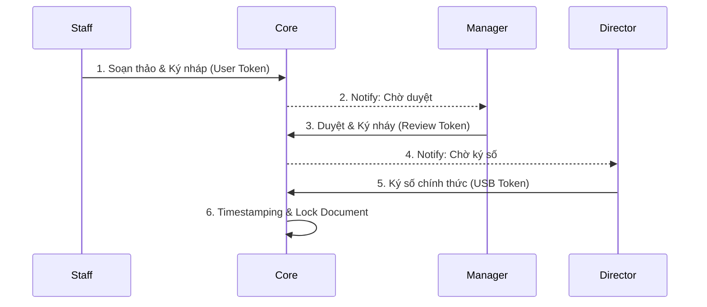

<!-- markdownlint-disable MD036 -->
# TeraChat V0.2.1 — Pure Technical Specification (TechSpec)

> **Document Owner:** Lead Developer / Architecture Team
> **Audience:** Engineering, DevOps, Security Engineers
> **Scope:** Implementation-level technical details only. For product flows see `PRD.md`. For business strategy see `BusinessPlan.md`.

---

## TABLE OF CONTENTS

1. [System Architecture](#1-system-architecture)
2. [Security & Cryptography Engine](#2-security--cryptography-engine)
3. [Identity & Access](#3-identity--access)
4. [Communication Protocols](#4-communication-protocols)
5. [Platform Feature Modules (Technical)](#5-platform-feature-modules-technical)
6. [Operations & Deployment](#6-operations--deployment)
7. [Business API & Integrations](#7-business-api--integrations) — 7.8 Inter-org Federation
8. [Mobile Architecture](#8-mobile-architecture)
9. [Security Threat Matrix](#9-security-threat-matrix)
10. [Enterprise Utility Tools](#10-enterprise-utility-tools)
11. [TeraVault — Virtual File System & Document Management](#11-teravault--virtual-file-system--document-management)

---

## 1. System Architecture  `☁️ Server`

### 1.1 Federated Private Clusters  `☁️ Server`

Kiến trúc Cluster thay thế VPS đơn lẻ (Single Point of Failure):

- **Encryption:** Toàn bộ Payload mã hóa bằng `Company_Key` trước khi rời thiết bị.
- **Storage:** Cluster gồm 3–5 Nodes chạy **Erasure Coding** (Sharding dữ liệu). Nếu 1 Node sập, dữ liệu tự phục hồi từ các mảnh còn lại.
- **Routing:** Client kết nối trực tiếp tới IP của Company Cluster, không đi qua Cloud công cộng.

**Cluster Scope — Hạ tầng 4-trong-1:**

| Thành phần | Chức năng |
| --- | --- |
| **MLS Backbone** | Phân phối khóa & định tuyến tin nhắn cho nhóm 5000+ người. Lưu trữ Encrypted Log Streams (Zero-Knowledge). |
| **HA TURN Cluster** | Floating IP, tự động Failover trong 3s. Chịu tải hàng nghìn cuộc gọi HD/Video Conference. |
| **Execution Environment** | Thực thi backend cho Mini-Apps nội bộ, dữ liệu P2P chỉ nằm trên RAM. |
| **Interop Hub** | Gateway mã hóa dữ liệu từ SAP/Jira/CRM chuẩn E2EE trước khi đẩy xuống Client. |

**Identity Onboarding:**

| Bước | Kỹ thuật |
| --- | --- |
| Admin nhập Email | Server phát **Invite Token** (Signed JWT) |
| User Click Link | App ký Token bằng Private Key → Bind thiết bị vào định danh |
| Auto-Sync | Azure AD/LDAP → Group mapping tự động |
| Identity Lock | Tên hiển thị bị khóa theo danh tính doanh nghiệp |

### 1.2 Tổng thể Kiến trúc: "Local-First Processing & Blind Routing"  `💻 Laptop` `🖥️ Desktop` `☁️ Server`

**Nguyên tắc cốt lõi:** Server (VPS/Cluster) chỉ luân chuyển gói Byte mã hóa. Mọi tác vụ nặng (Tìm kiếm, Lưu trữ, Sinh khóa) đều bị đẩy về Client (Desktop App).

**Trụ cột 1: Zero-Ticket Identity Recovery**

- **Giải pháp:** Multi-Device Cross-Signing (Mặc định) + Mailbox Re-binding (Dự phòng).
- **Cơ chế:** Khi Laptop hỏng, Mobile ký xác thực (Cross-Sign) cho thiết bị mới. Nếu mất cả 2, IT Admin revoke và cấp Invite Token mới. Nhân viên chấp nhận mất tin nhắn > 14 ngày.

**Trụ cột 2: Zero-Knowledge Search**

- **Cơ chế (Desktop):** Background Worker lập chỉ mục toàn bộ tin nhắn đã giải mã bằng **SQLite FTS5** (millisecond search). Bản báo cáo phức tạp chạy qua **Local Edge RAG** (Embedding WASM/Rust).
- **Bảo đảm:** Không metadata nào rò rỉ lên mạng.

> [!IMPORTANT]
> **Lead Dev Fix #3 — Giới hạn FTS5 trên Mobile (Apple DAS / Android Doze):** Apple DAS (Duet Activity Sync) và Android Doze Mode **không bao giờ** cho phép tiến trình nền chạy FTS5 Indexing cày nát CPU và Pin. Nếu cố ép, app sẽ bị đưa vào Blacklist tiết kiệm pin của OS. **Hai nền tảng phải có chiến lược lập chỉ mục tìm kiếm tách biệt.**

**Platform-Specific Search Strategy:**

| Chiến lược | Desktop | Mobile (iOS / Android) |
| --- | --- | --- |
| **Indexing Mode** | Background Worker — chạy liên tục | Chỉ khi App Active + cắm sạc, hoặc batch 100 tin nhắn/lần qua `requestIdleCallback` |
| **Index Window** | Toàn bộ lịch sử | **30 ngày gần nhất** (Sliding Window — giống Hot Tier §1.4.B) |
| **Search Scope** | Local FTS5 full history | Local FTS5 cho 30 ngày; tìm kiếm cũ hơn → **Encrypted Blind Search trên Cluster** |
| **CPU Budget** | Full background CPU | Batch nhỏ — không block UI thread |

**Mobile — Incremental Foreground Indexer (Rust Core):**

```rust
// Rust Core — Mobile FTS5 Incremental Indexer
// Chỉ chạy khi App Active — không bao giờ chạy trong background
pub struct MobileFtsIndexer {
    batch_size: usize,       // 100 tin nhắn mỗi batch
    window_days: i64,        // 30 ngày — Sliding Window
}

impl MobileFtsIndexer {
    pub const DEFAULT_BATCH: usize = 100;
    pub const WINDOW_DAYS:   i64   = 30;

    /// Gọi từ requestIdleCallback (React Native) hoặc khi UI thread nhàn rỗi
    /// Không bao giờ gọi từ background task / WorkManager job
    pub fn index_next_batch(&self, db: &mut SqlCipherDb) -> Result<usize> {
        let cutoff = now_unix() - self.window_days * 86_400;
        let msgs = db.fetch_unindexed_after(cutoff, self.batch_size)?;
        let count = msgs.len();
        for msg in msgs {
            // Decrypt trên stack — SensitiveBuffer auto-zeroize khi drop
            let plaintext = decrypt_for_search(&msg)?;
            db.fts5_insert(msg.id, plaintext.as_slice())?;
            // plaintext bị zeroize ở đây
        }
        Ok(count)
    }
}
```

**Mobile — Encrypted Blind Search (Tìm kiếm ngoài 30 ngày):**

```text
User tìm kiếm từ khóa > 30 ngày trên Mobile:
       ↓
Rust Core KHÔNG tải toàn bộ history (OOM risk)
       ↓
Gửi Encrypted Search Token lên Cluster:
  token = HMAC-SHA256(Company_Search_Key, keyword)
  → Cluster không biết keyword thực, chỉ thấy token
       ↓
Cluster TEE (Trusted Execution Environment) so sánh token
với Index mã hóa — trả về message_id list
       ↓
Client tải và giải mã chỉ các tin khớp (Cold Fetch)
```

> **Bảo mật Blind Search:** Server/Cluster chỉ thấy `HMAC token` — không có plaintext keyword. TEE đảm bảo code chạy trong môi trường isolated, ngay cả Cloud provider không đọc được dữ liệu.

**Trụ cột 3: Legacy Vault (Slack Migration)**

- **Cơ chế:** Export Slack → mã hóa 1 lần bằng `Archive_Key` → `.sqlite.enc` → đẩy về Client. Tìm kiếm trong Tab "Archive" bằng FTS5 engine.

**Trụ cột 4: Blind Observability**

- **Cơ chế:** Crash logs xóa hết nội dung text, chỉ giữ mã lỗi + Stack Trace → mã hóa bằng Admin PubKey. WASM Doctor script debug tại Client khi cần.

### 1.3 Chiến lược Routing: Vùng Chiến Thuật  `☁️ Server`

| Vùng | Hạ tầng | Quy tắc kỹ thuật |
| --- | --- | --- |
| **Vùng 1** (Intranet) | Private Cluster | Chỉ `Org_ID` hợp lệ. Dữ liệu không bao giờ rời Cluster. |
| **Vùng 2** (Federation) | Cluster + Federation Bridge | Audit Log BẮT BUỘC. mTLS + Sealed Sender. |

### 1.4 Tiered Storage Architecture — Kiến trúc Lưu trữ Phân tầng  `💻 Laptop` `🖥️ Desktop` `☁️ Server`

> **Bài toán:** Kiến trúc Local-First yêu cầu dữ liệu nằm trên Client để hoạt động offline. Nhưng nếu Client tải toàn bộ 50GB lịch sử tin nhắn, video, file log thì app sẽ ngốn hết RAM, SSD máy trạm "báo đỏ" chỉ sau 1 tháng, và khởi động app bị nghẽn. Giải pháp: **Phân tầng lưu trữ (Tiered Storage) kết hợp Lazy-Loading** — máy trạm chỉ lưu phần nóng nhất, phần lạnh nằm nguyên trên Cluster.

#### A. Lean Edge Caching — Zero-Byte Stubs + Selective Offline

> **Triết lý Lean:** Offline-First **không có nghĩa là ôm đồm dữ liệu**. 99% thời gian thiết bị có mạng — tự động tải hàng GB file vào máy nhân viên là lãng phí tài nguyên phần cứng. Hệ thống chỉ tải khi có lý do cụ thể.

**Ba tầng quyết định tải file:**

| Tầng | Cơ chế | Ai kiểm soát | Khi nào tải |
| --- | --- | --- | --- |
| **Tầng 1 — Auto (Pinned)** | Rust Core tự động kéo full ciphertext về local | Admin / Manager | File được đánh dấu `Pin` trong Channel |
| **Tầng 2 — On-demand** | User click "Tải xuống" / "Xem trước" hoặc mở TeraVault | User | Khi cần, ngay lập tức via Cluster hoặc LAN P2P |
| **Tầng 3 — Make Available Offline** | Background worker kéo toàn bộ folder về local | User tự chọn | Trước khi lên máy bay / ra giàn khoan / vào khu vực mất mạng |

**Zero-Byte Stub schema (99% file không thuộc Tầng 1/3):**

| Field | Mô tả |
| --- | --- |
| `file_name` | Tên file gốc |
| `file_size` | Kích thước thực (chỉ để hiển thị) |
| `mime_type` | Loại file (video/mp4, application/pdf, v.v.) |
| `cas_hash` | SHA-256 của ciphertext (dùng cho Dedup + CAS path) |
| `encrypted_thumbnail` | Ảnh xem trước siêu nhỏ, mã hóa E2EE (~5KB JPEG) |
| `storage_ref` | Con trỏ đến vị trí file trên Cluster (CAS path) |
| `is_pinned` | `bool` — Tầng 1: Rust Core tự tải về local |
| `offline_available` | `bool` — Tầng 3: User đã toggle "Make Available Offline" |

**Tầng 3 — "Make Available Offline" Toggle (Rust Core):**

```rust
// Rust Core — Make Available Offline background worker
// Chỉ kích hoạt khi User bật toggle ở cấp độ Folder / Project
pub async fn make_folder_offline_available(
    folder_id: &Uuid,
    cluster:    &ClusterClient,
    local_db:   &LocalDb,
) -> Result<OfflineSyncReport> {
    let stubs = local_db.get_stubs_in_folder(folder_id)?;
    let to_download: Vec<_> = stubs.iter()
        .filter(|s| !s.offline_available && !s.is_locally_cached)
        .collect();

    let mut downloaded = 0usize;
    for stub in &to_download {
        // Tải full ciphertext về SQLCipher local
        let ciphertext = cluster.download_chunked(&stub.cas_hash).await?;
        local_db.store_ciphertext(&stub.cas_hash, &ciphertext)?;
        local_db.mark_offline_available(&stub.cas_hash)?;
        downloaded += 1;
    }

    Ok(OfflineSyncReport { folder_id: *folder_id, downloaded })
}
```

**Thực thi on-demand (Tầng 2 — User click):**

- **Trên LAN:** Rust Core khởi tạo kết nối P2P trực tiếp tới Desktop Super Node (TeraShare) — tốc độ LAN đầy đủ.
- **Từ Cluster:** Stream file theo chunk, giải mã từng chunk bằng `File_Key` E2EE.
- **RAM Cache:** File giải mã vào RAM tạm thời. Đóng app → xóa cache RAM. File lưu xuống disk chỉ khi thuộc Tầng 1/3 hoặc user chủ động Save.

#### B. Sliding Window Sync — Cửa sổ Đồng bộ Trượt (SQLCipher)

Database SQLCipher cục bộ (Desktop/Mobile) **không đồng bộ toàn bộ lịch sử**. Áp dụng quy tắc cache 2 tầng:

| Tầng | Dữ liệu | Lưu trữ | Hành vi |
| --- | --- | --- | --- |
| **Hot (Nóng)** | `Text` + `Metadata` của **30 ngày gần nhất** hoặc **10.000 tin nhắn mới nhất** | RAM / SSD local (SQLCipher) | Đồng bộ tự động, truy cập tức thì |
| **Cold (Lạnh)** | Tin nhắn / file cũ hơn 30 ngày | Private Cluster (encrypted) | **On-demand Fetching** — chỉ tải khi user cuộn lên hoặc tìm kiếm |

**On-demand Fetching (Cold Data):**

```rust
// Rust Core — On-demand History Fetch
pub async fn fetch_cold_history(
    channel_id: &Uuid,
    before_timestamp: i64,
    limit: usize,
) -> Result<Vec<MessageStub>> {
    // 1. Kiểm tra SQLCipher local cache trước
    if let Some(cached) = local_db.query_before(channel_id, before_timestamp, limit)? {
        return Ok(cached);
    }
    // 2. Cache miss → gọi Cluster API
    let response = cluster_client
        .get_history(channel_id, before_timestamp, limit)
        .await?;
    // 3. Lưu Stub (không lưu nội dung file) vào local cache
    local_db.insert_stubs(&response.stubs)?;
    Ok(response.stubs)
}
```

**Mobile Constraint:** Cửa sổ thu hẹp hơn — chỉ **7 ngày** hoặc **2.000 tin nhắn**, ưu tiên tiết kiệm pin và RAM.

#### C. Convergent Encryption — Salted MLE + Contextual Heuristics Engine

> **Vấn đề của MLE cổ điển:** `Key = SHA-256(file_content)` dễ bị **Known-Plaintext Attack (KPA)** — hacker tự hash file phổ biến (mẫu đơn xin nghỉ phép chuẩn, file cài phần mềm công khai) → suy ra key → giải mã ciphertext. TechSpec cũ thừa nhận "MLE chỉ phù hợp cho file không nhạy cảm" nhưng **không có cơ chế tự động phân loại**.

**Giải pháp nâng cấp:** Kết hợp **Contextual Heuristics Engine** (bộ định tuyến tĩnh, zero-latency) + **Salted MLE** (HMAC-SHA256 keyed bởi `Channel_Key`) → đạt đồng thời 3 mục tiêu: tiết kiệm 80–90% dung lượng, chống KPA tuyệt đối từ bên ngoài, và zero-friction với người dùng.

##### C1. Tầng Router — Contextual Heuristics Engine

Chạy ngầm tại **Rust Core trên Client**, quyết định chiến lược mã hóa mà không cần đọc nội dung file hay gọi API (< 1ms).

**Nguyên tắc loại trừ:** Mặc định mọi file dùng `StrictE2EE` — trừ khi thỏa mãn điều kiện "Được phép Salted MLE".

```rust
// Rust Core — Contextual Heuristics Router (chạy ngầm, zero-friction)
// Lead Dev Fix #4: thêm CompanyMediaMLE — dùng Company_Media_Key thay Channel_Key
// → file forward xuyên 10 Channel vẫn cùng 1 CAS_Hash → Dedup 100%
pub enum Strategy { StrictE2EE, SaltedMLE, CompanyMediaMLE }

pub fn determine_encryption_strategy(file: &FileMeta, ctx: &ChatContext) -> Strategy {
    // Luật 1: File nhỏ → không bõ công Dedup (overhead > benefit)
    if file.size_mb < 5.0 {
        return Strategy::StrictE2EE;
    }

    // Luật 2: Ngữ cảnh bảo mật cao → luôn Strict E2EE
    if ctx.chat_type == ChatType::DirectMessage || ctx.is_high_security_channel {
        return Strategy::StrictE2EE;
    }

    // Luật 3: MIME type nhạy cảm (tài liệu, hợp đồng, dữ liệu) → Strict E2EE
    const STRICT_MIMES: &[&str] = &[
        "application/pdf",
        "application/vnd.openxmlformats-officedocument",  // .docx, .xlsx
        "text/csv",
        "application/vnd.ms-excel",
    ];
    if STRICT_MIMES.iter().any(|m| file.mime_type.starts_with(m)) {
        return Strategy::StrictE2EE;
    }

    // Luật 4 (Fix Lead Dev #4): Media lớn PUBLIC (Video nội quy, .exe, .dmg)
    // → CompanyMediaMLE: Salt = Company_Media_Key (toàn tenant)
    // → CAS_Hash GIỐNG NHAU xuyên channel → Dedup 100% (1 bản duy nhất trên VPS)
    const COMPANY_MEDIA_MIMES: &[&str] = &[
        "video/mp4", "video/webm",
        "application/x-msdownload",          // .exe
        "application/x-apple-diskimage",     // .dmg
    ];
    if COMPANY_MEDIA_MIMES.iter().any(|m| file.mime_type.starts_with(m)) {
        return Strategy::CompanyMediaMLE;
    }

    // Luật 5: Image lớn trong channel nội bộ → SaltedMLE (Channel_Key)
    const CHANNEL_DEDUP_MIMES: &[&str] = &["image/jpeg", "image/png"];
    if CHANNEL_DEDUP_MIMES.iter().any(|m| file.mime_type.starts_with(m)) {
        return Strategy::SaltedMLE;
    }

    Strategy::StrictE2EE  // Fallback an toàn nhất
}
```

**Bảng phân loại tự động (cập nhật):**

| Loại file | Kích thước | Chiến lược | Salt Key | Dedup xuyên Channel? |
| --- | --- | --- | --- | --- |
| Hợp đồng PDF, .docx | Bất kỳ | **Strict E2EE** | Random Key | ❌ |
| File 1-1 DM | Bất kỳ | **Strict E2EE** | Random Key | ❌ |
| Video nội quy 500MB | > 5MB | **CompanyMediaMLE** | `Company_Media_Key` | ✅ 1 bản duy nhất |
| Setup.exe 150MB | > 5MB | **CompanyMediaMLE** | `Company_Media_Key` | ✅ 1 bản duy nhất |
| Ảnh JPEG lớn (channel) | > 5MB | **SaltedMLE** | `Channel_Key` | ❌ (per-channel) |
| Logo PNG 100KB | < 5MB | **Strict E2EE** | Random Key | ❌ |

> [!IMPORTANT]
> **Lead Dev Fix #4 — Company_Media_Key:** File forward 500MB qua 10 Channel với `Channel_Key` → 10 CAS_Hash khác nhau → VPS lưu 10 bản = 5GB lãng phí. Với `Company_Media_Key` (cấp toàn tenant lúc onboarding, **không bao giờ rời thiết bị**) → 10 Channel cùng 1 CAS_Hash → 500MB duy nhất. Kẻ tấn công ngoài công ty không có `Company_Media_Key` → vẫn không thể KPA.

##### C2. Tầng Cryptography — Salted MLE (Chống KPA + Epoch-Independent Dedup)

> [!IMPORTANT]
> **Lead Dev Fix #2 — Xung đột giữa Salted MLE và MLS Ratchet:** Nếu dùng `Channel_Key` (xoay theo MLS Epoch) làm salt để tính `CAS_Hash`, sau mỗi Epoch Rotation (thêm/bớt thành viên), cùng một file sẽ tạo ra `CAS_Hash` khác hoàn toàn so với lần gửi trước. Deduplication xuyên thời gian thất bại 100%. **Giải pháp:** Tách biệt `Static_Dedup_Key` (bất biến, chỉ dùng để tính hash) với `Channel_Key` (xoay theo Epoch, dùng để mã hóa nội dung).

**Sinh `Static_Dedup_Key` lúc tạo Channel:**

```text
[Admin tạo Channel / Group]
       ↓
Channel khởi tạo MLS TreeKEM Group
       ↓
Rust Core sinh: Static_Dedup_Key = HKDF-SHA256(Channel_Master_Secret, "dedup-v1")
       ↓
Static_Dedup_Key được phân phối bảo mật cho thành viên qua TreeKEM (như Channel_Key)
       ↓
Khóa này KHÔNG BAO GIờ rotate theo Epoch Rotation — bất biến suốt vòng đời Channel
```

**Nguyên tắc phân vai:**

| Khóa | Mục đích | Rotate? |
| --- | --- | --- |
| `Channel_Key` (MLS Epoch) | Mã hóa nội dung file (AES-256-GCM) | ✅ Xoay khi thành viên thay đổi — Forward Secrecy |
| `Static_Dedup_Key` | Tính `CAS_Hash` (Dedup identifier) | ❌ Bất biến — đảm bảo Dedup xuyên Epoch |

Với file đi vào nhánh `SaltedMLE`, thay vì `Key = Hash(File)` (dễ đoán), hệ thống **tiêm `Static_Dedup_Key`** vào quá trình sinh hash và dùng `Channel_Key` hiện tại cho mã hóa:

```rust
// Rust Core — Salted MLE Encryption (nâng cấp với Static_Dedup_Key)
use hmac::{Hmac, Mac};
use sha2::Sha256;
use aes_gcm::{Aes256Gcm, Key, Nonce, aead::Aead};

type HmacSha256 = Hmac<Sha256>;

pub struct SaltedMleResult {
    pub ciphertext: Vec<u8>,
    pub cas_hash:   [u8; 32],  // Dùng để check dedup trên Server
    pub mle_key:    [u8; 32],  // Wrap bằng Public Key người nhận rồi gửi kèm Stub
}

pub fn salted_mle_encrypt(
    file_content:     &[u8],
    channel_key:      &[u8; 32],  // Channel_Key hiện tại — dùng cho mã hóa nội dung
    static_dedup_key: &[u8; 32],  // Static_Dedup_Key — bất biến, dùng cho CAS_Hash
) -> Result<SaltedMleResult> {
    // Bước 1: Sinh CAS_Hash bằng STATIC key — nhất quán xuyên mọi MLS Epoch
    // → Hacker biết file gốc nhưng KHÔNG có static_dedup_key → không tính được Hash
    let mut mac = HmacSha256::new_from_slice(static_dedup_key)?;
    mac.update(file_content);
    let cas_hash: [u8; 32] = mac.finalize().into_bytes().into();

    // Bước 2: Sinh MLE_Key bằng CURRENT Channel_Key — xoay theo Epoch
    // → Giữ Forward Secrecy: ai không có Channel_Key Epoch hiện tại không giải mã được
    let mut mac2 = HmacSha256::new_from_slice(channel_key)?;
    mac2.update(file_content);
    let mle_key: [u8; 32] = mac2.finalize().into_bytes().into();

    // Bước 3: Mã hóa AES-256-GCM (deterministic nonce từ mle_key để đảm bảo dedup)
    let nonce_bytes: [u8; 12] = Sha256::digest(&mle_key)[..12].try_into()?;
    let cipher = Aes256Gcm::new(Key::<Aes256Gcm>::from_slice(&mle_key));
    let ciphertext = cipher.encrypt(Nonce::from_slice(&nonce_bytes), file_content)?;

    Ok(SaltedMleResult { ciphertext, cas_hash, mle_key })
}
```

> **Tại sao chống KPA?** Hacker biết chính xác `setup_terachat_v2.exe` nhưng **không có `static_dedup_key`** đang nằm trong bộ nhớ RAM của thiết bị thành viên → không tính được `cas_hash` → không giải mã được ciphertext.
>
> **Dedup xuyên Epoch?** `Static_Dedup_Key` không thay đổi → cùng file gửi lại sau Epoch Rotation → `CAS_Hash` giống hệt → Server trả HIT → không upload lại 150MB nữa ✔

##### C3. Luồng Deduplication (Client ↔ Server)

```text
[Client chuẩn bị gửi file 150MB]
       ↓
Heuristics Router → SaltedMLE
       ↓
salted_mle_encrypt(file, channel_key) → {ciphertext, cas_hash, mle_key}
       ↓
Gửi cas_hash (32 bytes) lên Server: "File này đã có chưa?"
       ├── HIT (Đã có): Server trả về "Có rồi!"
       │       ↓
       │   Client KHÔNG upload 150MB
       │   Gửi Zero-Byte Stub (< 1KB) + mle_key được wrap bằng Public Key người nhận
       │   Băng thông: ~1KB. Tốc độ: tức thì. ⚡
       │
       └── MISS (Chưa có): Server trả về "Chưa"
               ↓
           Client chunk + stream upload ciphertext lên Server
           Server lưu với tên là cas_hash (CAS Path)
           Gửi Stub + wrapped mle_key cho người nhận
```

```rust
// Rust Core — Dedup Upload Flow
pub async fn upload_with_salted_mle(
    file_content: &[u8],
    channel_key:  &[u8; 32],
    recipient_pubkey: &PublicKey,
    cluster: &ClusterClient,
) -> Result<FileStub> {
    let result = salted_mle_encrypt(file_content, channel_key)?;

    // Check dedup (chỉ gửi 32 bytes)
    let exists = cluster.cas_exists(&result.cas_hash).await?;
    if !exists {
        cluster.upload_chunked(&result.cas_hash, &result.ciphertext).await?;
    }

    // Wrap mle_key bằng Public Key của người nhận (E2EE key delivery)
    let wrapped_key = recipient_pubkey.seal(&result.mle_key)?;

    Ok(FileStub {
        cas_ref:  result.cas_hash,
        size:     file_content.len(),
        key_blob: wrapped_key, // Người nhận dùng Private Key để mở, lấy mle_key giải mã
    })
}
```

##### C4. Hoạt động trên LAN/Mesh khi mất Internet

```text
[Internet sập → chuyển sang LAN Wi-Fi Direct / Mesh]

User A gửi file cho User B (cùng channel):

  1. Client A: Heuristics → SaltedMLE → sinh {ciphertext, cas_hash, mle_key}
  2. Stream ciphertext trực tiếp sang máy B qua TCP/Wi-Fi Direct (không qua Cluster)
  3. Máy B nhận, giải mã bằng mle_key (đã có channel_key) → đọc file bình thường

Khi Internet phục hồi:

  4. Máy A (hoặc B) sync cas_hash lên Cluster
  5. Cluster: "CAS_Hash này đã có rồi!" (máy kia đã up, hoặc máy khác trong channel đã gửi)
  6. Không conflict, không vi phạm Zero-Knowledge — đồng bộ hoàn hảo ✓
```

**Kết quả đo lường (ước tính):**

| Kịch bản | Strict E2EE | Salted MLE Dedup | Tiết kiệm |
| --- | --- | --- | --- |
| 100 user gửi setup.exe 150MB (channel) | 15.000MB | 150MB | **99%** |
| 50 user gửi video hướng dẫn 200MB | 10.000MB | 200MB | **98%** |
| File hợp đồng PDF unique (1-1 DM) | 5MB | 5MB | **0% — StrictE2EE không Dedup** |
| File nhỏ < 5MB bất kỳ | N/A | N/A | **0% — StrictE2EE theo Luật 1** |

> [!IMPORTANT]
> **Bảo mật Salted MLE:** Key giải mã = `HMAC-SHA256(Channel_Key, file_content)`. Hacker cần **cả hai**: nội dung file gốc VÀ `Channel_Key` đang nằm trong RAM thiết bị thành viên. Thiếu một trong hai → không thể giải mã. File nhạy cảm (PDF, .docx, DM, kênh bảo mật cao) được Heuristics Engine tự động route sang **Strict E2EE** với random `File_Key` — không bao giờ qua Salted MLE.

---

## 2. Security & Cryptography Engine

### 2.1 Key Hierarchy Management (HKMS)  `💻 Laptop` `🖥️ Desktop` `📱 Mobile` `☁️ Server`

**Key Ratchet Rotation:** Khi Admin Revoke → Server phát lệnh Epoch Rotation → Khóa giải mã cũ bị hủy hiệu lực.

**Dead Man Switch (Hardware-Backed):**

- **Monotonic Counter:** Sử dụng Hardware Counter (iOS: Secure Enclave Counter, Android: StrongBox) — chống Time Travel Attack.
- **Mechanism:** Mỗi lần unlock DB → Counter++. Server lưu "Last Valid Counter Value" cho mỗi device.
- **Verification:** Khi online, Client gửi Counter hiện tại. Nếu Counter < Server's Value → Device đã bị revert/clone → từ chối + trigger Self-Destruct.
- **Offline Grace:** Client hoạt động offline tối đa 72h, sau đó bắt buộc verify counter.

**Remote Wipe (MLS Protocol):**

1. App lắng nghe `onEpochChanged`. Nếu `self.userID` trong `removedMembers`:
2. `KeyStore.deleteKeys()` → Xóa Private Key trong Secure Enclave.
3. `WatermelonDB.unsafeResetDatabase()` → Drop bảng chat.
4. `FileSystem` → Quét và xóa file Sandbox.
5. Thực thi trong `autoreleasepool` (iOS) hoặc `try-finally` (Android) — không thể bị User chặn.

### 2.2 Crypto-Shredding  `💻 Laptop` `🖥️ Desktop` `📱 Mobile`

Trên SSD/NVMe, overwrite data vô hiệu quả do Wear Leveling. Giải pháp: xóa khóa giải mã thay vì xóa dữ liệu.

| Lớp | Implementation |
| --- | --- |
| **Data Layer** | DB mã hóa bằng **DEK** (256-bit AES-GCM), unique per DB instance. |
| **Key Layer** | DEK được wrap bằng **KEK** (Key Encryption Key), derive từ Master Key trong Secure Enclave/TPM. |
| **Master Key** | Nằm trong Hardware Security Module. **Không bao giờ** rời khỏi chip. |
| **Shredding** | Xóa KEK từ Secure Enclave → DEK không thể decrypt → DB = garbage data. |

```swift
// Swift (iOS) - Crypto-Shredding
func secureDataDestruction() {
    let query: [String: Any] = [
        kSecClass as String: kSecClassKey,
        kSecAttrApplicationTag as String: "com.terachat.kek"
    ]
    SecItemDelete(query as CFDictionary)
    memset_s(&dek, dek.count, 0, dek.count)
}
```

**Best Practices:** KEK Rotation mỗi 30 ngày. RAM Pinning (`mlock()`). Full Disk Encryption (BitLocker/FileVault) bắt buộc.

### 2.3 Ephemeral Memory & Swap Defense  `💻 Laptop` `🖥️ Desktop` `📱 Mobile`

> [!IMPORTANT]
> **Lead Dev Fix #2 — `mlock()` bị CẤM trên iOS/Android:** Gọi `mlock()` lạm dụng trên iOS sẽ khiến **Jetsam daemon** "bắn hạ" (kill) app ngay lập tức vì vi phạm Memory Footprint Limit. Thêm vào đó, iOS không có Swap-to-disk cho app thứ ba, Android dùng zRAM (không phải swap truyền thống) — `mlock()` không có tác dụng bảo vệ như trên Desktop. **Hai nền tảng phải có chiến lược tách biệt hoàn toàn.**

**A. Desktop — RAM Pinning (`mlock` / `VirtualLock`):**

```rust
// Rust (Desktop only — Tauri)
// Khóa vùng nhớ chứa Key vào RAM vật lý, ngăn kernel swap ra disk
libc::mlock(ptr as *const c_void, size);
// Windows: kernel32::VirtualLock(ptr, size);
```

**Encrypted Swap Policy (Desktop):** Client kiểm tra BitLocker (Windows) / FileVault (macOS) khi khởi động. Nếu không bật → từ chối khởi chạy.

**B. Mobile — Aggressive Zeroing & Keychain Enclave (iOS/Android):**

> Tuyệt đối **không** dùng `mlock()` trên iOS/Android. Chiến lược bảo vệ trên Mobile dựa trên **Zeroize ngay lập tức** và **không giữ key lâu trong RAM app**.

| Nguyên tắc | Mô tả | Platform |
| --- | --- | --- |
| **Zeroize on Drop** | Mọi biến chứa plaintext hoặc Key phải wrap trong `zeroize::Zeroize`. OS có quyền thu hồi RAM nhưng chúng ta đảm bảo RAM bị overwrite bằng `0x00` ngay sau scope | iOS & Android |
| **Secure Enclave / StrongBox** | Key tạm thời phải đẩy vào hardware chip — không giữ lâu trong RAM app | iOS: Secure Enclave, Android: StrongBox |
| **Không giữ plaintext qua context switch** | Mọi biến plaintext phải được zeroize trước bất kỳ `await` hay `suspend` point | iOS & Android |

**Rust Core — ZeroizeGuard Wrapper (Mobile):**

```rust
// Rust Core — Mobile Memory Pattern (không dùng mlock)
use zeroize::{Zeroize, ZeroizeOnDrop};

/// Wrapper bảo vệ cho bất kỳ dữ liệu nhạy cảm nào trên Mobile
/// Tự động overwrite 0x00 khi Drop — không bị compiler optimize-away
#[derive(ZeroizeOnDrop)]
pub struct SensitiveBuffer {
    data: Vec<u8>,
}

impl SensitiveBuffer {
    pub fn new(capacity: usize) -> Self {
        Self { data: Vec::with_capacity(capacity) }
    }

    /// Trả về slice đọc; khi scope kết thúc → Zeroize tự động
    pub fn as_slice(&self) -> &[u8] { &self.data }
}

/// Ví dụ: giải mã E2EE trên Mobile — plaintext sống tối thiểu nhất có thể
pub fn decrypt_e2ee_mobile(ciphertext: &[u8], key_id: u32) -> Result<SensitiveBuffer> {
    let key = keystore::get_from_secure_enclave(key_id)?;  // key từ chip
    let mut plaintext = SensitiveBuffer::new(ciphertext.len());
    aes_gcm_decrypt_into(ciphertext, &key, &mut plaintext.data)?;
    // key bị Zeroize ngay khi out-of-scope (ZeroizeOnDrop)
    Ok(plaintext)
    // plaintext.data sẽ bị overwrite 0x00 khi caller drop SensitiveBuffer
}
```

**Key Storage (Mobile — Thay thế RAM Pinning):**

| Desktop | Mobile (Thay thế) |
| --- | --- |
| `mlock()` khóa key vào RAM vật lý | Key đẩy vào **Secure Enclave** (iOS) / **StrongBox Keymaster** (Android) |
| Key nằm trong RAM process | Key không bao giờ rời hardware chip |
| Protection = ngăn Swap | Protection = hardware isolation |

### 2.4 Hardware-Backed Signing  `💻 Laptop` `🖥️ Desktop` `📱 Mobile`

Hai thế giới tách biệt:

- **App Land (Untrusted):** CPU/RAM thường.
- **The Fortress (Trusted):** Chip bảo mật vật lý (Secure Enclave/Titan M). Private Key không bao giờ ra ngoài chip.

**Quy trình ký:** App tạo Unsigned Payload → gọi TPM/Secure Enclave API → User xác thực sinh trắc học → Chip ký bằng Private Key → trả về `Signature`.

**OS Implementation:**

| Platform | API | Mechanism |
| --- | --- | --- |
| **macOS** | `CryptoTokenKit` | `kSecAttrTokenIDSecureEnclave`, `SecAccessControlCreateWithFlags(..., .userPresence)` |
| **Windows** | `CNG (Cryptography Next Gen)` | `Microsoft Platform Crypto Provider` (TPM 2.0), `NCryptSignHash` |
| **iOS** | `LAContext` | `SecKeyCreateSignature`, `.biometryCurrentSet` |
| **Android** | `BiometricPrompt` | `setUserAuthenticationRequired(true)`, Hardware-backed Keystore |

**Gov-Grade (USB Token/SmartCard):** PKCS#11 Interface, Rust `pkcs11` crate. Support SafeNet/Viettel/VNPT CA trên Windows và TokenKit trên macOS.

### 2.5 WYSIWYS Defense (What You See Is What You Sign)  `💻 Laptop` `🖥️ Desktop` `📱 Mobile`

**Attack Vectors:** UI Redressing (Overlay Attack), Function Hooking (Frida hooking `renderApprovalDetails()`).

**Defense-in-Depth:**

**Solution 1: System-Managed Trusted UI**

```kotlin
// Android - BiometricPrompt
val promptInfo = BiometricPrompt.PromptInfo.Builder()
    .setTitle("Xác thực Phê duyệt")
    .setDescription("LỆNH: Duyệt chi ${payload.amount} USD\nCHO: ${payload.recipientName}")
    .setConfirmationRequired(true)
    .build()
biometricPrompt.authenticate(promptInfo, BiometricPrompt.CryptoObject(signature))
```

**Solution 2: Visual Challenge-Response** — Nhập Mã đơn hàng + số tiền (không dùng Yes/No). Bàn phím Randomized Layout.

**Solution 3: Structured Approval Signing** — Dữ liệu phân rã thành cấu trúc (Approver, Recipient, Amount, Reference).

**Anti-Overlay:** Quét Floating Windows liên tục. Phát hiện `SYSTEM_ALERT_WINDOW` → vô hiệu hóa Smart Approval, fallback Password.

**Server Verification:** `Recover(Signature, Hash(PlainData)) == User_Public_Key`.

### 2.6 Remote Attestation (Zero-Trust Endpoint)  `📱 Mobile` `💻 Laptop` `🖥️ Desktop` `☁️ Server`

Server từ chối cấp Key nếu thiết bị không chứng minh Hardware Integrity.

**Flow:**

1. Server gửi `nonce` ngẫu nhiên.
2. Client yêu cầu Chip tạo "Health Quote": `nonce` + Boot State + Chip signature.
3. Server verify Quote với Vendor CA → cấp Session Token.

| Platform | Native API | Requirement |
| --- | --- | --- |
| **iOS** | `DCAppAttestService` | Verify App gốc, không Jailbreak |
| **Android** | `Play Integrity API` | `MEETS_STRONG_INTEGRITY` (Hardware-backed Keystore) |
| **Windows** | `TPM 2.0 Health Attestation` | PCR check + BitLocker ON |

```kotlin
// Android: Play Integrity
val tokenResponse = integrityManager.requestIntegrityToken(
    IntegrityTokenRequest.builder().setNonce(serverNonce).build()
).await()
// Server requires: "deviceRecognitionVerdict": ["MEETS_STRONG_INTEGRITY"]
```

**Policy:** Chỉ đạt `MEETS_BASIC_INTEGRITY` hoặc Root → Server từ chối Handshake + gửi Remote Wipe.

### 2.7 Binary Hardening & Obfuscation  `💻 Laptop` `🖥️ Desktop` `📱 Mobile`

| Kỹ thuật | Mục tiêu |
| --- | --- |
| **Control Flow Flattening** (O-LLVM) | Phá vỡ CFG trong IDA Pro/Ghidra |
| **Bogus Control Flow** | Làm nhiễu phân tích tĩnh |
| **Instruction Substitution** | Làm rối Decompiler |

**Compile-time String Encryption:**

```rust
use obfstr::obfstr;
fn verify_license() {
    let endpoint = obfstr!("https://auth.terachat.internal/verify");
    // Chỉ giải mã trên Stack, Zeroized ngay sau dùng
}
```

**Tamper Detection:** App tự tính Hash của `.text section` khi khởi chạy. Hash thay đổi → Silent Crash (treo ngẫu nhiên).

### 2.8 Continuous Fuzzing Infrastructure  `☁️ Server`

| Target | Strategy | Mục tiêu |
| --- | --- | --- |
| **Packet Parser** (Protobuf/Binary) | Structure-Aware Fuzzing (LibFuzzer) | Buffer Overflow, DoS |
| **Crypto Handshake** (Noise/MLS) | Stateful Fuzzing | Deadlock, bypass xác thực |
| **File Processing** (Image/Docs) | File Format Mutation (AFL++) | Memory Corruption |

**CI/CD Pipeline:**

- **Smoke Fuzz (PR Gate):** 10 phút fuzzing. Crash → Block Merge.
- **Deep Fuzz (Nightly):** Server chuyên dụng 24h/ngày.
- **LLVM Sanitizers:** ASan (Buffer Overflow), MSan (Uninitialized vars), UBSan.

```rust
// Rust Fuzz Target
fuzz_target!(|data: &[u8]| {
    if let Ok(packet) = parse_packet(data) {
        let _encoded = packet.to_bytes();
    }
});
```

### 2.9 Formal Verification (Z3 SMT Solver)  `☁️ Server`

```smt2
(declare-const balance_old Int)
(declare-const amount Int)
(declare-const balance_new Int)
(assert (>= balance_old amount))
(assert (= balance_new (- balance_old amount)))
(assert (< balance_new 0))   ; Attack: Can balance go negative?
(check-sat)
; UNSAT = AN TOÀN. SAT = FIX NGAY.
```

**CI/CD:** OPA Policy + Approval Logic → SMT Model → Z3 Solver. Tìm kẽ hở → Block Deploy.

### 2.10 Rate Limiting Engine (Sliding Window)  `☁️ Server`

**Algorithm:** Sliding Window Log — log timestamp vào Redis ZSET, xóa log cũ hơn cửa sổ T, đếm và drop nếu `Count > Limit` (429 Too Many Requests).

**Áp dụng:** API Gateway (chặn brute-force). Giới hạn tốc độ truy cập theo phòng ban (OPA) — ngăn một nhóm người dùng chiếm hết băng thông Cluster nội bộ.

### 2.11 DLP Multi-Sig Quarantine & Cryptographic RBAC  `💻 Laptop` `🖥️ Desktop` `☁️ Server`

**A. Internal Delegation Certificate (Maker-Checker)**

CEO ký *Chứng thư ủy quyền* cho Kế toán trưởng bằng Private Key trên thiết bị vật lý của mình. Hacker chiếm DB Server không thể giả mạo chứng thư vì không có Private Key của CEO.

**B. M-of-N Cryptographic Quarantine**

1. OPA intercept: `If (Dept == R&D AND Destination = Zone 2) => QUARANTINE`
2. Client sinh `File_Key`, mã hóa E2EE cho Người nhận + N Supervisors. Gói neo lại trên Message Queue.
3. Supervisors xem trước nội dung → Bấm Phê duyệt = ký điện tử bằng Secure Enclave.
4. Cổng Hải Quan đếm: đạt đủ M-of-N chữ ký hợp lệ → Release gói mã hóa.

---

## 3. Identity & Access  `☁️ Server`

### 3.1 Enterprise Identity (Federated PKI)  `☁️ Server`

**Architecture Components:**

- **Identity Broker (Keycloak/Dex):** Cầu nối OIDC/SAML giữa TeraChat và đa nguồn IdP (Azure AD, Google Workspace, Okta, OneLogin).
- **Enterprise CA:** PKI nội bộ. Chỉ tin tưởng Key được ký bởi CA doanh nghiệp.
- **SCIM Listener:** Lắng nghe sự kiện nhân sự từ bất kỳ nguồn hỗ trợ SCIM 2.0.

**Database Schema (PostgreSQL):**

```sql
CREATE TABLE enterprise_users (
    internal_id UUID PRIMARY KEY,
    external_id VARCHAR(255) UNIQUE,
    source_provider VARCHAR(50) DEFAULT 'azure_ad',
    source_metadata JSONB DEFAULT '{}',
    email VARCHAR(255) UNIQUE NOT NULL,
    active BOOLEAN DEFAULT TRUE,
    attributes JSONB DEFAULT '{}'
);

CREATE TABLE pki_bindings (
    binding_id UUID PRIMARY KEY,
    user_id UUID REFERENCES enterprise_users(internal_id),
    device_public_key TEXT NOT NULL,  -- Ed25519
    certificate_body TEXT NOT NULL,   -- Signed by Enterprise CA
    revoked BOOLEAN DEFAULT FALSE,
    expires_at TIMESTAMPTZ NOT NULL
);

-- Trigger: Auto-Revoke when HR deactivates user
CREATE TRIGGER trg_auto_revoke
AFTER UPDATE OF active ON enterprise_users
FOR EACH ROW EXECUTE FUNCTION auto_revoke_on_terminate();
```

**Multi-Source Integration:**

| Giải pháp | Áp dụng cho | Cơ chế |
| --- | --- | --- |
| **SCIM 2.0** | Slack Enterprise, Okta, Google Workspace | Real-time webhook, tự động offboarding |
| **SAML/OIDC SSO** | Azure AD, Google, M365 | JIT Provisioning qua Keycloak/Dex |
| **Custom API** | Slack Free, HR tự build | Business API (Section 7), batch sync 15 phút |

### 3.2 Access Policy Engine (OPA/ABAC)  `☁️ Server`

```rego
package terachat.authz
default allow = false

allow {
    input.action == "join"
    input.resource.type == "chat_group"
    input.resource.required_dept == "Finance"
    input.user.attributes.department == "Finance"
}

deny {
    input.resource.geo_restriction == "US-Only"
    input.user.attributes.location != "US"
}
```

### 3.3 GeoHash Indexing (OPA Optimization)  `☁️ Server`

**Problem:** Haversine formula cho hàng nghìn request/giây → tốn pin & CPU.

**Solution:** Mã hóa tọa độ (Lat, Long) thành chuỗi ký tự (VD: `w21z7`). OPA so sánh String Prefix thay vì tính toán lượng giác. Tốc độ tăng hàng trăm lần. Edge Nodes tra cứu lân cận = O(1).

### 3.4 Enterprise Escrow Key (Legal Compliance)  `☁️ Server`

Doanh nghiệp giữ **Recovery Key** để giải mã dữ liệu nhân viên trong trường hợp điều tra nội bộ hoặc yêu cầu pháp lý. Recovery Key được quản lý nghiêm ngặt bởi Admin.

---

## 4. Communication Protocols  `⚙️ Core`

### 4.1 Messaging Core (MLS + Encrypted Mailbox)  `⚙️ Core`

**Protocol: MLS (IETF RFC 9420)**

- **TreeKEM Structure:** Mã hóa 1 lần cho cả nhóm, O(log n). Tăng tốc sync 100x cho nhóm 5000 user.
- **Self-Healing:** Epoch Rotation khi nhân viên rời công ty.

**Store-and-Forward (Encrypted Mailbox):**

```text
Sending → Encrypted & Uploaded → Stored on Server → Downloaded by Recipient → ACK Received → Deleted from Server
```

ACK mechanism: Client giải mã thành công → gửi ACK → Server xóa. Nếu crash trước khi lưu → tin nhắn vẫn còn trên Server.

**Multi-Device Queue:**

| Bước | Chi tiết |
| --- | --- |
| **Nhận tin** | Server nhân bản N bản copy (1 bản/device đã đăng ký) |
| **Queue** | Mỗi device có Queue riêng biệt |
| **Xóa** | Device A ACK → xóa bản A. Device B giữ bản B. |
| **Orphan Cleanup** | Device revoke → Queue purge ngay |

**TTL:** 14 ngày. Sau đó Server Crypto-Shred (xóa KEK của gói tin). Admin có thể cấu hình ngắn hơn qua OPA.

**Sealed Sender:** Server biết gói tin đi đến đâu nhưng không biết từ ai.

### 4.2 iOS Push Notification — E2EE Notification Service Extension (NSE)  `📱 Mobile`

> [!IMPORTANT]
> **Lead Dev's Critical Fix:** Kiến trúc `content-available: 1` (Silent Push) ban đầu có **lỗ hổng chết người**:
> Nếu user Force Kill app từ App Switcher, iOS từ chối **hoàn toàn** mọi Silent Push — app "chết lâm sàng" cho đến khi user tự mở lại. Ngay cả không Force Kill, Apple DAS (Duet Activity Sync) giới hạn chỉ ~2–3 Silent Push/giờ khi pin yếu. SLA 100% delivery là **không thể thực thi** với kiến trúc này.
> **Giải pháp:** Thay bằng `UNNotificationServiceExtension` + `mutable-content: 1` — tiêu chuẩn của Signal và WhatsApp.

#### A. Tại sao NSE Vượt qua Giới hạn Force Kill

| Cơ chế | Silent Push (`content-available:1`) | NSE (`mutable-content:1`) |
| --- | --- | --- |
| **Force Kill** | ❌ iOS từ chối hoàn toàn | ✅ Extension process độc lập, iOS vẫn khởi động |
| **DAS Rate Limit** | ❌ Bị throttle khi pin yếu | ✅ Alert Push — ưu tiên cao hơn |
| **Thời gian xử lý** | 30 giây Background Fetch | 30 giây Extension runtime (đảm bảo) |
| **E2EE** | ❌ Phải reveal content trên server | ✅ Giải mã tại Extension — Apple "mù" hoàn toàn |

#### B. Pha 1 — Key Provisioning (Khởi tạo khóa cho Extension)

`Notification Service Extension` chạy trong Sandbox độc lập với Main App (không share memory). Để Extension giải mã được, Main App phải chia sẻ khóa qua cơ chế an toàn của iOS:

- **App Groups + Shared Keychain:** Khi Main App thiết lập MLS Session với một channel/group, nó sinh ra `Symmetric Push Key` (AES-256-GCM) và lưu vào **Shared Keychain** (Apple Keychain chia sẻ giữa Main App và Extension cùng App Group ID).
- **Key per Chat:** Mỗi chat/group có `Push Key` riêng. Key được derive từ MLS epoch hiện tại để tự động rotate khi thành viên thay đổi.
- **Key Binding:** `chat_id → Symmetric Push Key` lưu trong Shared Keychain. Extension tra cứu theo `chat_id` từ push payload.

```swift
// Main App (TeraChat) — Lưu Push Key vào Shared Keychain
func storePushKey(chatId: String, key: Data) {
    let query: [String: Any] = [
        kSecClass as String: kSecClassGenericPassword,
        kSecAttrService as String: "com.terachat.pushkey",
        kSecAttrAccount as String: chatId,
        kSecAttrAccessGroup as String: "group.com.terachat.shared", // App Group
        kSecValueData as String: key,
        // Accessible trong Extension kể cả khi device bị khóa
        kSecAttrAccessible as String: kSecAttrAccessibleAfterFirstUnlockThisDeviceOnly
    ]
    SecItemAdd(query as CFDictionary, nil)
}
```

#### C. Pha 2 — Sender Side (Alice gửi tin)

1. Alice mã hóa nội dung tin nhắn chính qua MLS E2EE → gửi vào Messaging Core.
2. Client Alice tạo **Push Payload nhỏ** (`sender_name` + `message_preview`).
3. Alice mã hóa Push Payload bằng `Symmetric Push Key` của Bob → `Encrypted_Push_Blob`.
4. Alice gửi `Encrypted_Push_Blob` lên VPS kèm theo `chat_id`.

#### D. Pha 3 — Server Side (VPS định tuyến)

VPS đóng gói `Encrypted_Push_Blob` vào APNS Alert Push với `mutable-content: 1`:

```json
{
  "aps": {
    "alert": "Bạn có tin nhắn bảo mật mới",
    "mutable-content": 1,
    "sound": "default"
  },
  "ciphertext": "base64_encrypted_push_blob",
  "nonce": "base64_iv",
  "chat_id": "uuid_of_the_chat",
  "message_id": "uuid_for_hybrid_fetch"
}
```

> APNS giới hạn 4KB. Nếu blob nhỏ → nhúng trực tiếp. Nếu lớn → chỉ gửi `message_id` (xem Hybrid Fetch).

#### E. Pha 4 — NSE nhận & giải mã (Bob's device)

```swift
// TeraChat Notification Service Extension
class NotificationService: UNNotificationServiceExtension {
    var contentHandler: ((UNNotificationContent) -> Void)?
    var plaintext: String?

    override func didReceive(_ request: UNNotificationRequest,
                             withContentHandler contentHandler: @escaping (UNNotificationContent) -> Void) {
        self.contentHandler = contentHandler
        let content = request.content.mutableCopy() as! UNMutableNotificationContent

        defer {
            // Bước 3: Memory Zeroing — xóa plaintext khỏi RAM ngay sau khi xong
            if var text = plaintext {
                text.withUTF8 { ptr in
                    memset_s(UnsafeMutableRawPointer(mutating: ptr.baseAddress!), ptr.count, 0, ptr.count)
                }
            }
        }

        guard
            let chatId    = request.content.userInfo["chat_id"] as? String,
            let cipherB64 = request.content.userInfo["ciphertext"] as? String,
            let nonceB64  = request.content.userInfo["nonce"] as? String,
            let ciphertext = Data(base64Encoded: cipherB64),
            let nonce      = Data(base64Encoded: nonceB64)
        else {
            // Key Desync fallback — không bao giờ crash
            content.body = "Bạn có một tin nhắn bảo mật mới từ Công ty. Mở TeraChat để xem."
            contentHandler(content)
            return
        }

        // Lấy Push Key từ Shared Keychain theo chat_id
        guard let pushKey = fetchPushKey(chatId: chatId) else {
            content.body = "Bạn có một tin nhắn bảo mật mới từ Công ty. Mở TeraChat để xem."
            contentHandler(content)
            return
        }

        // Giải mã AES-256-GCM
        if let decrypted = try? AES.GCM.open(.init(nonce: .init(data: nonce),
                                                    ciphertext: ciphertext,
                                                    tag: Data()),
                                             using: .init(data: pushKey)),
           let text = String(data: decrypted, encoding: .utf8) {
            // Mutate notification với nội dung thực
            plaintext = text
            content.body = text
        } else {
            content.body = "Bạn có một tin nhắn bảo mật mới từ Công ty. Mở TeraChat để xem."
        }

        contentHandler(content)
    }

    override func serviceExtensionTimeWillExpire() {
        // iOS sắp thu hồi thời gian — fallback ngay
        let content = UNMutableNotificationContent()
        content.body = "Bạn có một tin nhắn bảo mật mới từ Công ty. Mở TeraChat để xem."
        contentHandler?(content)
    }
}
```

#### F. Cơ chế Phòng thủ Cấp cao (Dev Notes)

**1. Degraded E2EE Push — Cắt bỏ Hybrid Fetch (DevSecOps Fix Alpha)**

> [!IMPORTANT]
> **Lead Dev Alpha Fix #4 — Rủi ro iOS NSE Hybrid Fetch:** Gọi HTTP GET, giải mã AES-GCM, và cập nhật Shared Keychain trong 30 giây vòng đời / 24MB RAM khi 4G chập chờn là nguyên nhân số 1 gây **OOM Kill** hoặc **iOS Watchdog Kill** NSE. Kết quả: tin nhắn rớt thông báo bảo mật. **Giải pháp dứt khoát: Cắt bỏ hoàn toàn HTTP GET trong NSE.**

**Quy tắc cứng — NSE Payload Contract:**

| Quy tắc | Nội dung |
| --- | --- |
| **Payload ≤ 4KB tuyệt đối** | Toàn bộ Push Payload (text + metadata) phải fit trong 4KB APNS limit |
| **Không HTTP GET trong NSE** | NSE không được phép gọi bất kỳ network request nào |
| **Không Hybrid Fetch** | `message_id`-only payload không được dùng — NSE không biết lấy về từ đâu an toàn |
| **Push Key trong Keychain** | Payload mã hóa bằng `Push_Key` — Key này đã có trong Shared Keychain từ trước |
| **Defer file lớn về Main App** | Tin nhắn đính kèm ảnh/file → NSE chỉ hiển thị chuỗi báo hiệu. Main App tải khi user tap |

**Kiến trúc Push Payload mới (≤ 4KB):**

```text
[Server muốn thông báo tin nhắn mới cho User B]
       ↓
Relay Server tạo Push Payload nhỏ gọn:
  {
    "v": 1,
    "chat_id": "uuid",
    "sender_display": "Nguyen Van A",     ← tên hiển thị (≤ 64 chars)
    "preview_ct": "<AES-256-GCM ciphertext của preview text ≤ 200 chars>",
    "has_attachment": true,               ← nếu có file → NSE không fetch
    "epoch": 42                           ← MLS Epoch để NSE biết dùng Push Key nào
  }
Tổng kích thước: ~500 bytes — nằm gọn trong 4KB APNS limit
       ↓
NSE nhận payload → đọc Push_Key từ Shared Keychain (đã có sẵn, không cần network)
       ↓
Giải mã preview_ct bằng AES-256-GCM (Push_Key) → chuỗi preview text plain
       ↓
NSE gọi contentHandler() với title + body → Zeroize toàn bộ RAM ngay lập tức
```

**Xử lý tin nhắn có đính kèm (has_attachment = true):**

```text
NSE hiển thị: "Nguyen Van A vừa gửi một tài liệu"
             (KHÔNG fetch file, KHÔNG HTTP GET)
       ↓
User tap Push → iOS mở Main App (Rust Core)
       ↓
Main App tải encrypted blob từ Cluster → giải mã đầy đủ → hiển thị
```

**NSE Memory footprint sau khi cắt Hybrid Fetch:**

| Thành phần | Trước (Hybrid Fetch) | Sau (Degraded E2EE Push) |
| --- | --- | --- |
| HTTP client + TLS stack | ~6MB | ✅ 0MB (không dùng) |
| Network buffer | ~2MB | ✅ 0MB |
| AES-GCM decrypt (Push Key only) | ~2MB | ✅ ~2MB |
| Shared Keychain read | ~1MB | ✅ ~1MB |
| **Tổng** | **~11MB (rủi ro OOM khi có thêm thư viện)** | **✅ ~4MB (an toàn tuyệt đối dưới 24MB)** |

**2. NSE Memory Budget — Lead Dev Fix #3 (iOS 24MB RAM Constraint)**

> [!CAUTION]
> **Giới hạn cứng của Apple:** NSE chỉ được cấp **~24MB RAM** và sống tối đa **30 giây**. Nếu nhúng full Rust Crypto FFI (bao gồm MLS, CRDT, Automerge), memory footprint sẽ vượt 24MB → iOS OOM Kill process → mất Push Notification hoàn toàn.

**Nguyên tắc NSE Micro-Crypto (chỉ áp dụng trong NSE build target):**

| Thành phần | NSE Build | Main App Build | Lý do |
| --- | --- | --- | --- |
| `AES-256-GCM` decrypt | ✅ Có | ✅ Có | Cần thiết để giải mã payload |
| `Shared Keychain` read | ✅ Có | ✅ Có | Lấy Push Key |
| Memory zeroing (`memset_s`) | ✅ Có | ✅ Có | Zeroize plaintext ngay sau khi xong |
| `MLS / TreeKEM` | ❌ Loại bỏ | ✅ Có | Không cần trong NSE |
| `CRDT / Automerge` | ❌ Loại bỏ | ✅ Có | NSE không sync DB |
| `SQLCipher` write | ❌ Loại bỏ | ✅ Có | NSE **không được phép** ghi DB |

**Lazy Sync nguyên tắc:** NSE chỉ giải mã string hiển thị trên màn hình khóa → zeroize RAM ngay lập tức. Mọi thao tác DB sync, MLS epoch update, CRDT merge **chỉ xảy ra khi user tap Push → mở Main App**.

**2. Key Desync Fallback**

Extension không tìm thấy Key → **không crash** → hiển thị fallback text an toàn:
> *"Bạn có một tin nhắn bảo mật mới từ Công ty. Mở TeraChat để xem."*

**3. Memory Zeroing (bắt buộc)**

Mọi biến chứa plaintext trong RAM của Extension phải được overwrite `0x00` ngay sau `contentHandler()`. Sử dụng `memset_s()` (không bị compiler optimize-away).

**4. Push Key Rotation**

Push Key rotate đồng bộ với MLS Epoch. Khi nhân viên bị revoke khỏi group, cả `Chat Key` lẫn `Push Key` đều bị rotate — Extension cũng "mù" theo.

#### G. FCM (Android) — Tương đương

Android FCM không bị giới hạn Force Kill như iOS (doze mode cho phép cấu hình linh hoạt hơn). Tuy nhiên áp dụng cùng pattern:

- **Data Message** (thay vì Notification Message) → Android khởi động `FirebaseMessagingService`.
- Giải mã payload trong background service bằng Rust FFI.
- `StrongBox Keymaster` (Keychain tương đương Android) lưu Symmetric Push Key.

```kotlin
// Android FirebaseMessagingService
override fun onMessageReceived(message: RemoteMessage) {
    val chatId = message.data["chat_id"] ?: return
    val cipherB64 = message.data["ciphertext"] ?: return

    val pushKey = fetchPushKey(chatId) ?: run {
        showFallbackNotification()
        return
    }

    val plaintext = decryptAesGcm(
        key = pushKey,
        nonce = message.data["nonce"]!!.decodeBase64(),
        ciphertext = cipherB64.decodeBase64()
    )

    showNotification(plaintext)

    // Memory Zeroing
    pushKey.fill(0)
}
```

> Yêu cầu **Apple Enterprise Developer Program** ($299/năm) cho App nội bộ không publish App Store. Extension phải có **App Group Entitlement** riêng và Provisioning Profile tách biệt.

### 4.2b Desktop Background Wake-up — Lightweight Daemon  `💻 Laptop` `🖥️ Desktop`

> [!IMPORTANT]
> **Lead Dev Fix #4 — Desktop Push Notification khi App tắt:** Tài liệu §4.2 thiết kế kỹ lưỡng cho Mobile (iOS NSE, Android FCM) nhưng **bỏ quên hoàn toàn** cách Desktop nhận push khi người dùng tắt hẳn App (click dấu X, tắt xuống khay hệ thống). Desktop không có NSE hay FCM chuẩn hóa thống nhất giữa Windows/macOS/Linux. **Giải pháp: Tách Rust Core thành một tiến trình Daemon độc lập với Tauri UI.**

**Kiến trúc Daemon — Tách biệt khỏi Tauri UI:**

```text
┌─────────────────────────────────────────────────────────────────┐
│                       Máy Desktop                               │
│                                                                 │
│  ┌────────────────────────┐    ┌──────────────────────────────┐ │
│  │  TeraChat Daemon       │    │  TeraChat UI (Tauri)         │ │
│  │  (terachat-daemon)     │    │  (tắt hoàn toàn khi user X) │ │
│  │                        │    │                              │ │
│  │  • WebSocket/MQTT      │◄───│  Gọi daemon qua IPC khi     │ │
│  │  • ~5MB RAM            │    │  user click notification     │ │
│  │  • Chạy cả khi UI tắt  │    │                              │ │
│  │  • E2EE decrypt        │    └──────────────────────────────┘ │
│  │  • OS Native Notif.    │                                     │
│  └───────────┬────────────┘                                     │
│              │ WebSocket/MQTT (persistent)                      │
└──────────────┼──────────────────────────────────────────────────┘
               ↓
       VPS Cluster (MQTT Broker / WebSocket Relay)
```

**Daemon Registration (System Startup):**

| Platform | Cơ chế đăng ký | Ghi chú |
| --- | --- | --- |
| **Windows** | Windows Service (`sc create`) hoặc Task Scheduler (ONLOGON) | Tauri installer tự đăng ký |
| **macOS** | `launchd` LaunchAgent (`~/Library/LaunchAgents/com.terachat.daemon.plist`) | Auto-start khi login |
| **Linux** | `systemd` user service (`~/.config/systemd/user/terachat-daemon.service`) | `systemctl --user enable` |

**Rust Daemon — Lightweight Message Loop:**

```rust
// terachat-daemon/src/main.rs
// Tiến trình Daemon độc lập — compile riêng biệt với Tauri UI
// Mục tiêu: < 5MB RAM, < 0.1% CPU khi idle

use tokio_tungstenite::connect_async;
use rust_keystore::KeyStore;

#[tokio::main]
async fn main() -> anyhow::Result<()> {
    // 1. Load key từ OS Keychain (DPAPI/Keychain/SecretService)
    //    Key không bao giờ hardcode — lấy từ hardware keystore
    let keystore = KeyStore::open_os_default()?;

    // 2. Kết nối WebSocket/MQTT tới Cluster (persistent, auto-reconnect)
    let ws_url = keystore.get_cluster_url()?;
    let (mut ws, _) = connect_async(&ws_url).await?;

    println!("[TeraChat Daemon] Connected. Listening for messages...");

    // 3. Message Loop — cực nhẹ, chỉ 1 thread async
    while let Some(msg) = ws.next().await {
        let raw = msg?;
        if let Ok(payload) = parse_e2ee_payload(&raw.into_data()) {
            // 4. Giải mã E2EE bằng key trong memory (đã load từ OS Keychain)
            let key = keystore.get_session_key(&payload.key_id)?;
            if let Ok(plaintext) = aes_gcm_decrypt(&payload.ciphertext, &key) {
                // 5. Đẩy OS Native Notification — không cần Tauri UI
                send_os_notification(&plaintext.sender, &plaintext.preview)?;
                // 6. Zeroize plaintext ngay lập tức
                key.zeroize();
            }
        }
    }
    Ok(())
}
```

**OS Native Notification (Platform-Specific):**

```rust
// Rust — Cross-platform OS Notification (không cần Tauri UI)
pub fn send_os_notification(sender: &str, preview: &str) -> Result<()> {
    #[cfg(target_os = "windows")]
    {
        // Windows Toast Notification (WinRT API)
        windows_toast::notify(sender, preview)?;
    }
    #[cfg(target_os = "macos")]
    {
        // macOS UNUserNotificationCenter (via objc bridge)
        macos_notif::post(sender, preview)?;
    }
    #[cfg(target_os = "linux")]
    {
        // libnotify (D-Bus)
        notify_rust::Notification::new()
            .summary(sender)
            .body(preview)
            .show()?;
    }
    Ok(())
}
```

**Daemon ↔ Tauri UI Wake-up (khi user click notification):**

```rust
// Daemon: khi user click → gửi IPC signal để mở Tauri UI
// Sử dụng Unix socket (macOS/Linux) hoặc Named Pipe (Windows)
pub fn wake_tauri_ui(channel_id: &str) -> Result<()> {
    let ipc = LocalIpc::connect("terachat-daemon")?;
    ipc.send(&DaemonWakeSignal {
        action: WakeAction::OpenChannel,
        channel_id: channel_id.to_string(),
    })?;
    // Nếu Tauri UI chưa chạy → spawn process: terachat --deeplink channel://uuid
    Ok(())
}
```

**RAM Budget Breakdown:**

| Thành phần | RAM tiêu thụ |
| --- | --- |
| tokio async runtime | ~1.5MB |
| WebSocket/TLS stack | ~1.5MB |
| Key cache (OS Keychain ref) | ~0.5MB |
| E2EE decrypt buffer (per-message, reused) | ~1.0MB |
| **Tổng Daemon** | **~4.5MB** |

> [!NOTE]
> **Daemon không lưu tin nhắn.** Chức năng duy nhất: nhận E2EE payload → giải mã preview → gửi OS notification → xóa plaintext. DB sync, FTS5 index, và CRDT merge chỉ xảy ra khi Tauri UI được mở.

---

### 4.3 Secure Calling (WebRTC / Blind Relay)  `💻 Laptop` `🖥️ Desktop` `📱 Mobile` `☁️ Server`

- **Signaling:** Trao đổi SDP qua kênh chat MLS.
- **Transport:** SRTP (Secure Real-time Transport Protocol) — E2EE cho Audio/Video.
- **Blind Relay:** TURN Server chỉ chuyển tiếp gói UDP mã hóa, không nắm Key giải mã.
- **HA:** Keepalived (Floating IP), failover trong 3 giây.

**Sizing (1 Relay Node ~ 50 HD Video streams):** 4 vCPUs, 8GB RAM, 1 Gbps.

### 4.4 Survival Link (BLE/Wi-Fi Direct Mesh Network)  `💻 Laptop` `🖥️ Desktop` `📱 Mobile`

**Architecture: Hybrid Mesh**

| Layer | Protocol | Role | Speed | Range |
| --- | --- | --- | --- | --- |
| **Signal Plane** | BLE 5.0 Advertising | Gossip text, device discovery | ~2 Mbps | ~10-100m |
| **Data Plane** | Wi-Fi Direct / AWDL | File transfer sau BLE handshake | ~200 Mbps | ~50-100m |

**Trigger: User-Prompted Fallback**

1. Passive Detection: WebSocket timeout > 15s → xác nhận mất Internet.
2. Prompt: *"Mất kết nối. Kích hoạt Mesh? [BẬT] / [BỎ QUA]"*
3. Chỉ khi User bấm **[BẬT]** mới mở ăng-ten BLE.
4. Auto-Teardown: Khi Internet trở lại → tắt Mesh, quay về E2EE Relay.

#### A. TeraLink Multipath — App-Layer MLO (Multi-Link Operation)  `⚙️ Core`

> [!IMPORTANT]
> **Dev Fix #1 — Từ "Fallback" sang "Multipath":** Cơ chế hiện tại buộc hệ thống chờ timeout 15s mới chuyển mạng. Trong thực tế mạng chập chờn (cell handover, Wi-Fi roaming), người dùng trải nghiệm 15 giây freeze mỗi lần. **Cảm hứng Wi-Fi 7 MLO:** Thay vì chờ mạng A chết hẳn mới nhảy sang B, Rust Core duy trì **3 socket ngầm song song** và gửi các gói tin nhỏ (CRDT events < 1KB) qua **tất cả đường cùng lúc**. Bên nào đến trước thì nhận — bản đến sau bị drop bởi Bloom Filter.

**Kiến trúc TeraLink Multipath:**

```text
┌──────────────────────────────────────────────────────────────┐
│                    Rust Core — TeraLink                       │
│                                                              │
│  AppEvent (CRDT < 1KB)                                       │
│       │                                                      │
│       │  nhân bản → gửi song song                           │
│       ├───────────────────────────────────────────────────►  │
│       │         Socket 1: 4G/5G (WAN)                       │
│       ├───────────────────────────────────────────────────►  │
│       │         Socket 2: Wi-Fi Intranet                     │
│       └───────────────────────────────────────────────────►  │
│                 Socket 3: BLE Mesh Lane 1                    │
│                                                              │
│  Bên nhận: Bloom Filter Dedup — bản copy đến sau bị DROP    │
└──────────────────────────────────────────────────────────────┘
```

**Quy tắc áp dụng Multipath:**

| Loại payload | Multipath? | Lý do |
| --- | --- | --- |
| `AppEvent` / CRDT event (< 1KB) | ✅ Gửi 3 đường đồng thời | Gói nhỏ, overhead negligible, latency = 0ms |
| File chunk (> 64KB) | ❌ Chỉ dùng kênh tốc độ cao | Nhân bản file lớn sẽ lãng phí băng thông BLE |
| E2EE key exchange | ✅ Gửi 3 đường | Quan trọng, phải đến nơi nhanh nhất |

**Rust Core — TeraLinkMultipath:**

```rust
// Rust Core — TeraLink Multipath (App-Layer MLO)
// Cảm hứng: Wi-Fi 7 Simultaneous Multi-Link Operation
use bloom::{BloomFilter, ASMS};

pub struct TeraLinkMultipath {
    /// Bloom Filter lưu packet_id đã xử lý — chống xử lý bản copy đến sau
    /// False positive rate ~0.1% với 10,000 packets (chấp nhận được)
    dedup_filter: BloomFilter,
    socket_wan:   Option<TcpStream>,    // 4G/5G WAN
    socket_lan:   Option<TcpStream>,    // Wi-Fi Intranet
    socket_ble:   Option<BleChannel>,  // BLE Mesh Lane 1
}

impl TeraLinkMultipath {
    /// Gửi AppEvent (CRDT < 1KB) song song qua tất cả đường khả dụng
    /// Không chờ một đường chết hẳn mới gửi đường khác
    pub fn send_multipath(&self, event: &AppEvent) -> MultiPathResult {
        let packet = event.serialize_with_id(); // packet_id = UUID v4
        let mut sent_paths = 0u8;

        // Gửi đồng thời — không block lẫn nhau
        if let Some(ref wan) = self.socket_wan {
            if wan.send_nonblocking(&packet).is_ok() { sent_paths |= 0b001; }
        }
        if let Some(ref lan) = self.socket_lan {
            if lan.send_nonblocking(&packet).is_ok() { sent_paths |= 0b010; }
        }
        if let Some(ref ble) = self.socket_ble {
            if ble.send_nonblocking(&packet).is_ok() { sent_paths |= 0b100; }
        }

        MultiPathResult { sent_paths }
    }

    /// Gọi khi nhận được packet — Bloom Filter loại duplicate
    pub fn dedup_on_receive(&mut self, packet: &[u8]) -> Option<AppEvent> {
        let packet_id = extract_packet_id(packet);
        // Nếu đã xử lý rồi → drop bản copy đến sau
        if self.dedup_filter.contains(&packet_id) {
            return None;
        }
        self.dedup_filter.insert(&packet_id);
        AppEvent::deserialize(packet).ok()
    }
}
```

**Kết quả:**

| Kịch bản | Không có Multipath | Có TeraLink Multipath |
| --- | --- | --- |
| Cell handover (4G → 5G) | ❌ Freeze 15s timeout | ✅ BLE/Wi-Fi đã gửi xong trong giây đó |
| Wi-Fi roaming (AP A → AP B) | ❌ Freeze 15s timeout | ✅ 4G WAN đã backup ngay lập tức |
| Mạng chập chờn (jitter cao) | ❌ Packet loss rõ ràng | ✅ 3 đường → xác suất mất gói ≈ 0% |

**Text (BLE Flooding):** Gossip Protocol, Chunking vào BLE Advertisement packet, relay nhảy cóc A→B→C. Security: E2EE (MLS) vẫn áp dụng.

**File Transfer (Wi-Fi Direct):**

1. BLE: Phát signal *"Tôi có file 5MB, Hash=XYZ"*
2. BLE: Handshake thỏa thuận
3. Tạo Soft AP
4. Transfer qua TCP/IP (~50MB/s trên LAN Gigabit)
5. Teardown ngay để tiết kiệm pin

**Enterprise Security (Cert-Based Auth + Prim's MST):**

| Feature | Mô tả |
| --- | --- |
| **Cert-Based Auth** | Chỉ thiết bị có Certificate Doanh nghiệp được tham gia Mesh. |
| **Prim's Algorithm (MST)** | Xây dựng Cây khung nhỏ nhất từ RSSI + Battery Level. Loại bỏ trùng lặp, ngăn Broadcast Storm. |
| **Post-Disaster Sync** | Chat log offline (Encrypted) → tự động sync về Server khi có Internet. |
| **Offline TTL** | Session Key tự hết hạn sau 24h không kết nối được Server — khóa cứng app ngay cả khi Mesh còn hoạt động. |
| **Gossip CRL** | Danh sách đen (CRL) lan truyền peer-to-peer qua Mesh, loại thiết bị bị revoke trong vài giây sau khi bất kỳ node nào bắt được Internet. |

#### Phân tích lỗ hổng: Nghịch lý Offline PKI / Mesh QoS

> [!IMPORTANT]
> **Lead Dev Fix #3 — Tắc nghẽn mạng Mesh DTN do Payload của App:** Khi mạng sập, người dùng tiếp tục nhập liệu vào Smart Order và hệ thống cố đẩy file lớn / CRDT blob qua BLE 5.0 (~2 Mbps). Hậu quả: **Broadcast Storm** — toàn bộ pin thiết bị cạn kiệt, tin nhắn văn bản khẩn cấp bị rớt. **Giải pháp:** Triển khai `MeshQosRouter` tại Rust Core, phân luồng ưu tiên ngay khi thiết bị chuyển sang Survival Link.

#### A. Mesh QoS Traffic Shaping — Phân luồng ưu tiên (Rust Core)

| Lane | Giao thức | Loại payload | Hành vi khi mạng Mesh |
| --- | --- | --- | --- |
| **Lane 1 — Critical** | BLE 5.0 Gossip | Text < 4KB, tín hiệu Discovery | ✅ Truyền ngay lập tức |
| **Lane 2 — Bulk** | Wi-Fi Direct / AWDL | File, CRDT blob, .tapp sync | ⛔ Queue tại Local DB đến khi có WebRTC Data Channel |

**Nguyên tắc hoạt động:**

```text
[Thiết bị chuyển sang Survival Link (Internet sập)]
       ↓
MeshQosRouter kích hoạt tại Rust Core
       ↓
Phân loại mỗi payload vào Lane:
  ├─ Text < 4KB / Discovery → Lane 1 (BLE Gossip) → gửi ngay
  └─ File / CRDT blob / .tapp → Lane 2 → đưa vào Local Queue
       ↓
Lane 2: Chờ BLE handshake thành công (2 thiết bị tìm thấy nhau)
       ↓
Tạo Wi-Fi Direct / AWDL Data Channel (~20–40 MB/s)
       ↓
Drain toàn bộ Queue Lane 2 qua kênh tốc độ cao → Teardown ngay sau khi xong
```

```rust
// Rust Core — Mesh QoS Router (kích hoạt khi chuyển sang Survival Link)
use std::collections::VecDeque;

#[derive(Debug, Clone)]
pub enum MeshLane {
    /// Lane 1: Tin nhắn khẩn cấp (<4KB) và Discovery — gửi ngay qua BLE Gossip
    Critical,
    /// Lane 2: File/CRDT blob/.tapp sync — queue, chờ Wi-Fi Direct kênh tốc độ cao
    Bulk,
}

pub struct MeshQosRouter {
    bulk_queue: VecDeque<Vec<u8>>,  // Queue riêng cho Lane 2
}

/// Phân loại payload vào đúng Lane — gọi trước khi gửi bất kỳ gói tin nào qua Mesh
pub fn classify_payload(payload: &[u8], is_text_message: bool) -> MeshLane {
    const CRITICAL_THRESHOLD: usize = 4 * 1024;  // 4KB
    if is_text_message && payload.len() < CRITICAL_THRESHOLD {
        MeshLane::Critical
    } else {
        // File, CRDT blob, .tapp bytecode → Bulk
        MeshLane::Bulk
    }
}

impl MeshQosRouter {
    /// Gọi khi nhận payload cần gửi qua Mesh
    pub fn route(&mut self, payload: Vec<u8>, is_text: bool) -> Option<Vec<u8>> {
        match classify_payload(&payload, is_text) {
            // Lane 1: trả về ngay để gửi qua BLE Gossip
            MeshLane::Critical => Some(payload),
            // Lane 2: đưa vào Queue, không gửi ngay
            MeshLane::Bulk => {
                self.bulk_queue.push_back(payload);
                None  // Caller không gửi gì qua BLE
            }
        }
    }

    /// Drain Queue Lane 2 sau khi Wi-Fi Direct / AWDL kênh đã thiết lập
    pub fn drain_bulk_queue(&mut self) -> impl Iterator<Item = Vec<u8>> + '_ {
        self.bulk_queue.drain(..)
    }

    /// Gọi khi Internet phục hồi — xóa queue (sẽ sync qua Cluster thay vì Mesh)
    pub fn clear_on_internet_restore(&mut self) {
        self.bulk_queue.clear();
    }
}
```

**Kết quả sau khi áp dụng QoS:**

| Kịch bản | Không có QoS | Có QoS |
| --- | --- | --- |
| 50 thiết bị nhắn tin khẩn cấp qua BLE | ❌ Broadcast Storm, tin nhắn rớt | ✅ Text < 4KB được ưu tiên, không nghẽn |
| File 5MB chờ sync qua Mesh | ❌ BLE nghẽn toàn mạng | ✅ Queue tại Local DB, chờ Wi-Fi Direct |
| Pin thiết bị sau 2h Mesh | ❌ Cạn do Broadcast liên tục | ✅ Tiết kiệm ~60% (BLE chỉ gửi packet nhỏ) |

#### B. Dynamic Contextual Slicing — App-Level Network Slicing  `⚙️ Core`

> [!IMPORTANT]
> **Dev Fix #2 — Từ 2 Lane cứng sang 3 Slice động:** `MeshQosRouter` hiện tại chỉ phân biệt Critical / Bulk — quá cứng nhắc khi nhiều `.tapp` doanh nghiệp cùng chạy. **Cảm hứng 5G Network Slicing + Wi-Fi 6 OFDMA:** Chia băng thông Mesh nội bộ thành 3 "lát cắt ảo" với SLA riêng biệt, tương tự như 5G phân chia mạng cho IoT/Streaming/Realtime.

**3 Slice và SLA tương ứng:**

| Slice | Tên 5G tương đương | Loại payload | Priority | Hành vi |
| --- | --- | --- | --- | --- |
| **Slice 1 — URLLC** | Ultra-Reliable Low Latency | Smart Approval, Discovery Ping (< 500 bytes) | 🔴 Tuyệt đối — cướp luồng | Gửi ngay lập tức, preempt mọi tiến trình khác |
| **Slice 2 — eMBB** | Enhanced Mobile Broadband | File Wi-Fi Direct, media chunk | 🟡 Cao | Queue và drain ngay khi kênh tốc độ cao thiết lập |
| **Slice 3 — mMTC** | Massive Machine Type Comm. | Event Sourcing CRM, Smart Order batch | 🟢 Thấp | Gom batch 100 events → gửi 1 lần → tiết kiệm pin |

**Rust Core — DynamicSliceRouter:**

```rust
// Rust Core — Dynamic Contextual Slice Router
// Cảm hứng: 5G Network Slicing + Wi-Fi 6 OFDMA
// Thay thế MeshQosRouter 2-Lane bằng 3-Slice có SLA động
use std::collections::VecDeque;

#[derive(Debug, Clone, PartialEq)]
pub enum NetworkSlice {
    /// URLLC: Smart Approval, Discovery Ping — < 500 bytes, preempt all
    Urllc,
    /// eMBB: File transfer, bulk data via Wi-Fi Direct
    Embb,
    /// mMTC: Event Sourcing batch — tích lũy, gửi 1 lần mỗi 100 events
    Mmtc,
}

pub struct DynamicSliceRouter {
    embb_queue: VecDeque<Vec<u8>>,
    mmtc_batch: Vec<Vec<u8>>,           // Gom đủ 100 mới gửi
    mmtc_batch_limit: usize,            // Mặc định: 100
}

impl DynamicSliceRouter {
    pub const MMTC_BATCH_LIMIT: usize = 100;

    /// Phân loại payload theo App Context (loại .tapp + kích thước)
    pub fn classify(payload: &[u8], app_ctx: &AppContext) -> NetworkSlice {
        match app_ctx.app_type {
            // Smart Approval / Discovery — độ trễ 0 là tối thượng
            AppType::SmartApproval | AppType::Discovery if payload.len() < 512 => {
                NetworkSlice::Urllc
            }
            // Event Sourcing (CRM, Smart Order) — batch để tiết kiệm pin
            AppType::EventSourcing | AppType::SmartOrder => NetworkSlice::Mmtc,
            // File, AI input, bulk — dùng kênh tốc độ cao
            _ if payload.len() > 64 * 1024 => NetworkSlice::Embb,
            // Sub-4KB text/control → URLLC mặc định
            _ => NetworkSlice::Urllc,
        }
    }

    /// Route payload theo Slice — trả về Some(payload) nếu cần gửi ngay
    pub fn route(&mut self, payload: Vec<u8>, app_ctx: &AppContext) -> SliceDecision {
        match Self::classify(&payload, app_ctx) {
            // Slice 1 URLLC: gửi ngay, preempt mọi thứ
            NetworkSlice::Urllc => SliceDecision::SendImmediate(payload),

            // Slice 2 eMBB: queue, chờ Wi-Fi Direct
            NetworkSlice::Embb => {
                self.embb_queue.push_back(payload);
                SliceDecision::Queued
            }

            // Slice 3 mMTC: gom batch — chỉ gửi khi đủ 100 events
            NetworkSlice::Mmtc => {
                self.mmtc_batch.push(payload);
                if self.mmtc_batch.len() >= self.mmtc_batch_limit {
                    let batch = std::mem::take(&mut self.mmtc_batch);
                    SliceDecision::SendBatch(batch) // gửi 100 events 1 lần
                } else {
                    SliceDecision::Buffering(self.mmtc_batch.len())
                }
            }
        }
    }
}

pub enum SliceDecision {
    SendImmediate(Vec<u8>),    // URLLC — gửi ngay
    Queued,                    // eMBB — vào queue chờ Wi-Fi Direct
    SendBatch(Vec<Vec<u8>>),   // mMTC — đủ 100, gửi batch
    Buffering(usize),          // mMTC — đang tích lũy (n/100)
}
```

**Kết quả so sánh:**

| Kịch bản | 2-Lane cũ | 3-Slice mới |
| --- | --- | --- |
| Smart Approval Mesh trong nhà kho | ✅ Lane 1 (OK) | ✅ URLLC — nhanh hơn, preempt file sync |
| File 500MB đang sync qua BLE | ❌ Nghẽn Lane 2 cả mạng | ✅ eMBB queue, chờ Wi-Fi Direct |
| CRM Event Sourcing (1000 records) | ❌ Gửi từng cái một | ✅ mMTC batch 100 → tiết kiệm 90% battery overhead |
| 3 .tapp cùng chạy | ❌ Dẫm chân nhau | ✅ Mỗi .tapp đi đúng Slice — không nghẽn cổ chai |

#### Phân tích lỗ hổng: Nghịch lý Offline PKI

> [!IMPORTANT]
> **Lỗ hổng xác định:** Cert-Based Auth ràng buộc rằng *"chỉ thiết bị có Certificate Doanh nghiệp mới được tham gia Mesh"*. Tuy nhiên, khi mất Internet, các node không thể gọi lên Enterprise CA để kiểm tra trạng thái thu hồi (CRL/OCSP). **Kịch bản tấn công:** nhân viên bị đuổi buổi sáng (Admin đã revoke key trên Server), buổi chiều mạng sập — anh ta vẫn có Certificate cũ còn hạn và có thể tham gia Mesh vì 49 máy còn lại không thể kiểm tra lệnh revoke.

**Giải pháp: 2 chốt chặn kỹ thuật bổ sung**

#### A. Chốt chặn 1 — Offline TTL (Session Key Time-To-Live)

**Nguyên tắc:** App không bao giờ tin tưởng một Session Key vĩnh viễn. Nếu mất liên lạc với Server quá `Offline_TTL`, Rust Core tự động **đóng băng toàn bộ Session** — dù Mesh vẫn hoạt động.

```rust
// Rust Core — Offline TTL Enforcement
use std::time::{Duration, Instant};

pub const OFFLINE_TTL: Duration = Duration::from_secs(24 * 3600); // 24 giờ

pub struct SessionGuard {
    last_server_contact: Instant,
    is_frozen: bool,
}

impl SessionGuard {
    /// Gọi mỗi khi App thành công ping/xác thực với Enterprise Server
    pub fn on_server_contact(&mut self) {
        self.last_server_contact = Instant::now();
        self.is_frozen = false;
    }

    /// Gọi trước mỗi thao tác gửi/giải mã tin nhắn trên Mesh
    pub fn check_or_freeze(&mut self) -> Result<(), MeshError> {
        if self.last_server_contact.elapsed() > OFFLINE_TTL {
            self.is_frozen = true;
            // Xóa Session Key khỏi RAM (không xóa dữ liệu cũ đã lưu)
            self.clear_session_keys();
            return Err(MeshError::SessionFrozen {
                reason: "Chưa xác thực với Server trong 24h. \
                         Vui lòng kết nối Internet để tiếp tục.".into(),
            });
        }
        Ok(())
    }

    fn clear_session_keys(&self) {
        // Zeroize toàn bộ Session Key trong RAM
        // (dùng zeroize crate — không bị compiler optimize-away)
        SESSION_KEY_STORE.write().zeroize();
    }
}
```

**Trạng thái Locked State:**

| Hành động | Trước TTL hết hạn | Sau TTL hết hạn |
| --- | --- | --- |
| Gửi tin nhắn qua Mesh | ✅ Bình thường | ❌ Bị chặn, hiển thị cảnh báo |
| Giải mã tin nhắn mới | ✅ Bình thường | ❌ Từ chối, hiển thị cảnh báo |
| Xem tin nhắn cũ (đã giải mã) | ✅ Bình thường | ✅ Vẫn đọc được (đã lưu plaintext) |
| Unlock | N/A | Phải ping Server thành công 1 lần |

> **Lý do 24h:** Đủ dài để hoạt động qua đêm trong hầm mỏ/khu vực offline. Đủ ngắn để loại kẻ bị đuổi khỏi Mesh trong vòng 1 ngày làm việc. Admin có thể cấu hình ngắn hơn (ví dụ: 4h) qua OPA Policy.

#### B. Chốt chặn 2 — Gossip CRL (Lây nhiễm Danh sách Đen)

**Nguyên tắc:** Không cần tất cả 50 máy đều có Internet cùng lúc. Chỉ cần **1 node** bắt được Internet trong vài giây → CRL mới nhất lan truyền sang toàn bộ Mesh qua Gossip Protocol.

**Luồng hoạt động:**

```text
[Node A bắt được 4G/Wi-Fi]
       ↓
App tải CRL delta từ Server: { revoked: ["user_id_123", "cert_serial_XYZ"] }
       ↓
Node A ký CRL packet bằng Enterprise CA (xác thực nguồn gốc)
       ↓ BLE Gossip Advertisement
Node B nhận → verify chữ ký → lưu vào Local CRL Cache → relay sang Node C, D...
       ↓
Toàn bộ Mesh cập nhật trong ~30 giây (tùy số hop)
       ↓
Node nào khớp với revoked list → tự động bị loại khỏi MLS Group → Key Rotation kích hoạt
```

```rust
// Rust Core — Gossip CRL Propagation
use ed25519_dalek::{Signature, Verifier, VerifyingKey};
use serde::{Deserialize, Serialize};

#[derive(Serialize, Deserialize, Clone)]
pub struct CrlPacket {
    pub version: u64,            // Monotonic counter — chỉ chấp nhận version mới hơn
    pub revoked_cert_serials: Vec<String>,
    pub issued_at: i64,          // Unix timestamp (từ Server)
    pub signature: Vec<u8>,      // Ed25519, ký bởi Enterprise CA
}

pub struct GossipCrlManager {
    local_cache: CrlPacket,
    enterprise_ca_pubkey: VerifyingKey,
}

impl GossipCrlManager {
    /// Gọi khi nhận được CRL packet từ peer qua BLE/Wi-Fi Direct
    pub fn on_receive_crl(&mut self, packet: CrlPacket) -> Result<()> {
        // 1. Chỉ chấp nhận version mới hơn (chống Replay Attack)
        if packet.version <= self.local_cache.version {
            return Ok(()); // Bỏ qua — đã có bản mới hơn
        }

        // 2. Xác minh chữ ký của Enterprise CA
        let payload = serde_json::to_vec(&CrlPayload {
            version: packet.version,
            revoked: &packet.revoked_cert_serials,
            issued_at: packet.issued_at,
        })?;
        let sig = Signature::from_bytes(&packet.signature.try_into()?);
        self.enterprise_ca_pubkey.verify(&payload, &sig)
            .map_err(|_| MeshError::InvalidCrlSignature)?;

        // 3. Cập nhật cache nội bộ
        self.local_cache = packet.clone();

        // 4. Kích hoạt loại trừ các node bị revoke
        self.evict_revoked_peers(&packet.revoked_cert_serials)?;

        // 5. Relay tiếp sang các peer khác (Gossip)
        self.broadcast_to_peers(&packet)?;

        Ok(())
    }

    fn evict_revoked_peers(&self, revoked: &[String]) -> Result<()> {
        for serial in revoked {
            if let Some(peer) = MESH_PEERS.lock().remove(serial) {
                // Xóa peer khỏi MLS Group → tự động trigger Key Rotation (Epoch++)
                mls_group::remove_member(&peer.user_id)?;
                log::warn!("Mesh: Evicted revoked peer {}", peer.user_id);
            }
        }
        Ok(())
    }

    /// Gọi khi Node bắt được Internet — tải CRL mới nhất từ Cluster
    pub async fn sync_from_server(&mut self, cluster: &ClusterClient) -> Result<()> {
        let latest = cluster.get_crl_delta(self.local_cache.version).await?;
        if let Some(packet) = latest {
            self.on_receive_crl(packet)?;
        }
        Ok(())
    }
}
```

**Bảo vệ chống Replay Attack:**

| Cơ chế | Mô tả |
| --- | --- |
| **Monotonic Version Counter** | Mỗi CRL có `version++`. Node chỉ chấp nhận `version > local_version`. |
| **Enterprise CA Signature** | CRL packet phải có chữ ký Ed25519 của CA nội bộ. Kẻ tấn công không thể giả mạo. |
| **Timestamp Window** | `issued_at` không được cũ hơn `MAX_CRL_AGE = 48h`. CRL quá cũ bị từ chối. |

**Kết quả tổng hợp — Kịch bản nhân viên bị đuổi:**

| Thời điểm | Trạng thái |
| --- | --- |
| **08:00** — Admin revoke Certificate trên Server | Server cập nhật CRL v42 |
| **08:05** — Mạng sập, Mesh kích hoạt | Các node vẫn tin tưởng nhau (chưa nhận CRL mới) |
| **08:30** — Node B bắt được 4G 5 giây | Node B tải CRL v42, Gossip lan sang 49 máy trong ~30s |
| **08:31** — Kẻ bị đuổi bị evict | MLS Key Rotation, app bị đuổi nhận `SessionFrozen` |
| **Trường hợp xấu nhất:** Không ai bắt được Internet trong 24h | Offline TTL kích hoạt — **toàn bộ Mesh đóng băng**, kể cả kẻ bị đuổi |

### 4.5 External Messaging Sandbox (Isolated WebView Container)  `💻 Laptop` `🖥️ Desktop` `📱 Mobile`

> **Lead Dev's Directive:** TeraChat là app chat nội bộ thuần túy. Hệ thống không route bất kỳ tin nhắn nào ra ngoài Public Internet. Thay vào đó, các app nhắn tin bên ngoài (Zalo, Telegram, WhatsApp) sẽ được nhúng trực tiếp vào UI của TeraChat dưới dạng **Isolated WebView Sandbox** — mang lại trải nghiệm 1 màn hình mà không compromise `Company_Key`.

**Architecture Overview:**

```text
┌────────────────────────────────────────────────────────────────┐
│                  TeraChat Workspace Container                  │
│  ┌──────────────────────────┐  ┌────────────────────────────┐ │
│  │   TeraChat Core (E2EE)   │  │  External Messaging Panel  │ │
│  │   (Rust + Tauri IPC)     │  │  (Isolated BrowserView)    │ │
│  │                          │  │  ┌──────────┐ ┌─────────┐  │ │
│  │  Company_Key: [SECURED]  │  │  │ Zalo Web │ │TG Web   │  │ │
│  │  MLS Sessions: [SEALED]  │  │  └──────────┘ └─────────┘  │ │
│  └──────────────────────────┘  └────────────────────────────┘ │
│            ▲  NO IPC BRIDGE  ▼                                 │
│  ┌─────────────────────────────────────────────────────────┐  │
│  │          DLP Smart Clipboard Controller (Rust)          │  │
│  └─────────────────────────────────────────────────────────┘  │
└────────────────────────────────────────────────────────────────┘
                   External App Traffic → Internet (Direct)
                   Internal Traffic → Private Cluster ONLY
```

**A. Desktop Implementation (Tauri)**

Không bao giờ dùng `<webview>` hay `<iframe>` thông thường. Mỗi app bên ngoài chạy trong **Window riêng biệt** với cờ cô lập tiến trình:

```rust
// Tauri — Khởi tạo External Messaging Window
use tauri::WebviewWindowBuilder;

pub fn open_external_sandbox(app: &tauri::AppHandle, label: &str, url: &str) {
    WebviewWindowBuilder::new(app, label, tauri::WebviewUrl::External(url.parse().unwrap()))
        // Cô lập hoàn toàn: không có quyền gọi Tauri IPC commands
        .initialization_script("window.__TAURI_INTERNALS__ = undefined;")
        // Network: traffic đi thẳng ra Internet qua card mạng thiết bị
        // KHÔNG đi qua VPS Cluster của công ty
        .build()
        .unwrap();
}
```

**Process Isolation Rules:**

| Quy tắc | Chi tiết |
| --- | --- |
| **Không có Tauri IPC** | Window ngoài không thể gọi bất kỳ Rust command nào của Core |
| **Không thấy Company_Key** | Memory space tách biệt — crash/XSS từ Zalo/Telegram không thể dump key |
| **Network độc lập** | Traffic của Zalo/Telegram đi thẳng ra Internet — không qua VPS công ty → Zero Bandwidth Cost |
| **Ephemeral Storage** | Khi Admin bật policy → Cookie/LocalStorage của Sandbox bị xóa khi đóng phiên |

**B. Mobile Implementation (iOS/Android)**

- **iOS:** `WKWebView` trong `WKWebViewConfiguration` riêng với `websiteDataStore: .nonPersistent()` — cookie không lưu.  
- **Android:** `GeckoView` / `WebView` trong `Activity` độc lập với `WebSettings.setDomStorageEnabled(false)` nếu Admin yêu cầu Ephemeral mode.

**C. App Whitelist (Admin Policy)**

Admin IT cấu hình trên Dashboard — chỉ URL được whitelist mới được nhúng:

```rego
package terachat.external_sandbox

# Whitelist domains được phép nhúng
allowed_domains := {
    "web.telegram.org",
    "chat.zalo.me",
    "web.whatsapp.com"
}

# Phòng ban được phép dùng External Apps
allow_external_panel {
    allowed_domains[input.requested_domain]
    input.user.attributes.department == input.policy.allowed_departments[_]
}

# Mọi domain khác bị block tuyệt đối
deny { not allow_external_panel }
```

### 4.6 DLP Smart Clipboard Controller (Anti-Data-Exfiltration)  `💻 Laptop` `🖥️ Desktop`

> **Mục tiêu:** Ngăn nhân viên **copy tin nhắn nội bộ (đã giải mã) → paste sang Zalo/Telegram** để tuồn dữ liệu ra ngoài. Đây là vector tấn công DLP nguy hiểm nhất trong mô hình Workspace Container.

**A. Memory Air-Gap (Cách ly RAM)**

TeraChat Core và External Sandbox chạy trên **2 phân vùng RAM tách biệt** (2 Process riêng biệt ở cấp OS):

- Crash hay mã độc từ Zalo/Telegram Web (XSS attack) không thể dump memory để đọc tin nhắn nội bộ.
- `mlock()` áp dụng cho vùng nhớ chứa plaintext đã giải mã — kernel không được phép swap ra disk.

**B. Smart Clipboard Controller (Rust module)**

Module hook trực tiếp vào OS Clipboard API theo thời gian thực:

```rust
// Rust — Smart Clipboard Controller
pub struct ClipboardController {
    // Lưu hash của nội dung clipboard được copy từ vùng nội bộ
    internal_clipboard_hashes: HashSet<u64>,
}

impl ClipboardController {
    /// Gọi khi user Copy text từ TeraChat Core
    pub fn on_internal_copy(&mut self, content: &str) {
        let hash = fnv1a_hash(content);
        self.internal_clipboard_hashes.insert(hash);
    }

    /// Hook vào OS Paste event của External Sandbox window
    /// Windows: SetClipboardViewer / AddClipboardFormatListener
    /// macOS: NSPasteboard change count polling
    pub fn on_sandbox_paste_attempt(&self, clipboard_content: &str) -> PasteDecision {
        let hash = fnv1a_hash(clipboard_content);
        if self.internal_clipboard_hashes.contains(&hash) {
            // Nội dung này được copy từ vùng nội bộ → CHẶN
            PasteDecision::Block {
                reason: "Chính sách công ty không cho phép chuyển dữ liệu nội bộ ra ứng dụng bên ngoài"
            }
        } else {
            PasteDecision::Allow
        }
    }
}
```

**C. Drag & Drop Blocking**

Chặn triệt để hành vi kéo thả file từ TeraChat sang External Sandbox:

```rust
// Tauri — Block drag-and-drop giữa 2 cửa sổ
// Đăng ký handler chặn file drop vào External Window
window.on_drop_blocked(|event| {
    if event.source_window == "main" && event.target_window.starts_with("external_") {
        event.prevent_default();
        // Hiển thị cảnh báo DLP
        show_dlp_warning("Không được phép kéo file nội bộ vào ứng dụng bên ngoài");
    }
});
```

**D. OPA Policy Engine cho External Apps**

```rego
package terachat.dlp

# Quy tắc DLP cho Zone 2 (Federation)
deny_federation {
    input.file_size_mb > 1
}
deny_federation {
    input.action == "screen_share"
}
deny_federation {
    input.action == "audio_video_call"
}

# Quy tắc DLP cho Sandbox (External Apps)
block_sandbox_paste {
    input.clipboard_source == "terachat_internal"
    input.paste_target == "external_sandbox"
}
```

**E. Mobile DLP — In-App Controls & OS Flags**  `📱 Mobile`

> [!IMPORTANT]
> **Lead Dev Fix #5 — DLP trên Mobile:** iOS Sandbox nghiêm cấm app đọc ngầm Clipboard của hệ thống hoặc hook vào tiến trình khác. Desktop `ClipboardController` (§4.6.B) **không thể áp dụng trên Mobile**. Rào chắn DLP phải đặt ở **hành vi Sao chép (Copy)** bên trong TeraChat, không phải ở Paste. Thêm vào đó, Screen Recording phải được chặn ở cấp OS flag.

**1. Chặn Screen Capture / Screen Recording — Cấp phần cứng:**

| Platform | Cơ chế | Hiệu lực |
| --- | --- | --- |
| **Android** | `FLAG_SECURE` (WindowManager) | Chặn hoàn toàn Screenshot + Screen Recording từ cấp phần cứng |
| **iOS** | Lắng nghe `UIScreen.capturedDidChangeNotification` | Phủ View đen ngay khi bắt đầu quay màn hình |

```kotlin
// Android — FLAG_SECURE (Khởi tạo khi Activity tạo)
// Chặn Screenshot / Screen Recording ở cấp phần cứng — không thể bypass từ userland
override fun onCreate(savedInstanceState: Bundle?) {
    super.onCreate(savedInstanceState)
    window.setFlags(
        WindowManager.LayoutParams.FLAG_SECURE,
        WindowManager.LayoutParams.FLAG_SECURE
    )
}
```

```swift
// iOS — Screen Recording Detection + Overlay
// Lắng nghe event UIScreen.capturedDidChangeNotification
class ScreenProtectionManager {
    private var overlayWindow: UIWindow?

    func startMonitoring() {
        NotificationCenter.default.addObserver(
            self,
            selector: #selector(screenCaptureStatusDidChange),
            name: UIScreen.capturedDidChangeNotification,
            object: nil
        )
    }

    @objc private func screenCaptureStatusDidChange() {
        if UIScreen.main.isCaptured {
            // Phủ View đen toàn màn hình ngay lập tức
            showSecurityOverlay()
        } else {
            // Gỡ overlay khi dừng quay
            hideSecurityOverlay()
        }
    }

    private func showSecurityOverlay() {
        let overlay = UIWindow(frame: UIScreen.main.bounds)
        overlay.windowLevel = .alert + 1
        let vc = UIViewController()
        vc.view.backgroundColor = .black
        // Hiển thị logo công ty tùy chọn (không lộ nội dung nhạy cảm)
        overlay.rootViewController = vc
        overlay.makeKeyAndVisible()
        overlayWindow = overlay
    }

    private func hideSecurityOverlay() {
        overlayWindow?.isHidden = true
        overlayWindow = nil
    }
}
```

**2. Clipboard Mobile — In-App Copy Restriction:**

> Không thể can thiệp vào hành vi Paste của user trên app khác (Zalo/Telegram) như Desktop. Thay vào đó, **chặn hành vi Copy** từ Text Node trong TeraChat Mobile.

```typescript
// React Native — Vô hiệu hóa Copy từ SecureText component
// Admin có thể bật cờ OPA `allow_copy: true` để mở khóa trong context cụ thể
interface SecureTextProps {
  children: string;
  allowCopy?: boolean;  // Mặc định false — Admin kiểm soát qua OPA
}

function SecureText({ children, allowCopy = false }: SecureTextProps) {
  return (
    <Text
      selectable={allowCopy}           // false = không thể bôi đen + copy
      contextMenuHidden={!allowCopy}   // true = ẩn menu Copy/Paste
      onLongPress={() => {
        if (!allowCopy) {
          // Hiển thị cảnh báo DLP thay vì menu Copy
          showDlpWarning("Chính sách công ty không cho phép sao chép nội dung này");
        }
      }}
    >
      {children}
    </Text>
  );
}
```

```swift
// iOS — Custom UITextView không cho Copy (nếu Admin không bật allow_copy)
class SecureTextView: UITextView {
    var allowCopy: Bool = false  // Mặc định: Cấm Copy

    // Override menu actions — chặn copy/cut/paste nếu không được phép
    override func canPerformAction(_ action: Selector, withSender sender: Any?) -> Bool {
        if !allowCopy && (action == #selector(copy(_:)) || action == #selector(cut(_:))) {
            return false
        }
        return super.canPerformAction(action, withSender: sender)
    }
}
```

**3. OPA Policy cho Mobile DLP:**

```rego
package terachat.mobile_dlp

# Admin bật allow_copy cho kênh/dept cụ thể
allow_copy {
    input.user.attributes.department == input.policy.copy_allowed_depts[_]
    input.channel.sensitivity_level != "HIGH"
}

# Mặc định: Cấm Copy hoàn toàn nếu không có policy cho phép
default allow_copy = false
```

**DLP Hard Rules Summary (cập nhật — bao gồm Mobile):**

| Hành động | Vùng 1 (Nội bộ) | Vùng 2 (Federation) | External Sandbox | Mobile |
| --- | --- | --- | --- | --- |
| Chat text | ✅ E2EE | ✅ E2EE + Audit Log | ✅ (App ngoài tự xử lý) | ✅ E2EE |
| File nội bộ | ✅ | ❌ > 1MB | ❌ Drag & Drop bị chặn | ✅ (On-demand) |
| Copy nội bộ → Paste ngoài | N/A | N/A | ❌ Clipboard Controller | ❌ SecureText (Copy blocked) |
| Screen Share | ✅ | ❌ | N/A | ❌ FLAG_SECURE / Overlay |
| Audio/Video | ✅ WebRTC | ❌ | N/A | ✅ WebRTC |

---

## 5. Platform Feature Modules (Technical)  `💻 Laptop` `🖥️ Desktop` `📱 Mobile`

### 5.1 AI Integration Gateway  `⚙️ Core` `☁️ Server`

**Architecture: AI as Participant (not System)**

AI Bot có KeyPair Ed25519 riêng, join MLS Group như member bình thường. Chỉ kích hoạt khi User @mention hoặc Add Bot.

> [!IMPORTANT]
> **Nguyên tắc Consent/Opt-in tuyệt đối:** AI **KHÔNG BAO GIỜ** tự động quét ngầm (background-scan) nội dung tin nhắn của bất kỳ channel nào. Toàn bộ quyền truy cập dữ liệu của AI Bot được kích hoạt **chỉ và chỉ khi** người dùng chủ động `@mention` Bot trong tin nhắn, hoặc Admin thêm Bot vào group theo yêu cầu rõ ràng. Mọi lần AI truy cập dữ liệu đều được ghi vào Tamper-Proof Audit Log (xem Section 6.3).

**AI Gateway Middleware (Rust):**

```text
[Client (E2EE)] → [AI Gateway (Rust)] → [OpenAI / Claude / Azure AI]
                         ├── PII Redactor (Regex + NER)
                         ├── Rate Limiter (per-tier)
                         ├── Quota Management
                         ├── Audit Logger (tamper-proof)
                         └── Model Router (Org Policy)
```

**PII Redaction — Dynamic Tokenization & De-tokenization (Dual-Mask Protocol):**

> **V\u1ea5n \u0111\u1ec1 c\u1ee7a Redaction t\u0129nh:** Redaction t\u0129nh (`replace_all → "[REDACTED_PHONE]"`) l\u00e0m AI nh\u1ea7m l\u1eabn khi c\u00f3 nhi\u1ec1u s\u1ed1 \u0111i\u1ec7n tho\u1ea1i kh\u00e1c nhau trong c\u00f9ng m\u1ed9t request — AI kh\u00f4ng bi\u1ebft `[REDACTED_PHONE]` l\u1ea7n \u0111\u1ea7u v\u00e0 l\u1ea7n hai l\u00e0 c\u00f9ng hay kh\u00e1c ng\u01b0\u1eddi. Gi\u1ea3i ph\u00e1p: **Alias \u0111\u1ed9ng + Session Vault + De-tokenization**.

#### A. Tokenization Pass (tr\u01b0\u1edbc khi g\u1eedi l\u00ean API)

```rust
// Rust — Dynamic PII Tokenizer (Dual-Mask Protocol)
use std::collections::HashMap;
use std::sync::atomic::{AtomicU32, Ordering};
use zeroize::Zeroize;

pub struct DynamicPiiRedactor {
    credit_card: Regex,
    phone_vn:    Regex,
    cccd:        Regex,
}

/// Session Vault: \u00e1nh x\u1ea1 alias \u21d2 gi\u00e1 tr\u1ecb g\u1ed1c, ch\u1ec9 s\u1ed1ng trong RAM trong 1 request
pub struct SessionVault {
    map: HashMap<String, String>,  // {"[REDACTED_PHONE_1]": "0901234567"}
}

impl Drop for SessionVault {
    fn drop(&mut self) {
        // Zeroize to\u00e0n b\u1ed9 gi\u00e1 tr\u1ecb g\u1ed1c khi Vault b\u1ecb drop (Zero-Retention)
        for v in self.map.values_mut() {
            v.zeroize();
        }
    }
}

impl DynamicPiiRedactor {
    /// B\u01b0\u1edbc 1: Tokenization — sinh alias \u0111\u1ed9ng, l\u01b0u Vault, tr\u1ea3 v\u1ec1 text \u0111\u00e3 mask
    pub fn tokenize(&self, input: &str) -> (String, SessionVault) {
        let mut vault = SessionVault { map: HashMap::new() };
        let counters: HashMap<&str, AtomicU32> = [
            ("CARD", AtomicU32::new(0)),
            ("PHONE", AtomicU32::new(0)),
            ("ID", AtomicU32::new(0)),
        ].into_iter().collect();

        // H\u00e0m sinh alias \u0111\u1ed9ng v\u00e0 ghi v\u00e0o Vault
        let mut mask = |text: &str, kind: &str| -> String {
            let n = counters[kind].fetch_add(1, Ordering::SeqCst) + 1;
            let alias = format!("[REDACTED_{kind}_{n}]");
            vault.map.insert(alias.clone(), text.to_string());
            alias
        };

        // \u00c1p d\u1ee5ng tu\u1ea7n t\u1ef1: Card \u21d2 Phone \u21d2 ID
        let s = self.credit_card.replace_all(input,  |c: &regex::Captures| mask(&c[0], "CARD"));
        let s = self.phone_vn.replace_all(&s,        |c: &regex::Captures| mask(&c[0], "PHONE"));
        let s = self.cccd.replace_all(&s,            |c: &regex::Captures| mask(&c[0], "ID"));

        (s.into_owned(), vault)
    }
}
```

**V\u00ed d\u1ee5 Tokenization:**

| Input g\u1ed1c | Sau Tokenization | Session Vault (RAM) |
| --- | --- | --- |
| *"SĐT: 0901234567 và 0912345678"* | *"SĐT: [REDACTED_PHONE_1] và [REDACTED_PHONE_2]"* | `{PHONE_1: 0901234567, PHONE_2: 0912345678}` |
| *"Thẻ 4111-1111-1111-1111 của khách"* | *"Thẻ [REDACTED_CARD_1] của khách"* | `{CARD_1: 4111-1111-1111-1111}` |

> **V\u1ec1 Semantic Understanding:** LLM \u0111\u1ed1i x\u1eed alias `[REDACTED_PHONE_1]` v\u00e0 `[REDACTED_PHONE_2]` nh\u01b0 hai **Named Entity ri\u00eang bi\u1ec7t**. Nh\u1edd NLP, AI t\u1ef1 \u0111\u1ed9ng gi\u1eef \u0111\u00fang v\u1ecb tr\u00ed trong k\u1ebft qu\u1ea3 t\u00f3m t\u1eaft mà kh\u00f4ng c\u1ea7n bi\u1ebft gi\u00e1 tr\u1ecb th\u1ef1c.

#### B. De-tokenization Pass (sau khi nh\u1eadn response t\u1eeb API)

```rust
// Rust — De-tokenization: kh\u00f4i ph\u1ee5c d\u1eef li\u1ec7u g\u1ed1c t\u1eeb alias
pub fn detokenize(ai_response: &str, vault: &SessionVault) -> String {
    let mut result = ai_response.to_string();
    // Thay th\u1ebf ng\u01b0\u1ee3c: alias \u21d2 gi\u00e1 tr\u1ecb g\u1ed1c
    for (alias, original) in &vault.map {
        result = result.replace(alias.as_str(), original.as_str());
    }
    result
    // Khi h\u00e0m n\u00e0y k\u1ebft th\u00fac, `vault` b\u1ecb drop \u21d2 SessionVault::drop() \u21d2 Zeroize()
}

/// Quy tr\u00ecnh \u0111\u1ea7y \u0111\u1ee7: Tokenize \u21d2 G\u1eedi API \u21d2 De-tokenize \u21d2 M\u00e3 h\u00f3a \u21d2 G\u1eedi v\u1ec1 MLS Group
pub async fn process_ai_request(
    raw_input: &str,
    redactor: &DynamicPiiRedactor,
    ai_client: &AiClient,
    mls_group: &MlsGroup,
    bot_key: &Ed25519KeyPair,
) -> Result<()> {
    // B1: Tokenization
    let (masked_input, vault) = redactor.tokenize(raw_input);

    // B2: G\u1eedi l\u00ean API (ch\u1ec9 g\u1eedi masked text — PII kh\u00f4ng r\u1eddi h\u1ea1 t\u1ea7ng n\u1ed9i b\u1ed9)
    let ai_response = ai_client
        .complete(&masked_input, "X-Zero-Retention: true")
        .await?;

    // B3: De-tokenization (kh\u00f4i ph\u1ee5c alias \u21d2 gi\u00e1 tr\u1ecb g\u1ed1c)
    let restored_response = detokenize(&ai_response, &vault);
    // vault b\u1ecb drop \u00f4 \u0111\u00e2y \u21d2 Zeroize() \u21d2 Zero-Retention compliance \u2713

    // B4: M\u00e3 h\u00f3a response b\u1eb1ng Bot Key v\u00e0 \u0111\u1ea9y v\u00e0o MLS Group
    let encrypted = bot_key.encrypt_for_group(&restored_response, mls_group)?;
    mls_group.send(encrypted).await?;

    Ok(())
}
```

**Security \u0026 Compliance:**

- **Dynamic Tokenization (n\u00e2ng c\u1ea5p t\u1eeb Static Redaction):** M\u1ed7i PII th\u1ef1c th\u1ec3 nh\u1eadn alias ri\u00eang (`[REDACTED_PHONE_1]`, `[REDACTED_PHONE_2]`) — AI kh\u00f4ng nh\u1ea7m l\u1eabn c\u00e1c ch\u1ee7 th\u1ec3.
- **Session Vault (RAM-only):** Mapping Dictionary ch\u1ec9 t\u1ed3n t\u1ea1i trong RAM trong ph\u1ea1m vi 1 request. Kh\u00f4ng bao gi\u1edd persist xu\u1ed1ng disk hay log.
- **Zero-Retention (Zeroize):** `SessionVault::drop()` overwrite to\u00e0n b\u1ed9 gi\u00e1 tr\u1ecb g\u1ed1c b\u1eb1ng `0x00` ngay sau khi De-tokenize xong (d\u00f9ng `zeroize` crate — kh\u00f4ng b\u1ecb compiler optimize-away).
- **Zero-Retention Header:** `X-Zero-Retention: true` tr\u00ean m\u1ecdi request \u2192 \u00e9p bu\u1ed9c API Provider kh\u00f4ng l\u01b0u tr\u1eef, kh\u00f4ng d\u00f9ng d\u1eef li\u1ec7u \u0111\u1ec3 hu\u1ea5n luy\u1ec7n m\u00f4 h\u00ecnh.
- **BYOK (Bring Your Own Key):** Doanh nghi\u1ec7p nh\u1eadp API Key c\u1ee7a ri\u00eang h\u1ecd \u2014 TeraChat Zero-Liability. Key l\u01b0u trong Secure Enclave / OS Keychain, kh\u00f4ng bao gi\u1edd l\u01b0u plaintext tr\u00ean Server.
- **Zero-Liability Isolation:** AI Gateway ch\u1ea1y nh\u01b0 m\u1ed9t sidecar service \u0111\u1ed9c l\u1eadp. N\u1ebfu b\u1ecb compromise, attacker kh\u00f4ng th\u1ec3 truy c\u1eadp `Company_Key` hay MLS Session Key.
- **PII kh\u00f4ng bao gi\u1edd r\u1eddi h\u1ea1 t\u1ea7ng n\u1ed9i b\u1ed9:** Ch\u1ec9 alias \u0111\u1ed9ng \u0111\u01b0\u1ee3c g\u1eedi l\u00ean API \u2014 kh\u00f4ng th\u1ec3 bypass d\u00f9 Admin c\u1ea5u h\u00ecnh.

**AI Output Sanitization (Defense against Prompt Injection):**

```rust
// Lớp 1: Ép JSON output format
// Lớp 2: Ammonia sanitizer (Rust)
pub fn sanitize_ai_response(raw_html: &str) -> String {
    Builder::new()
        .tags(hashset!["b", "i", "u", "p", "br"])
        .clean(raw_html)
        .to_string()
}
// Lớp 3: Adaptive Cards Engine (không dùng innerHTML/dangerouslySetInnerHTML)
// Lớp 4: iframe sandbox với strict CSP nếu bắt buộc render HTML
```

### 5.2 TeraChat Marketplace — Kiến trúc Bóc tách (Control Plane vs. Data Plane)  `⚙️ Core` `💻 Laptop` `🖥️ Desktop`

> **Vấn đề cần giải quyết:** Nếu VPS thực thi logic của App, nó phá vỡ nguyên tắc **Zero-Knowledge**. Giải pháp: tách bạch hoàn toàn 3 tầng — Web (danh mục), VPS (trung chuyển), Thiết bị (thực thi).

#### A. Tổng quan Kiến trúc 3 Tầng

```text
┌──────────────────────────────────────────────────────────────────────┐
│  TẦNG 1 — Web Marketplace (Global)                                   │
│  marketplace.terachat.io                                             │
│  • Danh mục .tapp đã ký duyệt bảo mật (Ed25519 — TeraChat CA)       │
│  • Admin bấm "Install" → gửi lệnh xuống VPS Doanh nghiệp            │
└──────────────────────────┬───────────────────────────────────────────┘
                           │ HTTPS Install Command {app_id, version}
                           ▼
┌──────────────────────────────────────────────────────────────────────┐
│  TẦNG 2 — VPS Control Plane (Enterprise Cluster nội bộ)              │
│  • Kéo file .tapp (bytecode) từ Web Marketplace về Cluster           │
│  • Cấp phát bảng SQL trống (Blind Storage) để làm Backend Sync       │
│  • Phân phối .tapp xuống thiết bị nhân viên qua App Sync             │
│  • ❌ KHÔNG thực thi logic của App — chỉ lưu blob mã hóa mù          │
└──────────────────────────┬───────────────────────────────────────────┘
                           │ .tapp bytecode + SQL schema (encrypted)
                           ▼
┌──────────────────────────────────────────────────────────────────────┐
│  TẦNG 3 — Device Data Plane (Desktop / Mobile)                       │
│  • WASM Runtime thực thi 100% logic App bằng CPU thiết bị            │
│  • Per-app SQLCipher (cô lập hoàn toàn, không cần Internet)          │
│  • CRDT Automerge sync blob mã hóa ngược lên VPS                     │
│  • ❌ VPS không đọc được dữ liệu — Zero-Knowledge đảm bảo            │
└──────────────────────────────────────────────────────────────────────┘
```

#### B. Luồng Triển khai (Control Plane Flow)

**Bước 1: Admin cài đặt App từ Web Marketplace:**

```rust
// Server-side — Control Plane Install Handler
pub async fn handle_marketplace_install(
    cmd: InstallCommand,      // { app_id, version, requesting_admin }
    cluster: &ClusterClient,
    policy: &OpaClient,
) -> Result<InstallReceipt> {
    // Kiểm tra quyền Admin (OPA Policy)
    policy.check("terachat.marketplace.install", &cmd).await?;

    // Tải .tapp từ Web Marketplace CDN
    let tapp_bytes = marketplace_cdn::download(&cmd.app_id, &cmd.version).await?;

    // Verify chữ ký TeraChat CA trước khi lưu
    terachat_ca::verify_signature(&tapp_bytes)?;

    // Lưu .tapp vào Cluster (sẵn sàng phân phối cho nhân viên)
    cluster.store_tapp(&cmd.app_id, &tapp_bytes).await?;

    // Cấp phát bảng SQL trống làm Blind Storage Backend
    cluster.provision_app_schema(&cmd.app_id).await?;

    Ok(InstallReceipt { app_id: cmd.app_id, installed_at: now() })
}
```

**Bước 2: Thiết bị nhân viên tự động sync .tapp:**

```rust
// Rust Core — App Sync (Data Plane)
pub async fn sync_installed_apps(cluster: &ClusterClient, local: &LocalDb) -> Result<()> {
    let remote_apps = cluster.list_installed_apps().await?;
    for app in remote_apps {
        if !local.has_tapp(&app.app_id, &app.version) {
            let tapp_bytes = cluster.download_tapp(&app.app_id).await?;
            // Verify integrity TRƯỚC KHI lưu xuống disk
            load_tapp_verified(&tapp_bytes, &TRUSTED_CA_KEYS)?;
            local.store_tapp(&app.app_id, &tapp_bytes)?;
        }
    }
    Ok(())
}
```

#### C. Hybrid Event-Sourcing Sync — Data Plane → VPS Blind Storage

> [!IMPORTANT]
> **Lead Dev Fix #1 — Xung đột CRDT Automerge và Dữ liệu lớn:** Dùng `automerge::create_changeset()` để đẩy toàn bộ State của SQLite lên VPS Blind Storage sẽ làm metadata CRDT (State Vector) phình to theo thời gian — thiết bị Mobile OOM (Out-of-Memory) chỉ sau vài tuần sử dụng CRM hay Smart Order với hàng nghìn bản ghi. **Giải pháp:** Hybrid Event-Sourcing — chỉ dùng CRDT cho metadata/schema; dùng Event Log nhỏ gọn (< 1KB/event) cho dữ liệu thực tế.

**Phân tách vai trò:**

| Thành phần | Công nghệ | Mục đích | Kích thước |
| --- | --- | --- | --- |
| **App Schema/State** | CRDT Automerge | Quản lý trạng thái tool, schema phiên bản | Nhỏ — vài KB |
| **Dữ liệu thực (hàng ngàn bản ghi)** | Event Log E2EE | Replay vào SQLite local | < 1KB/event |

**Nguyên tắc Event Log Sync:**

```text
[User thao tác trên Smart Order / CRM .tapp]
       ↓
WASM sinh Event nhỏ gọn: INSERT_ORDER_123 {product: "A", qty: 10}
       ↓
Rust Core mã hóa E2EE bằng Company_Key → Event_Blob (< 1KB)
       ↓
Đẩy Event_Blob lên VPS Blind Storage (thay vì toàn bộ SQLite state)
       ↓
Thiết bị khác tải Event_Blob → giải mã → replay vào SQLite local
       ↓
Giải quyết xung đột bằng Timestamp + Last-Write-Wins (không cần State Vector khổng lồ)
```

Dữ liệu nhập liệu (VD: Smart Order, Magic Logger) **không gửi plaintext lên VPS**:

```rust
// Rust Core — Hybrid Event-Sourcing Sync (thay thế CRDT thuần túy)
// Fix #1: Chỉ CRDT cho metadata. Dữ liệu thực = Event Log nhỏ gọn < 1KB/event

#[derive(Serialize, Deserialize)]
pub struct AppEvent {
    pub event_id:   Uuid,
    pub event_type: String,   // "INSERT_ORDER", "UPDATE_INVENTORY", "DELETE_RECORD"
    pub payload:    Value,    // JSON payload < 1KB
    pub timestamp:  i64,      // Unix ms — dùng để LWW conflict resolution
    pub app_id:     String,
}

/// Sync Event Log E2EE lên VPS Blind Storage
pub async fn push_app_event_log(
    events:      &[AppEvent],   // Danh sách Event chưa sync (thường < 10 event)
    company_key: &[u8; 32],     // Company_Key — VPS không có key này
    cluster:     &ClusterClient,
    local_db:    &SqlCipherDb,
) -> Result<()> {
    // Bước 1: Serialize danh sách Event thành JSON
    let event_batch = serde_json::to_vec(events)?;

    // Bước 2: Mã hóa batch bằng Company_Key TRƯỚC khi gửi lên VPS
    // → Kích thước nhỏ: 10 event × 1KB = 10KB (so với CRDT blob hàng chục MB)
    let encrypted_blob = aes_256_gcm::encrypt(&event_batch, company_key)?;

    // Bước 3: Đẩy blob mã hóa mù lên VPS — VPS CHỈ thấy ciphertext
    cluster.push_blob(&events[0].app_id, &encrypted_blob).await?;

    // Bước 4: Đánh dấu Event đã sync trong SQLite local
    local_db.mark_events_synced(events.iter().map(|e| e.event_id).collect())?;
    Ok(())
}

/// Thiết bị nhận Event từ VPS → Replay vào SQLite local
pub async fn replay_event_log(
    app_id:      &str,
    company_key: &[u8; 32],
    cluster:     &ClusterClient,
    local_db:    &SqlCipherDb,
) -> Result<()> {
    // Tải Event blobs từ VPS kể từ lần sync cuối
    let last_sync = local_db.get_last_sync_timestamp(app_id)?;
    let blobs = cluster.fetch_event_blobs(app_id, last_sync).await?;

    for blob in blobs {
        // Giải mã Event batch
        let event_json = aes_256_gcm::decrypt(company_key, &blob)?;
        let events: Vec<AppEvent> = serde_json::from_slice(&event_json)?;

        // Replay từng Event vào SQLite local (Last-Write-Wins theo timestamp)
        for event in events {
            local_db.apply_event(&event)?;
        }
    }
    Ok(())
}
```

**CRDT Automerge chỉ dùng cho Schema/State (không phải dữ liệu):**

```rust
// CRDT Automerge — Chỉ quản lý metadata: schema version, tool config, field definitions
// Không bao giờ đẩy hàng nghìn bản ghi SQLite vào Automerge!
pub async fn push_app_schema(
    app_id:      &str,
    schema_meta: &AppSchemaMeta,   // Nhỏ: vài KB
    company_key: &[u8; 32],
    cluster:     &ClusterClient,
) -> Result<()> {
    let changeset = automerge::create_changeset(schema_meta)?;
    let encrypted_blob = aes_256_gcm::encrypt(&changeset, company_key)?;
    cluster.push_blob(app_id, &encrypted_blob).await?;
    Ok(())
}
```

**So sánh RAM usage:**

| Kịch bản | CRDT thuần túy | Hybrid Event-Sourcing |
| --- | --- | --- |
| CRM 10.000 bản ghi sau 6 tháng | ❌ ~500MB RAM (State Vector tích lũy) | ✅ ~5MB RAM (Event Log nhỏ gọn) |
| Smart Order 1.000 đơn/ngày | ❌ OOM trên Mobile sau vài tuần | ✅ Chạy mượt, tiết kiệm 95% RAM |
| Xung đột dữ liệu | CRDT tự giải quyết | Last-Write-Wins + Timestamp |

**Vai trò VPS trong Data Flow:**

| Thao tác | VPS biết | VPS KHÔNG biết |
| --- | --- | --- |
| Nhận CRDT blob | `app_id`, `timestamp`, `blob_size` | Nội dung dữ liệu (encrypted) |
| Phân phát .tapp | `app_id`, `version` số | Logic nghiệp vụ bên trong |
| Giải quyết conflict | Timestamp CRDT (metadata) | Giá trị thực của các field |

> [!IMPORTANT]
> **Zero-Knowledge Guarantee:** VPS chỉ là **Blind Storage** — lưu blob mã hóa mù. Toàn bộ execution logic (FSM, validation, UI) chạy 100% bằng WASM Runtime trên CPU thiết bị người dùng. `Company_Key` chỉ nằm trong Secure Enclave của thiết bị, không bao giờ rời thiết bị.

#### E. Dual-Gateway Architecture — Gọi API Bên Ngoài từ `.tapp`

> **Nghịch lý cần giải quyết:** Nếu WASM App tự gọi API bừa bãi → mã độc có thể rò rỉ dữ liệu ra ngoài. Nếu VPS gọi API → VPS phải biết Plaintext → phá vỡ E2EE. Giải pháp: **3 kiến trúc cổng riêng biệt** theo từng kịch bản.

**Quy tắc "Bàn tay sắt" cho lập trình viên `.tapp`:**

| Luật | Quy định |
| --- | --- |
| **Luật 1** | WASM **không bao giờ** được chạm vào Network Socket trực tiếp |
| **Luật 2** | Mọi luồng ra/vào mạng phải đi qua `host_bindings` của Rust Core (có kiểm duyệt Permission) |
| **Luật 3** | API Key **không bao giờ** hardcode trong bytecode `.tapp` — phải phân phối qua E2EE |

##### E1. Client-Side Direct Fetch (Ưu tiên số 1 — 90% trường hợp)

> **Nguyên tắc:** Logic chạy trên thiết bị, API Key giải mã trong RAM, VPS hoàn toàn mù. Áp dụng cho gọi AI (OpenAI, Claude), CRM, ERP công khai có Internet.

**Luồng thực thi:**

```text
[Admin cài .tapp "AI Summarize"]

  1. Admin nhập OPENAI_API_KEY vào cài đặt .tapp trên máy Admin
  2. Rust Core mã hóa Key bằng Company_Key → push Ciphertext lên VPS
     VPS lưu blob mà không biết Key là gì (Zero-Knowledge)

[Nhân viên A mở app "AI Summarize"]

  3. Rust Core kéo API Key Ciphertext từ VPS về → giải mã trong RAM
  4. WASM App xây dựng Request Payload:
       {"text": "Tóm tắt hợp đồng..."} (KHÔNG tự gọi network)

  5. WASM gọi FFI: host_call_external_api(url, payload)
  6. Rust Core kiểm tra Permission Manifest → đính kèm API Key (RAM)
     → Gọi HTTPS trực tiếp đến api.openai.com

  7. OpenAI trả kết quả → Rust Core forward về WASM → hiển thị
     VPS không biết nội dung câu hỏi, không biết API Key ✓
```

**Rust Core — `host_call_external_api` Host Binding:**

```rust
// Rust Core — WASM Host Binding cho External API Call
// Đây là cổng DUY NHẤT WASM được phép gọi ra ngoài
#[tauri::command]
pub async fn host_call_external_api(
    app_id:   &str,
    url:      &str,
    payload:  &str,                // JSON string từ WASM
    key_ctx:  &AppKeyContext,      // API Key đã giải mã trong RAM
) -> Result<String> {
    // Bước 1: Kiểm tra permission trong Manifest (OPA)
    if !key_ctx.allowed_hosts.iter().any(|h| url.starts_with(h)) {
        return Err(AppError::HostNotAllowed(url.to_string()));
    }

    // Bước 2: Gửi request HTTPS — API Key đính kèm bởi Rust Core, không phải WASM
    let response = reqwest::Client::new()
        .post(url)
        .header("Authorization", format!("Bearer {}", key_ctx.api_key_plaintext))
        .header("Content-Type", "application/json")
        .body(payload.to_string())
        .send().await?
        .text().await?;

    Ok(response)
    // API Key bị drop khỏi RAM sau khi response trả về function này
}
```

##### E2. VPS Egress Proxy (Dành cho LAN Air-Gapped)

> **Kịch bản:** Máy nhân viên nằm trong mạng LAN khép kín (không có Internet), chỉ VPS được phép kết nối ra ngoài (ví dụ: hệ thống thanh toán, ERP tổng công ty). VPS bắt buộc làm Proxy — nhưng thiết kế theo chuẩn **Ephemeral Pipe** (không lưu log, không lưu DB).

```text
[Thiết bị A — LAN, không có Internet]

  1. WASM App tạo Request Payload
  2. Rust Core mã hóa Payload bằng Session Key (TLS ephemeral)
     → Đóng gói thành Egress_Ticket {encrypted_payload, target_url}

  3. Gửi Egress_Ticket lên VPS qua kênh mTLS nội bộ

[VPS Egress Module — Tiến trình riêng biệt, RAM-only]

  4. Giải mã Egress_Ticket trong RAM (không ghi xuống DB)
  5. Đính kèm API Key từ .env VPS
  6. Gọi HTTPS ra ngoài (OpenAI, Cổng thanh toán, ERP...)
  7. Nhận kết quả → forward ngược lại cho Thiết bị A
  8. Xóa tất cả khỏi RAM — không có audit log nội dung

[Bảo mật Egress Module]
  • Ephemerality: Không persist bất kỳ dữ liệu nào
  • Rate Limit: OPA kiểm soát số request/phút mỗi .tapp
  • Allow-list URL: Chỉ kết nối domain được khai báo trong Manifest
```

##### E3. Inbound Blind Webhooks (Nhận dữ liệu từ ngoài vào)

> **Kịch bản:** Hệ thống bên ngoài (GitHub Push, Jira Task mới, Stripe Payment) muốn đẩy thông báo vào `.tapp`. Họ không có `Company_Key` để mã hóa E2EE → giải pháp: **Hộp thư mù (Blind Mailbox)** dùng mã hóa bất đối xứng Curve25519.

```text
[Thiết lập một lần khi cài .tapp Jira]

  1. Client sinh cặp khóa riêng cho .tapp: (Webhook_PubKey, Webhook_PrivKey)
  2. Webhook_PubKey cung cấp cho Jira làm "địa chỉ mã hóa"
  3. Webhook_PrivKey lưu trong SQLCipher cục bộ của thiết bị

[Khi Jira có Task mới]

  4. Jira mã hóa nội dung bằng Webhook_PubKey (Curve25519 ECIES)
  5. Jira POST ciphertext đến: https://relay.company.vps/webhook/{app_id}
  6. VPS lưu blob vào bảng SQL của .tapp đó (VPS hoàn toàn mù)

[Thiết bị nhân viên sync về]

  7. Rust Core kéo blob Webhook về
  8. Giải mã bằng Webhook_PrivKey (trong SQLCipher local) → đọc nội dung
     "Sếp vừa giao task mới trên Jira: Viết báo cáo Q1"
```

**Rust Core — Webhook PrivKey Management:**

```rust
// Rust Core — Blind Mailbox Webhook Decrypt
pub fn decrypt_webhook_payload(
    blob:     &[u8],
    app_id:   &str,
    local_db: &SqlCipherDb,
) -> Result<String> {
    // Lấy Webhook Private Key từ SQLCipher cục bộ của .tapp
    let priv_key = local_db.get_webhook_privkey(app_id)?;

    // Giải mã ECIES (Curve25519 + AES-256-GCM)
    let plaintext = ecies::decrypt(&priv_key, blob)?;

    Ok(String::from_utf8(plaintext)?)
}
```

**So sánh 3 cổng giao tiếp:**

| Gateway | Dùng khi | VPS biết gì | Bảo mật |
| --- | --- | --- | --- |
| **E1 Direct Fetch** | Thiết bị có Internet | Không gì | Zero-Knowledge 100% |
| **E2 Egress Proxy** | LAN air-gapped, VPS có Internet | Chỉ URL đích + Ciphertext tạm | Ephemeral — không log |
| **E3 Blind Webhook** | Nhận event từ ngoài vào | Blob mã hóa mù | Curve25519 — VPS không giải mã được |

#### D. `.tapp` Package Format & Security Gates

```json
{
  "manifest_version": 1,
  "app_id": "com.terachat.magic-logger",
  "runtime": "wasm",
  "permissions": ["camera", "ai_gateway", "crm_write"],
  "signature": { "algorithm": "Ed25519", "hash": "sha256:abc123..." },
  "ui_entry": "index.html",
  "wasm_entry": "app.wasm"
}
```

**Security Gates:**

| Gate | Mechanism | When |
| --- | --- | --- |
| **Digital Signature** | Ed25519 (TeraChat CA hoặc Enterprise CA) | Upload |
| **Integrity Hash** | SHA-256 khớp với Manifest | Download |
| **Admin Approval** | OPA Policy check | Before Push |
| **Sandbox** | WASM container, no OS syscall | Runtime |
| **Permission Model** | Manifest-driven, Core chỉ cấp đúng quyền khai báo | Runtime |

### 5.3 Core App vs. App Packages (Architectural Boundary)  `⚙️ Core` `💻 Laptop` `🖥️ Desktop`

**The Boundaries:**

| Tầng | Tên gọi | Công nghệ | Quyền hạn |
| --- | --- | --- | --- |
| **Tầng Lõi** | TeraChat Core (The Fortress) | Rust + Tauri | Networking, Crypto (Kyber/Dilithium, MLS), Key Management, CRDT Sync |
| **Tầng Tiện ích** | Utility App Packages (`.tapp`) | WASM Sandbox | UI Assets + WASM bytecode. Không có đặc quyền hệ thống. |

```text
┌─────────────────────────────────────────────────────────────┐
│                  TeraChat Core (The Fortress)               │
│   ┌───────────┐  ┌──────────────┐  ┌───────────────────┐   │
│   │  Network  │  │  Crypto E2EE │  │  Key Management   │   │
│   │ (Clusters)│  │(Kyber/MLS)   │  │ (Secure Enclave)  │   │
│   └───────────┘  └──────────────┘  └───────────────────┘   │
│                       API Gateway (IPC)                     │
├─────────────────── WASM Sandbox Boundary ───────────────────┤
│   ┌───────────┐  ┌──────────────┐  ┌───────────────────┐   │
│   │  .tapp A  │  │   .tapp B    │  │     .tapp C       │   │
│   └───────────┘  └──────────────┘  └───────────────────┘   │
│              Utility App Packages (Zero-Trust)              │
└─────────────────────────────────────────────────────────────┘
```

**IPC Communication:**

```text
[.tapp (WASM)] → [Tauri IPC Bridge] ── Permission Check (OPA) → [Core API Gateway (Rust)]
    ├── camera          → OS Camera API
    ├── ai_gateway      → AI Middleware (PII Filter + Zero-Retention)
    ├── crm_write       → Private Cluster CRM endpoint
    └── ❌ crypto_keys  → DENIED
```

**Lead Dev Fix #2 — High-Throughput IPC: SharedArrayBuffer + Protobuf (bypass JSON bottleneck)**

> **Vấn đề:** `.tapp` CRM cần load 5.000 records từ SQLite. JSON serialize → Tauri IPC → JSON deserialize trong WASM làm CPU "hét lên", UI frame drop. IPC overhead là kẻ thù số 1 của kiến trúc Sandbox.

| Phương thức IPC | Throughput | Use Case |
| --- | --- | --- |
| **JSON qua Tauri IPC** (cũ) | ~5–10MB/s | Lệnh đơn lẻ, simple commands |
| **SharedArrayBuffer + Protobuf** (mới) | ~500MB/s | Bulk data (load danh sách, records) |
| **VFS Bridge qua SharedArrayBuffer + Protobuf** (mới — thay OPFS) | ~500MB/s | `.tapp` gửi SQL I/O call xuống Rust Core qua VFS driver; dữ liệu luôn trong SQLCipher |

> [!IMPORTANT]
> **Lead Dev Alpha Fix #1 — Xung đột WASM Storage / Zero-Knowledge:** OPFS bị trình duyệt/WebView khóa cứng theo origin — Rust Core OS process không thể can thiệp vào file `.db` đang bị WASM lock mà không gây **file corruption** hoặc **block UI thread**. Trích xuất file từ OPFS ra ngoài mỗi vài giây để Rust mã hóa tiêu tốn I/O cực lớn, phá vỡ mục tiêu High-Throughput IPC. **Giải pháp: Tuyệt đối không dùng OPFS cho lưu trữ vĩnh viễn — bơm VFS driver vào SQLite WASM.**

**Kiến trúc VFS Bridge:**

```text
.tapp WASM (Sandbox)
  │
  ├─ SQL query: "INSERT INTO orders VALUES (...)"
  │
  └─ Custom VFS Driver (bơm vào SQLite WASM build)
       │
       │  Không gọi OS filesystem API
       │  Thay vào đó: ghi thao tác I/O nhị phân vào SharedArrayBuffer
       │
       ↓  SharedArrayBuffer + Protobuf (zero-copy, ~500MB/s)
  ──────────────────────────────────────────────
  Rust Core (OS process)
       │
       ├─ Nhận Protobuf I/O request từ SharedArrayBuffer
       ├─ Thực thi Read/Write trực tiếp vào SQLCipher file của App
       └─ Trả kết quả ngược vào SharedArrayBuffer → WASM nhận
```

**Kết quả:**

- WASM chỉ chứa logic nghiệp vụ — không bao giờ đụng vào OS filesystem
- Dữ liệu luôn nằm trong SQLCipher mã hóa của Rust Core — Zero-Knowledge bảo toàn
- Không file lock conflict, không I/O overhead mã hóa định kỳ

```rust
// SQLite WASM build — Custom VFS Driver (bơm vào .tapp sandbox)
// Thay thế hoàn toàn OPFS backend
// Khi .tapp gọi SQL, VFS này interceptor mọi I/O và đẩy qua SharedArrayBuffer

// Phía WASM (pseudo-code interface):
//   sqlite3_vfs->xRead(offset, len)  → ghi vào SAB → Rust đọc → trả về data
//   sqlite3_vfs->xWrite(offset, buf) → ghi vào SAB → Rust nhận → ghi SQLCipher

// Protobuf message contract:
// message VfsRequest {
//   enum Op { READ = 0; WRITE = 1; TRUNCATE = 2; SYNC = 3; }
//   Op op = 1;
//   uint64 offset = 2;
//   bytes data = 3;       // chỉ cho WRITE
//   uint32 read_len = 4;  // chỉ cho READ
// }
// message VfsResponse {
//   bool ok = 1;
//   bytes data = 2;       // chỉ cho READ response
// }
```

```rust
// Rust Core — VFS Bridge Handler
pub fn handle_vfs_request(
    app_id:  &str,
    db:      &mut SqlCipherDb,
    request: VfsRequest,
) -> Result<VfsResponse> {
    match request.op {
        VfsOp::Read => {
            let data = db.read_at(request.offset, request.read_len as usize)?;
            Ok(VfsResponse { ok: true, data })
        }
        VfsOp::Write => {
            db.write_at(request.offset, &request.data)?;
            Ok(VfsResponse { ok: true, data: vec![] })
        }
        VfsOp::Sync => {
            db.fsync()?;
            Ok(VfsResponse { ok: true, data: vec![] })
        }
    }
}
```

### 5.2.C IPC Architecture — Control Plane / Data Plane (terachat_ipc.proto)  `⚙️ Core` `💻 Laptop` `🖥️ Desktop`

> [!IMPORTANT]
> **DevSecOps Alert — JSON/Base64 IPC là tự sát hiệu năng:** Truyền file hàng chục MB giữa WASM và Rust Core qua JSON serialize/deserialize hoặc Base64 qua Web Worker gây OOM ngay lập tức và block UI thread. Giải pháp dứt điểm: **Tách biệt Control Plane (Protobuf siêu nhẹ) và Data Plane (SharedArrayBuffer Zero-Copy).**

**Nguyên tắc kiến trúc:**

| Plane | Cơ chế | Nội dung | Kích thước |
| --- | --- | --- | --- |
| **Control Plane** | Protobuf qua WASM/Rust channel | Lệnh, metadata, SQL, offset pointer | < 50 bytes/message |
| **Data Plane** | SharedArrayBuffer (mmap vật lý) | File chunk, record bulk, AI input | Chunk 2MB, vòng tròn Ring Buffer |

**`terachat_ipc.proto` — Schema chính thức:**

```protobuf
syntax = "proto3";
package terachat.ipc;

option rust_package = "crate::ipc::schema";
option optimize_for = SPEED;

// [1] ENVELOPE — Lớp bao bọc mọi IPC call (Control Plane)
message IpcEnvelope {
  uint32 request_id = 1;     // Map async/await giữa WASM và Rust
  uint64 timestamp  = 2;     // Chống Replay Attack trong IPC

  oneof payload {
    VfsCommand     vfs_cmd  = 3;  // SQLite WASM VFS Bridge
    StreamControl  stream   = 4;  // File / Data Chunk lớn
    UtilityAction  utility  = 5;  // Enterprise Utility Tools API
    IpcResponse    response = 6;  // Phản hồi từ Rust về WASM
  }
}

// [2] MEMORY POINTER — Chìa khóa Zero-Copy (Data Plane)
// Protobuf chỉ mang offset + length — KHÔNG mang data thực
message MemoryPointer {
  uint32 offset   = 1;  // Vị trí bắt đầu trong SharedArrayBuffer
  uint32 length   = 2;  // Độ dài byte
  uint32 checksum = 3;  // CRC32 — phát hiện Out-of-Bounds Write
}

// [3] VFS BRIDGE (SQLite I/O)
message VfsCommand {
  enum Operation {
    OP_UNKNOWN  = 0;
    OP_READ     = 1;
    OP_WRITE    = 2;
    OP_SYNC     = 3;
  }
  Operation    op        = 1;
  string       file_path = 2;   // "tapp_storage/tool_a.db"
  MemoryPointer data_ptr = 3;   // Trỏ vào SAB — không nhúng bytes vào đây
}

// [4] STREAMING BĂNG THÔNG CAO (File, AI Model input)
message StreamControl {
  string stream_id    = 1;
  uint32 chunk_index  = 2;

  enum StreamState {
    STATE_START    = 0;
    STATE_TRANSFER = 1;
    STATE_EOF      = 2;
    STATE_ABORT    = 3;
  }
  StreamState   state     = 3;
  MemoryPointer chunk_ptr = 4;  // Chỉ có giá trị ở STATE_TRANSFER
}

// [5] ENTERPRISE UTILITY TOOLS
message UtilityAction {
  string app_id      = 1;   // "tera_crm", "doc_summarizer"
  string action_name = 2;   // "encrypt_document", "ask_ai"
  bytes  metadata    = 3;   // JSON/MsgPack request params (siêu nhẹ)
  MemoryPointer raw_data_ptr = 4;  // File 50MB+ ở Shared Memory
}

// [6] RESPONSE STANDARD
message IpcResponse {
  uint32 status_code    = 1;  // 200 OK | 400 Bad | 500 Rust Panic
  string error_message  = 2;
  MemoryPointer result_ptr = 3;  // Kết quả (file đã mã hóa/giải mã) ở SAB
}
```

**Kịch bản thực tế — Mã hóa file CAD 100MB vào TeraVault (Ring Buffer):**

```text
[WASM] Tapp yêu cầu mã hóa file CAD 100MB
       ↓
Bước 1 — Chunking (WASM không load cả file):
  File 100MB → chia thành 50 block × 2MB
  Block đầu tiên ghi vào SharedArrayBuffer (SAB) cố định 10MB
  RAM tiêu thụ tối đa: 10MB (Ring Buffer — không cần 100MB)

Bước 2 — Bắn Control Signal (Protobuf ~50 bytes):
  StreamControl {
    stream_id: "uuid-abc",
    chunk_index: 0,
    state: STATE_TRANSFER,
    chunk_ptr: { offset: 0, length: 2097152, checksum: 0xDEADBEEF }
  }
  → Rust nhận: "Chunk 0 ở offset 0, dài 2MB, CRC32=0xDEADBEEF — xử lý đi"

Bước 3 — Rust Zero-Copy (không sao chép data):
  Rust đọc con trỏ vật lý SAB[0..2097152]
  → Validate checksum CRC32 (phát hiện OOB ngay lập tức)
  → Ném thẳng vào AES-256-GCM không cần copy buffer
  → Ghi ciphertext vào offset khác trong SAB

Bước 4 — Phản hồi (Protobuf ~30 bytes):
  IpcResponse { status_code: 200,
    result_ptr: { offset: 4194304, length: 2097200 } }
  WASM lấy ciphertext từ SAB[4194304..] → lưu vào TeraVault VFS

Bước 5 — Ring Buffer xoay:
  Giải phóng slot đã dùng → ghi Block 1 (2MB tiếp theo) vào
  Lặp lại cho đến Block 49 → hoàn thành 100MB
  RAM tiêu thụ xuyên suốt: ≤ 10MB
```

**Security Contract — Ba quy tắc BẤT KHẢ XÂM PHẠM:**

| Quy tắc | Nội dung |
| --- | --- |
| **ACL per-.tapp** | Mọi `UtilityAction` từ bên thứ 3 phải qua ACL Policy tại Rust Core trước khi xử lý |
| **Key Isolation** | `Company_Key` / `Channel_Key` TUYỆT ĐỐI không truyền qua Protobuf lên WASM. WASM chỉ ném data vào SAB và nói "Mã hóa hộ tao". Rust tự dùng Key đang mlock'd trong RAM. |
| **OOB Boundary Check** | Rust kiểm tra `offset + length ≤ SAB_SIZE` và validate CRC32 trước mỗi read/write. Vi phạm → `SIGSEGV` trap + panic thay vì continue |

```rust
// Rust Core — IPC Dispatcher với Security Boundary Check
pub fn dispatch_ipc(envelope: IpcEnvelope, sab: &SharedBuffer) -> IpcResponse {
    // [Security] Verify timestamp chống Replay Attack
    if envelope.timestamp < now_ms().saturating_sub(5000) {
        return IpcResponse::error(400, "Stale IPC request");
    }

    match envelope.payload {
        Payload::VfsCmd(cmd) => {
            // [Security] Boundary check bắt buộc trước khi đọc SAB
            let ptr = cmd.data_ptr;
            if ptr.offset as usize + ptr.length as usize > sab.capacity() {
                return IpcResponse::error(400, "OOB violation");
            }
            if crc32(&sab[ptr.offset..ptr.offset + ptr.length]) != ptr.checksum {
                return IpcResponse::error(400, "Checksum mismatch");
            }
            // Zero-copy: đọc trực tiếp từ SAB, không clone
            let slice = &sab[ptr.offset as usize..(ptr.offset + ptr.length) as usize];
            handle_vfs(cmd.op, cmd.file_path, slice)
        }
        Payload::Utility(action) => {
            // [Security] ACL check — .tapp có quyền gọi action này không?
            if !acl_policy::check(&action.app_id, &action.action_name) {
                return IpcResponse::error(403, "ACL denied");
            }
            // Key KHÔNG bao giờ đi vào đây từ WASM — Rust tự lấy từ KeyStore
            let key = keystore::get_company_key();      // mlock'd RAM
            encrypt_in_place(sab, &action.raw_data_ptr, &key)
        }
        _ => IpcResponse::error(500, "Unknown payload")
    }
}
```

**Storage Isolation (Per-App SQLCipher):**

```rust
pub fn open_app_db(app_id: &str, user_key: &[u8]) -> Result<SqlCipherDb> {
    let salt = derive_salt(app_id);
    let app_db_key = hkdf_derive(user_key, app_id.as_bytes(), &salt, 32)?;
    SqlCipherDb::open_encrypted(&format!("apps/{}/data.db", app_id), &app_db_key)
}
// Key = HKDF(App_ID || User_Key || Salt)
```

**`.tapp` Load Verification:**

```rust
pub fn load_tapp(package: &TappPackage, trusted_keys: &[Ed25519PublicKey]) -> Result<WasmModule> {
    let is_valid = trusted_keys.iter().any(|key| {
        key.verify(&package.manifest_bytes, &package.signature).is_ok()
    });
    if !is_valid {
        return Err(AppError::InvalidSignature(package.app_id.clone()));
    }
    let computed_hash = sha256(&package.wasm_bytes);
    if computed_hash != package.manifest.wasm_hash {
        return Err(AppError::IntegrityViolation(package.app_id.clone()));
    }
    WasmRuntime::load(&package.wasm_bytes)
}
```

### 5.2.D Mobile IPC — JSI Memory Pointers (React Native / Dart FFI)  `📱 Mobile`

> [!IMPORTANT]
> **Lead Dev Fix #1 — Lỗ hổng SharedArrayBuffer trên iOS WKWebView:** Kiến trúc `SharedArrayBuffer + Protobuf` (~500MB/s) tại §5.2.C **chỉ khả thi trên Desktop (Tauri + Chromium)**. Safari/WKWebView trên iOS có chính sách `COOP` (Cross-Origin Opener Policy) và `COEP` (Cross-Origin Embedder Policy) cực kỳ khắt khe. Việc cấp quyền `SharedArrayBuffer` cho file cục bộ (`file://` hoặc custom scheme) trên iOS gần như bất khả thi hoặc thiếu ổn định. Nếu fallback về Base64 qua WebView Bridge trên Mobile, UI thread sẽ bị block hoàn toàn. **Giải pháp: Bỏ qua hoàn toàn WebView Bridge, thay bằng JSI / Dart FFI Memory Pointers.**

**So sánh kiến trúc IPC theo nền tảng:**

| Nền tảng | Cơ chế IPC | Throughput | Ghi chú |
| --- | --- | --- | --- |
| **Desktop (Tauri)** | `SharedArrayBuffer + Protobuf` (§5.2.C) | ~500MB/s | WV2/WebKit Desktop hỗ trợ COOP/COEP |
| **Mobile iOS (RN)** | **React Native JSI — C++ Shared Memory Pointer** | ~400MB/s | Bỏ qua WebView Bridge, trực tiếp vào Rust FFI |
| **Mobile Android (RN)** | **React Native JSI — C++ Shared Memory Pointer** | ~400MB/s | Không phụ thuộc Chromium WebView sandbox |
| **Mobile (Flutter)** | **Dart FFI — `Pointer<Uint8>` trực tiếp** | ~400MB/s | Dart Isolate giao tiếp Rust qua C-ABI |

**Kiến trúc JSI Memory Pointer (React Native):**

```text
[.tapp Logic / React Native JS Engine (Hermes / JSC)]
       │
       │  React Native JSI — KHÔNG qua WebView Bridge
       │  JS gọi C++ Host Object trực tiếp trong process
       ↓
[JSI Host Object — C++ (Rust FFI wrapper)]
       │
       ├─ Cấp phát vùng nhớ C++ dùng chung: malloc(50MB)
       │  → Trả về raw pointer dưới dạng JSI ArrayBuffer
       │
       ↓  Rust FFI đọc trực tiếp raw pointer (zero-copy)
[Rust Core (libterachat.a)]
       │
       ├─ Ném data thẳng vào AES-256-GCM (không serialize/deserialize)
       └─ Ghi ciphertext ngược lại vùng nhớ dùng chung
```

**Rust FFI Interface (C-ABI — Mobile):**

```rust
// Rust Core — Mobile FFI Entry Point (C-ABI)
// Biên dịch thành libterachat.a cho iOS/Android

/// Mobile gọi hàm này qua JSI/Dart FFI khi cần mã hóa
/// `ptr` là raw pointer vào vùng nhớ dùng chung (JSI ArrayBuffer / Dart malloc)
/// Không serialize, không copy — zero-overhead
#[no_mangle]
pub unsafe extern "C" fn terachat_encrypt_inplace(
    ptr:     *mut u8,   // con trỏ vùng nhớ dùng chung
    len:     usize,     // độ dài byte của plaintext
    key_id:  u32,       // ID của key trong Secure Enclave — không truyền key thực
) -> i32 {              // 0 = OK, -1 = Error
    // 1. Lấy key từ Secure Enclave theo key_id (key không bao giờ ra ngoài chip)
    let key = match keystore::get_key_by_id(key_id) {
        Ok(k)  => k,
        Err(_) => return -1,
    };

    // 2. Đọc slice trực tiếp từ pointer — zero-copy
    let plaintext = std::slice::from_raw_parts(ptr, len);

    // 3. AES-256-GCM encrypt (output ghi lại vào cùng vùng nhớ)
    let nonce = generate_nonce();
    match aes_gcm_encrypt_inplace(ptr, len, &key, &nonce) {
        Ok(ciphertext_len) => ciphertext_len as i32,
        Err(_) => -1,
    }
}
```

**React Native JSI Host Object (C++):**

```cpp
// JSI Host Object — bridge giữa Hermes JS Engine và Rust Core
// Chạy trong process của app — không có IPC overhead

class TerachatEncryptObject : public jsi::HostObject {
public:
    // JS gọi: terachat.encrypt(arrayBuffer, keyId)
    jsi::Value get(jsi::Runtime& rt, const jsi::PropNameID& name) override {
        if (name.utf8(rt) == "encrypt") {
            return jsi::Function::createFromHostFunction(rt, name, 2,
                [](jsi::Runtime& rt, const jsi::Value&,
                   const jsi::Value* args, size_t) -> jsi::Value {
                    // Lấy raw pointer từ ArrayBuffer — không copy
                    auto buf = args[0].getObject(rt).getArrayBuffer(rt);
                    uint8_t* ptr = buf.data(rt);
                    size_t   len = buf.size(rt);
                    uint32_t keyId = (uint32_t)args[1].getNumber();

                    // Gọi thẳng Rust FFI — zero-copy
                    int result = terachat_encrypt_inplace(ptr, len, keyId);
                    return jsi::Value(result);
                }
            );
        }
        return jsi::Value::undefined();
    }
};
```

**Dart FFI Interface (Flutter):**

```dart
// Flutter — Dart FFI trực tiếp vào Rust libterachat.a
import 'dart:ffi';
import 'dart:typed_data';

final DynamicLibrary _lib = DynamicLibrary.open('libterachat.so');

typedef TerachatEncryptC = Int32 Function(Pointer<Uint8>, IntPtr, Uint32);
typedef TerachatEncryptDart = int Function(Pointer<Uint8>, int, int);

final terachatEncryptInplace = _lib
    .lookup<NativeFunction<TerachatEncryptC>>('terachat_encrypt_inplace')
    .asFunction<TerachatEncryptDart>();

/// Gọi khi .tapp cần mã hóa file 50MB — không serialize, không base64
Future<void> encryptFile(Uint8List data, int keyId) async {
    // Cấp phát vùng nhớ native trong C heap
    final ptr = malloc.allocate<Uint8>(data.length);
    // Copy data vào native memory một lần duy nhất
    ptr.asTypedList(data.length).setAll(0, data);

    // Rust xử lý in-place — không copy thêm
    final result = terachatEncryptInplace(ptr, data.length, keyId);
    if (result < 0) throw Exception('Encryption failed');

    // Zeroize và giải phóng sau khi xong
    ptr.asTypedList(data.length).fillRange(0, data.length, 0);
    malloc.free(ptr);
}
```

> [!NOTE]
> **Nguyên tắc bất biến trên Mobile:** Key (Company_Key / Channel_Key) **không bao giờ truyền qua JSI/FFI**. JS/Dart chỉ truyền `key_id` (số nguyên). Rust Core tự lấy key thực từ Secure Enclave/StrongBox theo ID — key không rời khỏi hardware chip.

---

### 5.4 Offline First — Pragmatic (Thực dụng hóa)  `💻 Laptop` `🖥️ Desktop` `📱 Mobile`

> **Triết lý:** Offline-First **không phải là ôm đồm dữ liệu**. Mục tiêu duy nhất: **đảm bảo luồng giao tiếp không bị đứt gãy**. Sự cố mất mạng rất ngắn và hiếm với công nghệ thời đại này — giải pháp phải tương xứng, không phải tải hàng GB vào thiết bị nhân viên.

**Hai giao thức riêng biệt theo tình huống:**

| Tình huống | Giao thức | Mục tiêu |
| --- | --- | --- |
| **Xa — Mất kết nối Server** | Store-and-Forward DTN Gossip (cảm hứng Bitchat) | Tin nhắn text, lệnh gọi tiếp tục truyền qua Relay Nodes tạm thời |
| **Gần — Cùng phòng/tòa nhà** | BLE Signaling + Wi-Fi Direct Data Channel | Gửi file tốc độ cao 50–100MB/s không cần Internet |

#### A. Liên lạc xa khi mất Server — Store-and-Forward DTN Gossip

> **Nguồn cảm hứng Bitchat/Bitmessage:** Không cần Server trung tâm — tin nhắn lan truyền qua các Relay Node thiết bị tạm thời đến đích.

**Luồng Store-and-Forward:**

```text
[VPS Cluster sập — Internet gián đoạn]

User A gửi tin nhắn cho User B:

  1. Rust Core đóng gói Offline_Payload:
       { recipient_pubkey: B_pub, e2ee_payload, ttl_hours: 24 }

  2. Broadcast Offline_Payload tới bất kỳ thiết bị TeraChat nào kết nối được
       (qua 3G/4G chập chờn, Wi-Fi khách, LAN nội bộ)

  3. Thiết bị trung gian C ("Relay Node mù") lưu tạm Offline_Payload
       — Không giải mã được vì không có Private Key của B
       — Tự động forward khi dò thấy đường dẫn đến B

  4. Khi Server phục hồi hoặc B online trực tiếp:
       Relay Node đẩy Payload đến B

  5. B gửi ACK ngược lại mạng lưới
       → Tất cả Relay Node tự xóa bản nháp, giải phóng RAM
```

**Offline_Payload (Rust struct):**

```rust
// Rust Core — Offline Payload (DTN Store-and-Forward)
#[derive(Serialize, Deserialize)]
pub struct OfflinePayload {
    pub payload_id:       Uuid,
    pub recipient_pubkey: PublicKey,     // Ed25519 Public Key của người nhận
    pub e2ee_ciphertext:  Vec<u8>,       // Đã mã hóa — Relay Node không đọc được
    pub created_at:       i64,           // Unix timestamp
    pub ttl_hours:        u8,            // Mặc định 24h — tự hủy sau TTL
    pub hop_count:        u8,            // Tối đa 7 hop — chống network flooding
    pub ack_received:     bool,          // true → xóa khỏi Relay cache
}
```

**Bảo vệ chống Spam/Flooding:**

| Cơ chế | Mô tả |
| --- | --- |
| **TTL 24h** | Payload tự hủy sau 24h nếu không đến được người nhận |
| **Max 7 hops** | Giới hạn số lần relay — chống broadcast storm |
| **E2EE sealed** | Relay Node chỉ thấy `recipient_pubkey` + encrypted blob — không biết nội dung |
| **ACK Cleanup** | Khi B nhận thành công, ACK lan ngược → Relay Node xóa ngay |

#### B. Gửi file gần — Cross-Platform Local Transfer (Lead Dev Fix #1)

> [!CAUTION]
> **Nghịch lý iOS/AWDL:** Apple khóa cứng AWDL API. iOS **không thể** tự động join vào Soft-AP của Android/Windows qua Wi-Fi Direct mà không có thao tác thủ công. "Zero-click cross-OS Mesh" là bất khả thi — OS Sandbox sẽ kill process. **Giải pháp: 2 fallback theo kịch bản.**

**Bảng quyết định giao thức theo môi trường:**

| Môi trường | Giao thức Discovery | Giao thức Transfer | Ghi chú |
| --- | --- | --- | --- |
| **LAN công ty (Wi-Fi Router còn chạy, mất WAN)** | **Hybrid STUN qua Private Cluster** | TCP/WebRTC trực tiếp qua ICE Candidate | ✅ iOS + Android + macOS + Windows — vượt qua AP Isolation |
| **Hoàn toàn không có Router** | BLE Discovery + **QR-Assisted** | Wi-Fi Direct (sau khi user quét QR) | ⚠️ Cần 1 thao tác quét QR của iOS user |

> [!IMPORTANT]
> **Lead Dev Alpha Fix #2 — mDNS bị chặn bởi AP Isolation:** ~90% mạng Wi-Fi doanh nghiệp, khách sạn, văn phòng chia sẻ bật **AP Isolation / Client Isolation** và VLAN gắt. mDNS/Bonjour dùng Multicast UDP — Router chặn hoàn toàn gói Multicast giữa các client. Máy A không thể ping Máy B dù ngồi cạnh nhau. mDNS sẽ chết yểu trong thực tế. **Giải pháp: Dùng Private Cluster nội bộ (vẫn còn trên Intranet) làm Signaling Server — không cần Multicast, không cần biết IP trực tiếp.**

**Pha 1 — Hybrid STUN qua Private Cluster (có Intranet, mất WAN):**

```text
Bước 1: Signaling qua Private Cluster (không cần mDNS)
  ─────────────────────────────────────────────────────────
  Cả 2 máy vẫn kết nối được Intranet → Private Cluster VPS nội bộ
  Máy A gửi lên Cluster: { local_ip: "10.0.1.5", port: 48320,
                            ice_candidates: [...], ed25519_pubkey }
  Máy B nhận qua Cluster → trao đổi ICE Candidate
  → WebRTC dùng ICE để punch-through AP Isolation (STUN/TURN)
  → Kết nối thẳng P2P ngay cả khi Router bật AP Isolation

Bước 2: Handshake (qua WebRTC Data Channel đã thiết lập)
  ─────────────────────────────────────────────────────────
  Trao đổi Ed25519 Public Key + ECDH ephemeral session key
  Xác nhận danh tính bằng TeraChat Certificate

Bước 3: Truyền file qua WebRTC Data Channel
  ─────────────────────────────────────────────────────────
  File → Salted MLE / Strict E2EE (theo Heuristics Router)
       → Chunk 1MB → WebRTC Data Channel
  Tốc độ: 50–100MB/s (LAN full speed sau STUN punch-through)
```

**Luồng B2 — QR-Assisted Wi-Fi Direct (mất hoàn toàn Router / Cluster):**

```text
Bước 1: BLE Discovery (thay mDNS khi không có Router)
  ─────────────────────────────────────────────────────────
  Máy A phát BLE Advertisement (không cần Router/mDNS)
  Máy B scan BLE → thấy Máy A → trigger Wi-Fi Direct setup

Bước 2: Windows/Android tạo Soft-AP ẩn
  ─────────────────────────────────────────────────────────
  Thiết bị A (Windows/Android) bật Soft-AP:
    SSID: "TeraChat-Direct-{random}", WPA3-SAE password sinh ngẫu nhiên
  TeraChat app sinh mã QR chứa:
    { ssid, password, local_ip, port, ed25519_pubkey }

Bước 3: iOS User quét QR (1 thao tác thủ công — KHÔNG thể tránh)
  ─────────────────────────────────────────────────────────
  App iOS pop-up: "Quét mã QR để nhận file từ [User A]"
  iOS join Wi-Fi network qua Network Extension API (Apple cho phép)
  → Handshake Ed25519 + ECDH session key tự động

Bước 4: Truyền file qua WebRTC (Wi-Fi Direct)
  ─────────────────────────────────────────────────────────
  Tốc độ: 20–40MB/s (Wi-Fi Direct)
  File 1GB → ~30 giây
  Sau khi xong → iOS tự động re-join Wi-Fi cũ

Bước 5: Sync CAS_Hash lên Cluster khi Internet phục hồi
  ─────────────────────────────────────────────────────────
  Máy A hoặc B báo cas_hash lên Cluster
  Cluster: "CAS_Hash đã có rồi!" hoặc lưu bản mới → Zero conflict
```

**Rust Core — LocalTransferSession (hỗ trợ cả 2 pha):**

```rust
pub struct LocalTransferSession {
    pub peer_pubkey:   PublicKey,
    pub peer_local_ip: Ipv4Addr,
    pub session_key:   [u8; 32],      // ECDH ephemeral key cho tunnel này
    pub state:         TransferState,
    pub discovery:     DiscoveryMode,
}

pub enum DiscoveryMode {
    /// Pha 1: Private Cluster làm Signaling — vượt AP Isolation, tự động 100%
    HybridStunViaCluster,
    /// Pha 2: BLE discovery + iOS user quét QR để join Soft-AP
    BleQrWifiDirect,
}

pub enum TransferState {
    Discovering,            // BLE scan hoặc đợi ICE Candidate từ Cluster
    SignalingViaClusteR,    // Pha 1: trao đổi ICE qua Private Cluster Intranet
    HandshakePending,       // Đang ECDH key exchange
    TunnelEstablished,      // WebRTC Data Channel sẵn sàng
    Transferring,           // Đang bơm chunks
    Completed,              // Xong — sync CAS_Hash lên Cluster khi có mạng
}
```

**Kết quả trải nghiệm người dùng:**

| Kịch bản | Giao thức | Kết quả |
| --- | --- | --- |
| Đứt WAN, Wi-Fi Router còn chạy (AP Isolation bật) | Hybrid STUN qua Private Cluster | ✅ Tự động, vượt AP Isolation, 50–100MB/s |
| Đứt WAN, Wi-Fi Router còn chạy (AP Isolation tắt) | Hybrid STUN qua Private Cluster | ✅ Tự động, 50–100MB/s (vẫn dùng ICE) |
| Không có Router (giàn khoan, hầm mỏ), gửi file iOS↔Win/Android | BLE Discovery + QR Wi-Fi Direct | ⚠️ 1 lần quét QR, 20–40MB/s |
| Đứt mạng hoàn toàn, nhắn tin remote | DTN Gossip Relay (BLE Lane 1) | ✅ Trễ vài phút nhưng đến nơi |
| Internet phục hồi | Sync CAS_Hash → Cluster | ✅ Zero conflict |
| Open app offline | Instant-on < 500ms | ✅ Hot Cache, Stub lazy-load |

**Instant-on Guarantee:** Sau lần tải đầu tiên, app mở được trong **< 500ms** không cần mạng.

### 5.4.B Offline Double Ratchet (O-DR) + Stream Cryptography — LAN E2EE  `💻 Laptop` `🖥️ Desktop` `📱 Mobile`

> [!IMPORTANT]
> **Tử huyệt của Signal Protocol khi offline:** X3DH / Signal Protocol bắt buộc kéo PreKeys từ Server trung tâm để khởi tạo phiên. Khi mất Internet, Server chết — không có PreKeys, không thể thiết lập E2EE session giữa A và B trong LAN. **Giải pháp: Out-of-Band Key Exchange qua BLE hoặc QR Code.**

#### A. Offline X3DH — Khởi tạo khóa không cần Server

**Hai trường hợp xác lập danh tính:**

| Trường hợp | Điều kiện | Cơ chế |
| --- | --- | --- |
| **Case 1 — Đã từng chat** | A và B đã có session khi còn mạng | Local DB đã lưu `Identity Key (Ed25519)` của nhau. Broadcast `Ephemeral Key` qua Hybrid STUN/BLE để chạy X3DH. |
| **Case 2 — Chưa từng chat** | Mất mạng hoàn toàn, lần đầu gặp | QR Code: Máy A hiển thị `terachat://lan-handshake?id_key=[Base64]&eph_key=[Base64]&ip=10.x.x.x`. Máy B quét → 100% Zero-Trust, không sợ MitM từ máy C cùng mạng. |

**Luồng QR Handshake (Case 2 — không có Server):**

```text
[Máy A]                                    [Máy B]
   │                                          │
   │─── Hiển thị QR: {id_key, eph_key, ip} ──│
   │                                          │ (scan QR bằng camera)
   │                                          │ B nắm chắc Public Key của A
   │                                          │ Không thể bị máy C đánh chặn
   │                                          │
   │◄── TCP Handshake (B kết nối tới ip:port) │
   │                                          │
   │─── X3DH Key Exchange ───────────────────►│
   │    (Shared Secret = X25519)              │
   │                                          │
   └──── Double Ratchet bắt đầu ─────────────┘
```

#### B. Double Ratchet — Forward Secrecy + Post-Compromise Security

```text
┌─────────────────────────────────────────────────────────┐
│  Root Key (root_key) — nhảy mỗi khi đổi hướng gửi      │
│  ┌──────────────┐    ┌──────────────────────────────┐   │
│  │ Send Chain   │    │ Recv Chain Key               │   │
│  │ Key (SCK)    │    │ (RCK)                        │   │
│  └──────┬───────┘    └────────────┬─────────────────┘   │
│         │ HKDF                    │ HKDF                 │
│  Msg 1: message_key_1       Msg 1: message_key_1'        │
│  Msg 2: message_key_2       Msg 2: message_key_2'        │
│  ...    (mỗi tin → 1 key riêng, dùng 1 lần)             │
└─────────────────────────────────────────────────────────┘
```

```rust
// Rust Core — LanRatchetSession
use zeroize::Zeroize;

struct LanRatchetSession {
    root_key:       [u8; 32],  // Xoay khi đổi hướng gửi/nhận
    send_chain_key: [u8; 32],  // Xoay mỗi message gửi đi
    recv_chain_key: [u8; 32],  // Xoay mỗi message nhận
}

impl LanRatchetSession {
    /// Gửi tin nhắn chat hoặc File Metadata — mỗi call tạo message_key mới
    fn ratchet_encrypt(&mut self, plaintext: &[u8]) -> Vec<u8> {
        // HKDF "Ratchet" chain key → sinh message_key dùng 1 lần
        let (next_chain_key, mut message_key) = hkdf_sha256_ratchet(&self.send_chain_key);
        self.send_chain_key.zeroize();
        self.send_chain_key = next_chain_key;

        let ciphertext = aes_256_gcm::encrypt(&message_key, plaintext);
        message_key.zeroize(); // Hủy ngay — Forward Secrecy
        ciphertext
    }

    /// Nhận tin nhắn đã được ratchet bởi bên kia
    fn ratchet_decrypt(&mut self, ciphertext: &[u8]) -> Vec<u8> {
        let (next_chain_key, mut message_key) = hkdf_sha256_ratchet(&self.recv_chain_key);
        self.recv_chain_key.zeroize();
        self.recv_chain_key = next_chain_key;

        let plaintext = aes_256_gcm::decrypt(&message_key, ciphertext);
        message_key.zeroize();
        plaintext
    }
}
```

**Hai tính chất được đảm bảo bởi Double Ratchet:**

| Tính chất | Ý nghĩa thực tế |
| --- | --- |
| **Forward Secrecy** | Lộ key hôm nay → tin nhắn hôm qua vẫn an toàn (key cũ đã zeroize) |
| **Post-Compromise Security** | Lộ key hôm nay → tin nhắn ngày mai tự động an toàn (chain key xoay liên tục) |

#### C. Tối ưu gửi file lớn — Tách Data Plane (ChaCha20-Poly1305)

> [!IMPORTANT]
> **Cảnh báo kiến trúc:** Áp dụng nguyên xi Double Ratchet để gửi file Video 2GB (gọi KDF cho từng chunk 1MB × 2000 lần) sẽ giết CPU thiết bị di động và tốc độ LAN tụt thảm hại. **Giải pháp: Payload-Key Approach — tách Control Plane (Double Ratchet) và Data Plane (ChaCha20-Poly1305 streaming).**

**Luồng gửi file lớn (Payload-Key Approach):**

```text
[Giai đoạn 1 — Trao key qua Double Ratchet (1 message duy nhất)]
Máy A sinh:
  Ephemeral_File_Key (32 bytes, ngẫu nhiên)
  File_Nonce         (12 bytes, ngẫu nhiên)

A gửi "File Metadata Message" bằng ratchet_encrypt():
  {
    "file_name": "blueprint_v3.cad",
    "file_size": 2147483648,       ← 2GB
    "file_hash": "<SHA-256>",
    "ephemeral_file_key": "<32 bytes>",  ← được bọc bởi message_key của Ratchet
    "file_nonce": "<12 bytes>"
  }

B nhận → ratchet_decrypt() → lấy được Ephemeral_File_Key và File_Nonce

─────────────────────────────────────────────────────────────────────────
[Giai đoạn 2 — Streaming Data (Double Ratchet KHÔNG chạy nữa)]
A bắt đầu bơm chunks qua TCP/Wi-Fi Direct:
  Chunk_0 → ChaCha20-Poly1305(Ephemeral_File_Key, File_Nonce, offset=0, data[0..2MB])
  Chunk_1 → ChaCha20-Poly1305(Ephemeral_File_Key, File_Nonce, offset=2MB, data[2..4MB])
  ...
  Chunk_N → ChaCha20-Poly1305(Ephemeral_File_Key, File_Nonce, offset=2N·MB, ...)

Máy B nhận từng chunk → verify Poly1305 MAC → giải mã → ghi vào TeraVault

─────────────────────────────────────────────────────────────────────────
[Giai đoạn 3 — Cleanup]
Gửi xong → A và B đều zeroize Ephemeral_File_Key khỏi RAM ngay lập tức
```

**ChaCha20-Poly1305 — Lý do chọn thay AES-GCM cho file streaming:**

| Tiêu chí | AES-256-GCM | ChaCha20-Poly1305 |
| --- | --- | --- |
| Yêu cầu phần cứng | AES-NI instruction (desktop, iPhone chip thế hệ mới) | Không — pure software, tối ưu ARM/RISC-V |
| Tốc độ trên điện thoại tầm thấp | ~200MB/s (nếu có AES-NI) / ~50MB/s (không có) | **~300MB/s** (tất cả thiết bị AR |
| Tốc độ LAN thực tế | 50–60MB/s (Wi-Fi Direct) | **60–80MB/s** (Wi-Fi Direct) |
| Dùng cho | Mã hóa tin nhắn, key wrapping | **Streaming file lớn qua LAN** |

#### D. LanTransferPacket.proto — Wire Format qua TCP Socket

```protobuf
syntax = "proto3";
package terachat.lan;

// Toàn bộ dữ liệu trên LAN TCP socket — attacker chỉ thấy rác nhị phân
message LanTransferPacket {
  oneof packet_type {
    // Bắt tay X3DH ban đầu (nếu không dùng QR)
    LanHandshake      init                    = 1;

    // Tin nhắn chat hoặc File Metadata (mã hóa bằng message_key của Double Ratchet)
    bytes             encrypted_ratchet_msg   = 2;

    // Chunk dữ liệu file (mã hóa ChaCha20-Poly1305 từ Ephemeral_File_Key)
    FileChunk         encrypted_chunk         = 3;

    // Xác nhận nhận chunk — A biết để tiếp tục gửi
    ChunkAck          ack                     = 4;

    // Tín hiệu kết thúc stream + final hash để verify toàn vẹn
    StreamFinalize    finalize                = 5;
  }
}

message LanHandshake {
  bytes identity_key   = 1;   // Ed25519 Public Key
  bytes ephemeral_key  = 2;   // X25519 Ephemeral Key (X3DH)
  bytes handshake_sig  = 3;   // Ed25519 Signature của {eph_key || timestamp}
  uint64 timestamp     = 4;   // Unix ms — chống Replay Attack
}

message FileChunk {
  string file_id    = 1;
  uint64 offset     = 2;   // Byte offset trong file gốc
  bytes  ciphertext = 3;   // Dữ liệu đã mã hóa ChaCha20-Poly1305
  bytes  mac        = 4;   // Poly1305 Authentication Tag (16 bytes)
}

message ChunkAck {
  string file_id    = 1;
  uint64 offset     = 2;
  bool   ok         = 3;   // false → A retry chunk này
}

message StreamFinalize {
  string file_id    = 1;
  bytes  file_hash  = 2;   // SHA-256 của plaintext gốc — B verify sau khi giải mã
}
```

**Kết quả sau O-DR + ChaCha20 Streaming:**

| Vấn đề | Trước | Sau |
| --- | --- | --- |
| Khởi tạo E2EE khi mất Internet | ❌ Không thể (X3DH cần Server) | ✅ BLE/QR Out-of-Band Handshake |
| Nghe lén trên Wi-Fi LAN | ❌ Plaintext nếu không có TLS | ✅ Double Ratchet mọi tin nhắn |
| Gửi file 2GB qua LAN | ❌ Chậm / CPU dies (KDF loop) | ✅ ChaCha20 streaming 60–80MB/s |
| File key tồn tại sau transfer | ❌ Có thể còn trong RAM/cache | ✅ Zeroize ngay sau khi xong |

### 5.4.C Payload Puncturing — Khả năng phục hồi luồng file  `⚙️ Core` `💻 Laptop` `🖥️ Desktop` `📱 Mobile`

> [!IMPORTANT]
> **Dev Fix #3 — Cảm hứng Wi-Fi 7 Puncturing:** Wi-Fi 7 bỏ qua các phần phổ tần bị nhiễu (ví dụ: lò vi sóng đang chạy làm nhiễu 2.4GHz) thay vì hạ toàn bộ băng thông. Tương tự, khi stream file 2GB qua Wi-Fi Direct trong môi trường nhà máy/kho nhiễu sóng, TCP socket sẽ rớt và toàn bộ stream phải gửi lại nếu bị timeout. **Giải pháp: `PuncturingStream` — đánh dấu chunk bị nhiễu là "Punctured", tiếp tục bơm chunk tiếp mà không ngắt kết nối; vá chunk bị thủng ở cuối phiên.**

**Nguyên lý Puncturing:**

```text
Stream file 2GB = 1024 chunk × 2MB

  Chunk  1 → ✅ OK
  Chunk  2 → ✅ OK
  ...
  Chunk 45 → ❌ Nhiễu sóng (lò vi sóng / can nhiễu RF)
               → KHÔNG hủy kết nối
               → Đánh dấu "Punctured", tiếp tục
  Chunk 46 → ✅ OK
  Chunk 47 → ✅ OK
  ...
  Chunk 1024 → ✅ OK

  Sau khi stream xong:
    Bước phục hồi: Chunk 45 được gửi lại qua BLE Lane 1
    hoặc chờ nhiễu qua → Wi-Fi Direct "vá" lại cuối phiên
    → File toàn vẹn 100%, không cần resend từ đầu
```

**Rust Core — PuncturingStream:**

```rust
// Rust Core — Payload Puncturing Stream
// Cảm hứng: Wi-Fi 7 Preamble Puncturing
// Môi trường mục tiêu: nhà máy, kho hàng, giàn khoan — nhiều can nhiễu RF

use std::collections::BitVec;

pub struct PuncturingStream {
    total_chunks:    usize,
    chunk_size:      usize,           // Mặc định 2MB
    /// Bitmap trạng thái: true = đã nhận, false = Punctured hoặc chưa
    received_bitmap: BitVec,
    /// Các chunk bị thủng — sẽ phục hồi sau khi stream chính xong
    punctured_ids:   Vec<usize>,
}

impl PuncturingStream {
    pub fn new(file_size: usize, chunk_size: usize) -> Self {
        let total = (file_size + chunk_size - 1) / chunk_size;
        Self {
            total_chunks: total,
            chunk_size,
            received_bitmap: BitVec::from_elem(total, false),
            punctured_ids:   Vec::new(),
        }
    }

    /// Gọi khi nhận được chunk — trả về true nếu stream vẫn tiếp tục bình thường
    pub fn on_chunk_received(&mut self, chunk_id: usize) -> StreamAction {
        self.received_bitmap.set(chunk_id, true);
        if self.is_complete() {
            StreamAction::Complete
        } else {
            StreamAction::Continue
        }
    }

    /// Gọi khi chunk timeout / lỗi RF — đánh dấu Punctured, KHÔNG drop kết nối
    pub fn on_chunk_failed(&mut self, chunk_id: usize) -> StreamAction {
        self.punctured_ids.push(chunk_id);
        // Tiếp tục bơm chunk tiếp — không ngắt stream
        StreamAction::ContinueWithPuncture { pending_repair: self.punctured_ids.len() }
    }

    /// Sau khi main stream hoàn tất — phục hồi các chunk bị thủng
    pub fn recovery_plan(&self) -> RecoveryPlan {
        RecoveryPlan {
            chunk_ids:   self.punctured_ids.clone(),
            via_channel: if self.punctured_ids.len() <= 3 {
                // Ít chunk → gửi qua BLE Lane 1 ngay
                RecoveryChannel::BleLane1
            } else {
                // Nhiều chunk → chờ Wi-Fi Direct reconnect để vá hàng loạt
                RecoveryChannel::WifiDirectRepatch
            },
        }
    }

    pub fn is_complete(&self) -> bool {
        self.received_bitmap.all() && self.punctured_ids.is_empty()
    }
}

pub enum StreamAction {
    Continue,
    ContinueWithPuncture { pending_repair: usize },
    Complete,
}

pub struct RecoveryPlan {
    pub chunk_ids:   Vec<usize>,
    pub via_channel: RecoveryChannel,
}

pub enum RecoveryChannel {
    BleLane1,          // Ít chunk (<= 3) → gửi qua BLE ngay
    WifiDirectRepatch, // Nhiều chunk → chờ kênh tốc độ cao
}
```

**Kết quả trong môi trường công nghiệp:**

| Kịch bản | TCP truyền thống | PuncturingStream |
| --- | --- | --- |
| Lò vi sóng làm nhiễu 2.4GHz giữa chừng | ❌ TCP timeout → gửi lại từ đầu | ✅ Bỏ qua chunk 45, tiếp tục từ 46 |
| Crane/forklift RF interference 10 giây | ❌ Stream drop, phải restart | ✅ Đánh "Punctured", vá sau |
| File 2GB trong nhà kho nhiễu nặng | ❌ Có thể thất bại hoàn toàn | ✅ Phục hồi từng chunk rời, đảm bảo toàn vẹn |

---

### 5.4.D NTN Data Mules — Human Satellite Network  `⚙️ Core` `💻 Laptop` `🖥️ Desktop` `📱 Mobile`

> [!IMPORTANT]
> **Dev Fix #4 — Cảm hứng 6G NTN (Non-Terrestrial Networks):** Chế độ Survival Link hiện tại dựa vào hop-by-hop giữa các thiết bị gần nhau. Nếu 2 tòa nhà của công ty cách xa nhau và cả 2 đều mất Internet hoàn toàn, Mesh bị đứt đoạn — không có đường truyền. **Giải pháp: Biến thiết bị di động của nhân viên đang di chuyển thành "vệ tinh LEO di động" (Data Mule)**. Khi nhân viên A đi từ Tòa nhà 1 sang Tòa nhà 2, thiết bị tự động thu thập `OfflinePayload` từ Tòa nhà 1 và xả chúng vào Mesh của Tòa nhà 2 khi đến nơi.

**Kiến trúc Data Mule:**

```text
[Tòa nhà 1 — Mesh còn sống, mất WAN]        [Tòa nhà 2 — Mesh còn sống, mất WAN]
       │                                              │
  Thiết bị A, B, C                            Thiết bị D, E, F
  (OfflinePayload cho user D, E)              (OfflinePayload cho user A, B)
       │                                              │
       │  Nhân viên Minh đi từ Tòa 1 → Tòa 2        │
       │                                              │
  Device Minh                               Device Minh
  ┌──────────────┐                         ┌──────────────┐
  │ BLE Scan     │                         │ BLE Scan     │
  │ Thu thập     │  [Di chuyển vật lý]     │ Xả payload   │
  │ OfflinePayload│  ═══════════════════► │ vào Mesh T2  │
  │ (E2EE sealed)│                         │              │
  └──────────────┘                         └──────────────┘
```

**Cập nhật `OfflinePayload` với Data Mule flag:**

```rust
// Rust Core — OfflinePayload cập nhật (Data Mule extension)
#[derive(Serialize, Deserialize, Clone)]
pub struct OfflinePayload {
    pub payload_id:       Uuid,
    pub recipient_pubkey: PublicKey,     // Ed25519 — chỉ người nhận giải mã được
    pub e2ee_ciphertext:  Vec<u8>,       // Relay Node / Data Mule hoàn toàn mù
    pub created_at:       i64,
    pub ttl_hours:        u8,            // Mặc định 24h
    pub hop_count:        u8,            // Max 7 hop
    pub ack_received:     bool,

    // === Data Mule Extension (mới) ===
    /// true → payload này có thể được thu thập và vận chuyển vật lý
    pub mule_eligible:    bool,
    /// Số lần đã được Data Mule vận chuyển (để audit trail)
    pub mule_relay_count: u8,            // Max 3 lần vận chuyển vật lý
}
```

**Rust Core — DataMuleManager:**

```rust
// Rust Core — Data Mule Manager
// Kích hoạt khi thiết bị chuyển sang "Di chuyển" (GPS velocity > 0.5m/s hoặc cell ID thay đổi)
pub struct DataMuleManager {
    /// Cache payload đang mang theo — toàn bộ E2EE sealed
    carried_payloads: Vec<OfflinePayload>,
    /// Max dung lượng Data Mule (tránh thiết bị bị ăn hết RAM)
    max_carry_bytes:  usize,             // Mặc định 50MB
    current_bytes:    usize,
}

impl DataMuleManager {
    /// Gọi khi BLE scan thấy payload cần vận chuyển
    /// Data Mule KHÔNG biết nội dung — chỉ thấy recipient_pubkey + encrypted blob
    pub fn collect_for_transport(&mut self, payload: OfflinePayload) -> CollectResult {
        // Kiểm tra quota
        if self.current_bytes + payload.e2ee_ciphertext.len() > self.max_carry_bytes {
            return CollectResult::QuotaExceeded;
        }
        // Chỉ collect payload đủ điều kiện và chưa quá số lần relay
        if !payload.mule_eligible || payload.mule_relay_count >= 3 {
            return CollectResult::NotEligible;
        }
        self.current_bytes += payload.e2ee_ciphertext.len();
        self.carried_payloads.push(payload);
        CollectResult::Collected
    }

    /// Gọi khi thiết bị bước vào vùng Mesh mới (BLE scan thấy device lạ)
    /// Xả tất cả payload phù hợp vào Mesh cục bộ
    pub fn deliver_on_arrival(&mut self, local_mesh: &mut MeshNode) -> usize {
        let mut delivered = 0;
        self.carried_payloads.retain(|payload| {
            // Thử deliver — Mesh sẽ route tới recipient nếu họ ở đây
            if local_mesh.inject_payload(payload).is_ok() {
                delivered += 1;
                self.current_bytes -= payload.e2ee_ciphertext.len();
                false // xóa khỏi carried list
            } else {
                true  // giữ lại để deliver ở vùng Mesh tiếp theo
            }
        });
        delivered
    }
}

pub enum CollectResult {
    Collected,
    QuotaExceeded,
    NotEligible,
}
```

**Bảo mật Data Mule:**

| Mối lo ngại | Giải pháp |
| --- | --- |
| Data Mule đọc nội dung tin nhắn | ❌ Bất khả thi — `e2ee_ciphertext` chỉ người nhận giải mã được bằng Private Key |
| Data Mule giả mạo payload | ❌ Payload có chữ ký Ed25519 của người gửi — Rust Core verify trước khi inject |
| Data Mule xóa payload cố tình | Mỗi payload có `payload_id` — người gửi biết khi nào ACK không về (retry qua Mule khác) |
| Tràn RAM thiết bị Data Mule | `max_carry_bytes = 50MB` — collect từ chối khi vượt quota |
| Mule bị compromise leak metadata | `recipient_pubkey` là định danh ephemeral — không link được với danh tính thực |

**Kết quả — Kịch bản 2 tòa nhà mất WAN:**

| Thời điểm | Trạng thái |
| --- | --- |
| 09:00 — WAN sập cả 2 tòa nhà | Mesh nội bộ mỗi tòa hoạt động bình thường |
| 09:15 — Nhân viên Minh rời Tòa 1 | Device thu thập 3 OfflinePayload cho người ở Tòa 2 |
| 09:30 — Minh đến Tòa 2 | Device xả 3 payload vào Mesh Tòa 2 → người nhận nhận tin |
| 09:30 — Minh mang phản hồi về | Device thu thập payload từ Tòa 2 cho người ở Tòa 1 |
| 10:00 — WAN phục hồi | Data Mule fallback không cần thiết — sync lại qua Cluster |

### 5.5 CRDT Offline Sync (Automerge)  `💻 Laptop` `🖥️ Desktop` `📱 Mobile`

- **Library:** Automerge CRDT (Rust), tích hợp vào Rust Core.
- **Ordering:** Vector Clock + Causal ordering cho mỗi document/message.
- **Merge:** Khi reconnect, tự động merge (không phải Last Write Wins).
- **Scope:** Message ordering, Shared Document editing, Admin Policy sync.
- **Mobile constraint:** Chỉ lưu State Vector 30 ngày gần nhất. Xung đột phức tạp → offload cho Desktop.

### 5.6 WASM Sandbox & Digital Glass Room  `⚙️ Core` `💻 Laptop` `🖥️ Desktop`

**Technology Stack:**

| Component | Technology | Role |
| --- | --- | --- |
| **Runtime** | WebAssembly (WASM) | Chạy logic app, cách ly hoàn toàn với OS — không có OS syscall trực tiếp |
| **UI Layer** | Tauri (HTML5/CSS/JS WebView) | Hiển thị giao diện trong cửa sổ riêng |
| **Storage** | SQLCipher | Per-app encrypted storage |
| **Security** | Ed25519 Digital Signature | Bắt buộc khi load app |

**WASM Sandbox Isolation Boundaries (Ranh giới cô lập):**

| Tài nguyên | Quyền truy cập | Ghi chú |
| --- | --- | --- |
| **OS Syscall** | ❌ Không có | WASM chạy trong VM ảo — không thể gọi kernel trực tiếp |
| **Clipboard** | ❌ Không có | `.tapp` bị chặn hoàn toàn khỏi OS Clipboard API — ngăn data exfiltration |
| **Network** | ❌ Không có trực tiếp | Chỉ gọi qua IPC → Core API Gateway → OPA Policy check |
| **File System** | ❌ Không có trực tiếp | Chỉ đọc/ghi qua SQLCipher per-app DB được cấp phép |
| **Crypto Keys** | ❌ DENIED | Core từ chối cấp quyền truy cập `Company_Key` hay `Session_Key` |
| **Camera/Mic** | ✅ Nếu khai báo trong Manifest | OPA check + User approval prompt mỗi phiên |

**Digital Glass Room:**

| Lớp | Mechanism |
| --- | --- |
| **OS Level** | `SetWindowDisplayAffinity` (Windows), `window.sharingType = .none` (macOS 14+) |
| **Native Overlay** | Dynamic Watermark (UserID + Time + IP), đổi vị trí mỗi 5s — chống AI Inpainting |
| **Input Jammer** | Chặn Global Hooks bàn phím (Keylogger), vô hiệu hóa Clipboard khi Active |
| **Memory Zeroing** | Ghi đè toàn bộ vùng nhớ WASM khi đóng cửa sổ |

**Document Security:** Dynamic Watermark trên PDF/DOCX preview. Print Blocking (hook vào Print Driver cấp OS). Self-Destruct (xóa cache khi đóng cửa sổ).

### 5.7 Smart Approval (Fintech Bridge)  `💻 Laptop` `🖥️ Desktop` `📱 Mobile`

**Blind Fintech Bridge (Rust):**

```rust
async fn execute_payout(cmd: PayoutCommand, ctx: &AppContext) -> Result<PayoutReceipt> {
    let signature = ctx.secure_enclave.biometric_sign(&cmd.to_bytes())?;
    let oauth_token = ctx.secure_enclave.decrypt_token("paypal_oauth")?;
    let payout = PayPalPayout { /* ... */ };
    let receipt = ctx.paypal_client.create_payout(&oauth_token, &payout).await?;
    ctx.audit_log.append(AuditEntry {
        action: "PAYOUT", signer: signature, amount: cmd.amount, /* ... */
    })?;
    Ok(receipt)
}
```

**Sequential Signing Flow (Trình Ký):**



**Security:** OAuth Token rotation (30 ngày). Idempotency Key (`sender_batch_id`). Rate limit $10,000/ngày/user (OPA). Biometric Gate cho mọi lệnh > $0.

### 5.8 Desktop Transport (LAN P2P)  `💻 Laptop` `🖥️ Desktop`

| Data Type | Transport | Reason |
| --- | --- | --- |
| **Text Message** (< 64KB) | VPS Store-and-Forward | 100% delivery, offline OK |
| **File nặng** (> 1MB) | P2P trực tiếp (TeraShare/Torrent) | Tiết kiệm băng thông, tốc độ LAN cao |
| **Voice/Video** | WebRTC (Blind Relay) | Realtime, low-latency |

**Desktop Super Node:** Bridge Mode (Internet → BLE Mesh). LAN Seeding (Bonjour/mDNS). Không Seed qua Internet.

**Lightweight Server Target:** 512MB RAM cho SME < 200 users.

### 5.9 Desktop Feature Modules  `💻 Laptop` `🖥️ Desktop`

**Global Deduplication (CAS + MLE):**

- **CAS Path:** Physical Filename = `SHA-256(Ciphertext)` — Content-Addressable Storage.
- **Check-before-Write:** Local Bloom Filter kiểm tra `CAS_Path` → cache hit → hiển thị Stub ngay lập tức.
- **Convergent Encryption (MLE):** Xem chi tiết tại **Section 1.4.C** — dedup xuyên phòng ban mà không phá vỡ E2EE.
- **Packet Dedup:** Bloom Filter trong RAM ghi `PacketID` trong 10 phút — drop gói trùng ở cấp network.

**Rich File Preview:** pdf.js, Mammoth.js, SheetJS, tất cả trong WASM Sandbox. Streaming P2P từ RAM (không lưu file xuống disk).

**Topic-based Threading:** `Channel_Key → Topic_Key` (MLS hierarchy). Thread metadata index trong SQLCipher.

**Enterprise Launchpad Security:**

- **Airlock:** Bottom Sheet xác nhận trước khi mở external link.
- **Visual Trust:** Favicon Fetcher tự động, Google Safe Browsing API scan.
- **Admin Policy:** Managed Bookmarks (Push), Blacklist Domain, Audit Log.
- **OPA App Visibility:** Chỉ phòng ban được phép thấy app tương ứng.

---

## 6. Operations & Deployment  `☁️ Server`

### 6.1 Observability Pipeline (LGTM Stack)  `☁️ Server`

- **Metrics (Prometheus):** CPU, RAM, Connections, `delivery_latency_ms`.
- **Logs (Loki):** Structured JSON Logs (IP/User ẩn).
- **Traces (Tempo):** Theo vết gói tin qua các Relay Node.

**SLA Targets:** Availability 99.9% (< 43 phút downtime/tháng). Latency p95 < 200ms. Error Rate < 0.1%.

**Key Metrics:**

| Metric | Type | Mục đích |
| --- | --- | --- |
| `active_connections` | Gauge | User online |
| `delivery_latency_ms` | Histogram | SLA target < 200ms |
| `relay_buffer_bytes` | Gauge | Backpressure warning |
| `decryption_failures` | Counter | Attack detection |

### 6.2 Kubernetes Deployment  `☁️ Server`

**Helm Chart strategy:**

```yaml
# values-production-5k.yaml
relay:
  replicaCount: 3
  autoscaling: { minReplicas: 3, maxReplicas: 15, targetCPU: 70 }
  resources: { requests: { cpu: "500m", mem: "512Mi" }, limits: { cpu: "2000m", mem: "2Gi" } }
  affinity:
    podAntiAffinity:
      requiredDuringSchedulingIgnoredDuringExecution:

        - topologyKey: "kubernetes.io/hostname"

signaling:
  replicaCount: 3
  sessionAffinity: { enabled: true, timeoutSeconds: 3600 }

iam:
  provider: "keycloak-sidecar"
  config: { scimEnabled: true, syncInterval: "30s" }

postgresql-ha:
  postgresql: { repmgr: { enabled: true } }
  pgpool: { replicaCount: 2 }

ingress:
  annotations:
    nginx.ingress.kubernetes.io/limit-rps: "100"
    nginx.ingress.kubernetes.io/whitelist-source-range: "10.0.0.0/8"
```

```bash
helm install terachat-enterprise ./charts/terachat \
  --namespace terachat-prod \
  --values values-production-5k.yaml \
  --set postgresql-ha.postgresql.password=$(vault kv get -field=db_pass secret/terachat)
```

**GitOps:** ArgoCD, rollback tự động khi lỗi.

**MDM Client Deployment:**

| Platform | Mechanism |
| --- | --- |
| Windows | `Registry Key (HKLM\Software\Policies)` — Intune/GPO |
| macOS | `Managed Preferences (plist)` — Jamf/MDM |

**Air-Gapped Delivery:** `docker save` → `.tar.gz` (5GB) → Harbor nội bộ → Helm local.

### 6.3 Security Governance (Day-2 Ops)  `⚙️ Core` `☁️ Server`

- **SBOM:** `spdx.json` liệt kê toàn bộ thư viện phụ thuộc.
- **Reproducible Builds:** Binary Hash trùng khớp với Source Code.
- **Database:** Blue-Green Deploys (Zero-Downtime). Geo-Partitioning (GDPR data pinned to node).
- **Air-Gapped Patching (BSDiff):** Chỉ tải Delta Patch (vài KB/MB). Client tự vá binary sau khi verify chữ ký số.
- **GDPR Audit Trail:** Tamper-Proof Append-Only Log (Merkle Tree + Write-Only DB). Mỗi entry = `Hash(Encrypted_Data)` + chữ ký số.
- **Operations:** RASP (chống Debug/Dump RAM), UEBA (ML phát hiện bất thường), Chaos Mesh (diễn tập sự cố), Legal Hold.

### 6.4 Flexible Infrastructure (BYOS — Bring Your Own Storage)  `💻 Laptop` `🖥️ Desktop` `📱 Mobile` `☁️ Server`

**On-Premise (Magic Script):**

```bash
curl -sL install.terachat.com | sudo bash --token=[License_Key]
```

**Cloud Hybrid:** User thuê VPS → Nhập IP & SSH Key → TeraChat SSH vào VPS → Cài Docker/K8s → Bàn giao quyền Admin.

**Infinite Retention — S3-Compatible Storage Backend:**

TeraChat Cluster tích hợp sẵn chuẩn giao tiếp **S3-Compatible** (MinIO hoặc Ceph). Doanh nghiệp kiểm soát hoàn toàn dung lượng lưu trữ:

| Hành động | Cơ chế |
| --- | --- |
| **Mở rộng dung lượng** | IT Admin mua HDD 10TB → cắm vào Server vật lý → MinIO auto-expand |
| **Cấu hình TTL** | Admin định nghĩa chính sách xóa qua OPA (mặc định: vô hạn) |
| **Lịch sử vô hạn** | Không có giới hạn 90 ngày như Slack. Dữ liệu thuộc về Doanh nghiệp. |
| **Tiered Storage** | MinIO phân cấp HDD (lưu trữ lâu dài) + NVMe (Hot Cache) tự động |

```yaml
# MinIO Deployment trong Helm Chart
minio:
  enabled: true
  mode: distributed          # Cluster mode cho HA
  replicas: 4                # Erasure Coding 4+4
  persistence:
    size: 10Ti               # Có thể thay đổi linh hoạt
  buckets:

    - name: terachat-media    # File stubs + actual files
    - name: terachat-logs     # Encrypted audit logs
    - name: terachat-backup   # Encrypted DB backups
  lifecycle:
    # Tự động chuyển file cũ > 1 năm sang COLD tier (HDD chậm)
    cold_tier_after_days: 365
```

> **Vì sao khác Slack?** Slack giới hạn 90 ngày vì họ trả tiền cho AWS. TeraChat bán kiến trúc BYOS — doanh nghiệp tự nâng cấp ổ cứng, không phụ thuộc vào gói cước của chúng ta.

### 6.5 Interoperability & ESB  `☁️ Server`

- **Inbound:** SAP/Email/CRM → Webhook → Gateway mã hóa → Push xuống App.
- **Outbound:** Hành động trong TeraChat → trigger SAP hoặc gửi Email.
- **Standard Compliance:** MLS (Messaging Layer Security), NIEM (National Information Exchange Model).
- **Transport Auth:** mTLS (Gateway chỉ nhận từ Server có Certificate hợp lệ).

**Adaptive Cards Engine (JSON-driven Interactive UI):**

```json
{
  "type": "interactive_card",
  "actions": [{
    "type": "button",
    "label": "DUYỆT NGAY (Windows Hello)",
    "action_id": "approve_payment_123",
    "require_biometric": true
  }]
}
```

---

## 7. Business API & Integrations  `☁️ Server`

### 7.1 API Gateway Architecture  `☁️ Server`

```text
REST API | WebSocket | Webhook Engine
     ↓         ↓              ↓
  Authentication & Authorization (OAuth 2.0 + API Key + mTLS + OPA)
                    ↓
             E2EE Bridge Layer (Bot KeyPair → MLS Group)
                    ↓
              TeraChat Core (Rust)
```

### 7.2 Tiered API Packages  `☁️ Server`

| Tier | Name | Features | Audience |
| --- | --- | --- | --- |
| **Tier 1** | Notify API | Messages, Adaptive Cards, File attachments | IT Manager |
| **Tier 2** | Workflow API | Approval flows, Interactive buttons, Slash commands | PM |
| **Tier 3** | Data Export API | Compliance export, Audit trail, Legal Hold | CISO/DPO |
| **Tier 4** | Bot Builder SDK | Full bot lifecycle, Mini-Apps, Plugin marketplace | Developer |

### 7.3 REST API Endpoints  `☁️ Server`

```text
# MESSAGING
POST   /api/v1/messages
POST   /api/v1/messages/card
GET    /api/v1/messages/{channel_id}
DELETE /api/v1/messages/{msg_id}         # Crypto-Shred

# CHANNELS
POST   /api/v1/channels
PUT    /api/v1/channels/{id}/members
POST   /api/v1/channels/{id}/topics

# WORKFLOWS
POST   /api/v1/workflows/approval
POST   /api/v1/workflows/slash-command
GET    /api/v1/workflows/{id}/status

# COMPLIANCE (Tier 3)
POST   /api/v1/compliance/export         # GDPR export
POST   /api/v1/compliance/legal-hold
GET    /api/v1/compliance/audit-trail

# BOT MANAGEMENT (Tier 4)
POST   /api/v1/bots
PUT    /api/v1/bots/{id}/permissions
POST   /api/v1/bots/{id}/miniapp
```

### 7.4 E2EE Bridge for Bots  `☁️ Server`

| Model | Mechanism | When to Use |
| --- | --- | --- |
| **Service Bot (On-Prem)** | Bot có KeyPair riêng, join MLS như member | Cần đọc nội dung (AI, Search) |
| **Notification Bot (Proxy)** | Gửi 1 chiều qua Gateway, encrypt bằng Bot Key | Push notifications (Jira, SAP) |
| **Stateless Webhook** | Không có key, chỉ trigger event (metadata only) | Integration nhẹ (Zapier, n8n) |

### 7.5 Pre-built Connectors  `☁️ Server`

Jira/Linear (Workflow), SAP/Oracle ERP (Notify + Workflow), GitHub/GitLab (Notify), Google Workspace (Workflow), Microsoft 365 (Workflow), Salesforce (Notify + Workflow), Slack Bridge (2-way sync/migration), n8n/Zapier (Webhook).

### 7.6 SCIM 2.0 Identity Sync  `☁️ Server`

SCIM endpoint: `https://chat.company.com/api/v1/scim/v2`

**Custom Sync Worker (TypeScript SDK):**

```typescript
import { TeraChatAdminClient } from '@terachat/sdk';
const tera = new TeraChatAdminClient({ apiKey: process.env.TERACHAT_ADMIN_KEY });

await tera.users.upsert({
  email: member.profile.email,
  external_id: member.id,
  source: 'slack',
  attributes: { title: member.profile.title }
});
```

### 7.7 ChatOps & Secure Tunneling  `☁️ Server`

- **Alert Integration:** Webhook từ Grafana/Prometheus/Sentry → nhóm DevOps.
- **Secure Tunneling:** SSH/RDP qua TeraChat Tunnel (như Cloudflare Tunnel). Không cần VPN. Audit log ghi mọi phiên.

### 7.8 Inter-org Federation (Hệ thống Liên tổ chức)  `☁️ Server`

> **Triết lý:** Tổng công ty (`Org_ID_HQ`) và Công ty con (`Org_ID_Sub`) là hai thực thể pháp lý độc lập, mỗi bên có Private Cluster riêng. Luồng giao tiếp giữa họ đi qua **Vùng 2 ("Cổng Hải Quan")** — không bao giờ gom chung vào cùng một Intranet.

#### A. Kiến trúc Cầu nối Federation (Zone 2 Routing)

```text
┌──────────────────────────────────────────────────────────────────┐
│                    ZONE 1 — HQ Intranet                          │
│  [Employee A]──[HQ Private Cluster]──[HQ Relay Server]           │
└──────────────────────────────────┬───────────────────────────────┘
                                   │  mTLS Mutual Auth
                                   │  + Sealed Sender
                       ┌───────────▼───────────┐
                       │   ZONE 2 — Federation  │
                       │   Bridge (Blind Relay) │
                       │   E2EE Payload only    │
                       └───────────┬───────────┘
                                   │  mTLS Mutual Auth
                                   │  + Sealed Sender
┌──────────────────────────────────▼───────────────────────────────┐
│                    ZONE 1 — Sub-org Intranet                     │
│  [Sub Relay Server]──[Sub Private Cluster]──[Employee B]         │
└──────────────────────────────────────────────────────────────────┘
```

**Các trụ cột kỹ thuật:**

| Đặc điểm | Mô tả |
| --- | --- |
| **mTLS Mutual Auth** | Cả hai Relay Server xác thực nhau bằng Certificate. Không có cert hợp lệ = tự động từ chối kết nối. |
| **Sealed Sender** | Relay Server của mỗi tổ chức chỉ biết "Tin đến từ Org X", không biết danh tính cụ thể của người gửi (chống phân tích metadata). |
| **Blind Relay** | Federation Bridge chỉ forward E2EE Payload mà không giải mã. Server không nắm Key. |
| **Data Sovereignty** | Dữ liệu của HQ ở lại trên HQ Cluster. Dữ liệu của Sub ở lại trên Sub Cluster. Không có dữ liệu nào lưu tại Federation Bridge. |

#### B. Quản trị Tuân thủ (Audit & Compliance)

**Audit Log liên tổ chức (Write-only, Tamper-proof):**

```rust
// Rust — Federation Audit Logger
// Ghi metadata + encrypted hash cho mọi tin nhắn cross-org
#[derive(Serialize)]
pub struct FederationAuditEntry {
    pub timestamp:    i64,
    pub src_org_id:   Uuid,     // HQ
    pub dst_org_id:   Uuid,     // Sub
    pub msg_hash:     [u8; 32], // SHA-256 của payload — không lưu nội dung
    pub direction:    Direction, // Outbound | Inbound
    pub relay_hop:    String,   // IP Federation Bridge (audit trail)
}

pub async fn log_federation_event(entry: &FederationAuditEntry, db: &PgPool) -> Result<()> {
    // Append-only insert vào bảng federation_audit_log — không có UPDATE/DELETE
    sqlx::query!(
        "INSERT INTO federation_audit_log \
         (timestamp, src_org_id, dst_org_id, msg_hash, direction, relay_hop) \
         VALUES ($1, $2, $3, $4, $5, $6)",
        entry.timestamp, entry.src_org_id, entry.dst_org_id,
        &entry.msg_hash[..], entry.direction as i16, &entry.relay_hop,
    ).execute(db).await?;
    Ok(())
}
```

**Offboarding — Thu hồi quyền Federation (SCIM Event):**

| Bước | Hành động |
| --- | --- |
| **1** | SCIM Listener nhận sự kiện `user.deactivated` từ IdP của Sub-org |
| **2** | SCIM Listener gọi `federation.revoke_access(user_id, org_id)` trên HQ Relay |
| **3** | HQ Relay xóa `Federation Session Token` khỏi whitelist của Sub-org trong < 30 giây |
| **4** | Dữ liệu giao tiếp trước đó ở nguyên trên cluster của mỗi tổ chức — không theo nhân viên rời đi |

**OPA Policy — Zone Enforcement (Cấm kết nối cá nhân cho liên tổ chức):**

```rego
# OPA Rego — Chỉ cho phép liên tổ chức qua Federation Bridge (Zone 2)
# Cấm tuyệt đối việc dùng kết nối cá nhân (Zone 3 đã bị xóa)
package terachat.federation

default allow := false

allow if {
    input.request_type == "cross_org_message"
    input.route == "federation_bridge"          # Bắt buộc qua Zone 2
    input.src_org_id != input.dst_org_id        # Khác tổ chức
    valid_federation_cert(input.src_cert)        # mTLS cert hợp lệ
    not revoked(input.user_id, input.src_org_id) # Chưa bị offboard
}

# Bất kỳ về "trực tiếp" giữa hai Cluster qua kết nối cá nhân = DENY
deny if {
    input.request_type == "cross_org_message"
    input.route != "federation_bridge"
}
```

#### C. Identity Broker cho Hệ sinh thái Tập đoàn đa IdP

> **Khi HQ dùng Azure AD, Sub-org dùng Google Workspace** — cần Identity Broker (Keycloak / Dex) làm cầu nối đa nguồn danh tính.

```text
[Azure AD (HQ)]   [Google Workspace (Sub)]   [Internal LDAP (Sub2)]
       │                   │                          │
       └───────────────────── Keycloak / Dex ─────────────────────┘
                              │
                    PKI Mapping (PostgreSQL)
                  {org_id, user_id, cert_serial}
                              │
              ABAC Policy Engine (OPA) ─── Federation Bridge
```

**PKI Mapping Schema (PostgreSQL):**

```sql
CREATE TABLE federation_identity_map (
    map_id       UUID PRIMARY KEY DEFAULT gen_random_uuid(),
    org_id       UUID NOT NULL REFERENCES orgs(id),
    user_id      UUID NOT NULL REFERENCES enterprise_users(internal_id),
    idp_source   TEXT NOT NULL,          -- 'azure_ad' | 'google_ws' | 'ldap'
    external_id  TEXT NOT NULL,          -- ID từ IdP gốc
    cert_serial  TEXT,                   -- Certificate serial (cho Federation mTLS)
    is_active    BOOLEAN DEFAULT TRUE,
    created_at   TIMESTAMPTZ DEFAULT NOW(),
    revoked_at   TIMESTAMPTZ,            -- NULL = chưa bị thu hồi
    UNIQUE (org_id, external_id, idp_source)
);
```

**SCIM Multi-source Listener:**

- Hỗ trợ đồng thời nhiều IdP endpoint: mỗi Sub-org đăng ký SCIM webhook riêng.
- `federation_identity_map` map danh tính cross-IdP, định tuyến đúng người — đúng công ty con mà không lẫn lộn hệ thống phân quyền ABAC.
- Khi nhân viên nghỉ việc tại bất kỳ công ty nào: SCIM trigger `revoked_at = NOW()` → Federation Access tự động bị khóa trong < 30 giây.

#### D. Quá trình Bắt tay Liên cụm (Cross-Cluster Trust Handshake)

> **Cái "mã kết nối"** mà Admin nhập chính là **Federation Invite Token** — một Signed JWT kết hợp X.509 Certificate Exchange. Ba bước hoàn toàn offline-safe.

**Luồng Handshake:**

```text
[HQ Admin Console]
       │  Bước 1: Tạo Invite Token
       │  sinh JWT {HQ_Endpoint_URL, HQ_Public_Key, TTL=24h}
       │  ký bằng HQ Private Key (Ed25519)
       ▼
  [JWT Token] ──── gửi offline (email / điện thoại) ────▶ [Sub Admin]

[Sub TeraChat Setup]
       │  Bước 2: Sub Admin nhập Token
       │  Giải mã JWT → lấy HQ_Endpoint_URL
       │  Gửi Connection Request {Sub_Public_Key, Org_ID_Sub}
       │  qua HTTPS/mTLS sang HQ Endpoint
       ▼
[HQ Admin Console]
       │  Bước 3: Phê duyệt
       │  HQ bấm "Đồng ý" → Server trao đổi xác nhận Public Key
       │  Ghi vào federation_trust_registry
       │  Từ đây: mọi gói tin cross-org PHẢI ký bằng Keypair đã trao đổi
       ▼  TUYỆT ĐỐI không đồng bộ Database
```

**JWT Payload (Federation Invite Token):**

```json
{
  "iss": "HQ_Org_ID",
  "sub": "federation_invite",
  "hq_endpoint": "https://relay.hq.company.com:8443",
  "hq_public_key": "ed25519:BASE64...",
  "allowed_sub_domains": ["sub1.company.com"],
  "iat": 1740000000,
  "exp": 1740086400
}
```

**Federation Trust Registry (PostgreSQL — tại mỗi Cluster):**

```sql
CREATE TABLE federation_trust_registry (
    trust_id         UUID PRIMARY KEY DEFAULT gen_random_uuid(),
    peer_org_id      TEXT NOT NULL UNIQUE,          -- 'Org_ID_HQ' hoặc 'Org_ID_Sub'
    peer_endpoint    TEXT NOT NULL,                 -- URL Relay Server của bên kia
    peer_public_key  TEXT NOT NULL,                 -- Ed25519 Public Key đã trao đổi
    status           TEXT NOT NULL DEFAULT 'active', -- 'active' | 'suspended' | 'revoked'
    approved_by      UUID REFERENCES enterprise_users(internal_id),
    approved_at      TIMESTAMPTZ DEFAULT NOW(),
    suspended_at     TIMESTAMPTZ,                   -- NULL = chưa bị đình chỉ
    CONSTRAINT status_check CHECK (status IN ('active', 'suspended', 'revoked'))
);
```

#### E. Kiến trúc Giao tiếp Xuyên cụm (Messaging, Calling & File Transfer)

**Định tuyến dựa vào @domain suffix:**

```rust
// Rust — Cross-cluster Routing Logic
pub async fn route_message(msg: &OutboundMessage, trust_registry: &TrustRegistry) -> Result<()> {
    let target_domain = extract_domain(&msg.to);  // "boss@hq.domain" → "hq.domain"

    match trust_registry.find_peer(target_domain).await? {
        // Gửi nội bộ (cùng Cluster)
        None => local_routing::deliver(msg).await?,

        // Gửi liên tổ chức qua Federation Bridge
        Some(peer) if peer.status == "active" => {
            // OPA check trước khi forward
            let ctx = PolicyContext { user: &msg.sender, message: msg, peer_org: &peer };
            if !opa_client.evaluate("terachat.federation.routing", &ctx).await? {
                return Err(FederationError::PolicyDenied(
                    "Bạn không có quyền chủ động liên lạc với Tổng bộ".into()
                ));
            }
            // Forward qua kênh mTLS (Blind Relay — không giải mã payload)
            federation_bridge::forward(msg, &peer).await?;
        }
        Some(peer) => return Err(FederationError::PeerSuspended(peer.peer_org_id)),
    }
    Ok(())
}
```

**Nguyên tắc Blind Relay cho từng loại giao tiếp:**

| Loại | Signaling | Payload | Lưu trữ |
| --- | --- | --- | --- |
| **Nhắn tin** | Federation Bridge | E2EE (MLS/Double Ratchet) | Chỉ log trạng thái "sent/received" tại mỗi Cluster |
| **Gọi thoại/video** | SDP Offer/Answer qua Bridge | WebRTC P2P mã hóa trực tiếp hai thiết bị (hoặc TURN Server trung lập) | Không lưu nội dung cuộc gọi |
| **Gửi file** | File metadata qua Bridge | E2EE Payload, BYOS storage của bên nhận | File không đi qua Bridge, chỉ pointer CAS |

> **Cách ly dữ liệu (No Sync):** Sub Cluster chỉ ghi log `"sent packet → HQ"`. HQ Cluster chỉ ghi `"received packet from Sub"`. Tuyệt đối không có `UPDATE` hay `SYNC` danh bạ nhân sự, Database nội bộ của nhau.

#### F. Kiểm soát Truy cập Chống làm phiền (OPA Routing Policy)

> Admin Công ty con tự cấu hình luật OPA trên Sub Server để quản lý thành viên — tránh nhân viên quấy rầy Tổng bộ.

```rego
# OPA Rego — Anti-spam Cross-org Routing Policy (triển khai tại Sub Server)
package terachat.federation.routing

import input.message
import input.user

# Mặc định cấm gửi tin nhắn liên tổ chức (tất cả nhân viên)
default allow_cross_org = false

# Chỉ Manager/Director/Branch_Admin được chủ động nhắn lên Tổng bộ
allow_cross_org {
    user.org_id == "Org_ID_Sub"
    message.target_org_id == "Org_ID_HQ"
    user.role in {"Director", "Manager", "Branch_Admin"}
}

# Nhân viên thường được PHẢN HỒI nếu Tổng bộ chủ động nhắn trước
allow_cross_org {
    user.org_id == "Org_ID_Sub"
    message.target_org_id == "Org_ID_HQ"
    message.is_reply_to_existing_thread == true
}

# Chặn hoàn toàn người đang bị cảnh cáo spam (bất kể role)
deny_cross_org {
    user.status == "restricted"
}
```

**Luồng thực thi Policy:**

```text
[User A gửi tin nhắn → Sếp B@hq.domain]
       ↓
Sub Server nhận gói tin
       ↓
OPA Policy Check (< 1ms, in-process)
   ├─ allow_cross_org = true  →  Forward qua mTLS Bridge → HQ Relay → Inbox Sếp B
   └─ allow_cross_org = false →  TỪ CHỐI tại Sub Server
                                  Client nhận lỗi: "Bạn không có quyền
                                  chủ động liên lạc với Tổng bộ"
                                  (Không tốn băng thông Bridge)
```

**Cấu hình Admin Sub-org có thể thay đổi:**

| Tham số | Giá trị mặc định | Mô tả |
| --- | --- | --- |
| `allowed_roles` | `["Director", "Manager", "Branch_Admin"]` | Role được chủ động nhắn lên HQ |
| `allow_reply` | `true` | Nhân viên thường được reply thread do HQ khởi tạo |
| `rate_limit_per_user` | `20 msg/hour` | Giới hạn tần suất cross-org mỗi user |
| `restricted_auto_escalate` | `false` | Tự động hạ cấp user vi phạm về `restricted` |

#### G. Thu hồi Quyền Cục bộ — Offboarding Cascade

> **Điểm mạnh của kiến trúc:** HQ **không cần biết** nhân viên Sub bị đuổi. Sub Server tự thu hồi quyền → mất khả năng xác thực → mất quyền truy cập Bridge.

```text
[Admin Sub thao tác sa thải trên LDAP/AD hoặc TeraChat Admin Console]
       ↓
Identity Broker (Keycloak/Dex) nhận sự kiện
       ↓
Revoke Session: vô hiệu hóa Token + Device Key của nhân viên đó
       ↓
federation_identity_map.revoked_at = NOW()
       ↓
Nhân viên KHÔNG THỂ xác thực vào Sub Server nữa
       ↓
Mất quyền truy cập kênh mTLS sang HQ — tự động trong < 30 giây
       ↓ (HQ không nhận lệnh revocation — không cần biết)
HQ Server: "Mọi gói tin từ Sub Server đã xác thực đều hợp lệ"
            Sub Server đã tự dọn dẹp nội bộ.
```

**Bảo đảm Data không theo nhân viên:**

| Dữ liệu | Vị trí lưu | Khi nghỉ việc |
| --- | --- | --- |
| Lịch sử chat nội bộ Sub | Sub Cluster | Ở lại Sub Cluster, thuộc sở hữu Org |
| Lịch sử chat cross-org (bản Sub) | Sub Cluster | Ở lại Sub Cluster |
| Lịch sử chat cross-org (bản HQ) | HQ Cluster | Ở lại HQ Cluster |
| Device Key / Token | RAM thiết bị cá nhân | Zeroize ngay khi revoke |

---

## 8. Mobile Architecture  `📱 Mobile`

### 8.1 Tech Stack  `📱 Mobile`

**React Native / Flutter + Rust FFI**

UI cross-platform, giao tiếp mã hóa gọi trực tiếp xuống thư viện tĩnh C-compatible FFI của Rust Core (< 5ms giải mã E2EE, không bị nghẽn JS/Dart Bridge).

### 8.2 Background Execution (Wake-up Ping)  `📱 Mobile`

Khi App bị OS kill, WebSocket bị ngắt. Mobile không duy trì TCP 24/7 (tránh sập pin).

1. Relay Server nhận E2EE payload → gửi Silent Push: `content-available: 1` qua APNS/FCM.
2. OS đánh thức App (~30 giây).
3. App tự kết nối TCP tới Mesh Network, tải bản mã, giải mã bằng Private Key (Secure Enclave iOS / StrongBox Android).
4. App phát Local Notification lên màn hình khóa.

### 8.3 Kiosk Mode (Shared Device Auth)  `📱 Mobile`

**Problem:** Nhà hàng 1 iPad cho 3 nhân viên — binding 1:1 không khả thi.

**Solution: Store Key + Session PIN**

- iPad Register bằng **Store Key Pair** (định danh chi nhánh) để mã hóa đường truyền.
- Nhân viên xác thực bằng **PIN 4-6 số có TTL** → mở Session nội bộ (Layer 7).
- Audit Log vẫn ghi được "ai đã bấm".

### 8.4 Apple App-in-App Ban (Marketplace Workaround)  `📱 Mobile`

Apple nghiêm cấm tải WASM dynamic code từ bên ngoài.

**Workaround:** Marketplace Mobile trả về **"Plugin tiện ích nội bộ"** dưới dạng JSON tương tác (Adaptive Cards format). UI (React/Flutter) đóng vai trò Engine Renderer tĩnh — không chạy mã thực thi lạ. Tuân thủ App Store Guidelines.

---

## 9. Security Threat Matrix  `💻 Laptop` `🖥️ Desktop` `📱 Mobile` `☁️ Server`

| # | Attack Vector | Severity | Risk | Status |
| --- | --- | --- | --- | --- |
| 1 | Dead Man Switch Time Travel | CRITICAL | 9/10 | ✅ FIXED: Hardware Counter |
| 2 | Signing Oracle Attack | CRITICAL | 8/10 | ✅ MITIGATED: WYSIWYS + Rate Limiting |
| 3 | SSD Wear Leveling | HIGH | 7/10 | ✅ FIXED: Crypto-Shredding |
| 4 | Mailbox Data Loss (ACK Failure) | HIGH | 7/10 | ✅ FIXED: Per-device Queue + ACK + TTL |
| 5 | AI Data Leakage (PII to API) | HIGH | 8/10 | ✅ FIXED: Dual-Mask Protocol — Dynamic Tokenization + Session Vault (RAM-only) + Zeroize + BYOK + Opt-in (Section 5.1) |
| 6 | Mesh Network MITM (Offline PKI Paradox) | HIGH | 8/10 | ✅ FIXED: Offline TTL (24h SessionGuard) + Gossip CRL Propagation (Section 4.4) |
| 7 | Non-Custodial Enterprise Risk | MEDIUM | 6/10 | 📋 POLICY: Multi-Sig Strategy |
| 8 | Storage Bottleneck (Client Bloat) | HIGH | 8/10 | ✅ FIXED: Tiered Storage + Zero-Byte Stubs (Section 1.4) |
| 9 | MLE Key Inference Attack | MEDIUM | 5/10 | ⚠️ POLICY: MLE chỉ áp dụng cho file không nhạy cảm. File nhạy cảm dùng E2EE truyền thống. |
| 10 | Analog Hole (Camera) | LOW | 4/10 | ⚠️ ACCEPTED: Physical Limitation |

---

*Tài liệu này chỉ chứa thông tin kỹ thuật thuần túy. Xem `PRD.md` cho product features & user flows. Xem `BusinessPlan.md` cho chiến lược kinh doanh & go-to-market.*

---

## 10. Enterprise Utility Tools  `💻 Laptop` `🖥️ Desktop` `📱 Mobile`

> **Triết lý thiết kế:** Tương tự "Tools" của Slack hoặc "Apps" của Microsoft Teams. Đây là nơi chứa các **công cụ nghiệp vụ chuyên biệt** chạy trong WASM Sandbox, được Admin triển khai theo phòng ban qua OPA Policy. Mỗi Tool là một `.tapp` mini-app nhưng với **Form Schema cố định** thay vì UI tự do — đảm bảo dữ liệu sạch từ đầu vào (không Garbage In, Garbage Out).

**Nguyên tắc kiến trúc chung:**

| Đặc điểm | Chi tiết |
| --- | --- |
| **Runtime** | WASM Sandbox (không có OS syscall, không có Network trực tiếp) |
| **Data Schema** | JSON Schema bắt buộc do Admin định nghĩa — ngăn nhập liệu rác |
| **Offline-first** | Tất cả xử lý Local → Sync Queue → Private Cluster |
| **Encryption** | Payload mã hóa `Company_Key` trước khi đẩy lên Server |
| **Access Control** | OPA Policy — mỗi Tool chỉ hiển thị cho phòng ban được phép |
| **Trigger** | Slash Command (`/order`, `/pos`, `/ticket`, v.v.) |

---

### 10.1 Smart Order Entry SDK (FSM + Event Sourcing — F&B/Kiosk)  `⚙️ Core` `💻 Laptop` `🖥️ Desktop` `📱 Mobile`

> **Ngữ cảnh:** Nhập đơn hàng nhanh bằng bàn phím cho nhà hàng/cafe. Kích hoạt bằng `/order`. Toàn bộ logic chạy trong **WASM Sandbox** — không cần Internet.

#### A. Form Schema & Finite State Machine (FSM)

Bảng nhập liệu là chuỗi "bước" được định nghĩa cứng bởi Admin qua JSON Schema. WASM Core nạp Schema làm "bản đồ" dẫn đường cho con trỏ nhập liệu.

**Schema Config (JSON — Admin định nghĩa):**

```json
{
  "form_id": "order_form_v1",
  "steps": [
    { "id": "step_table",    "label": "Bàn",     "type": "reference", "dictionary": "tables"   },
    { "id": "step_item",     "label": "Món",      "type": "reference", "dictionary": "menu"     },
    { "id": "step_quantity", "label": "Số lượng", "type": "number",    "min": 1, "max": 99      },
    { "id": "step_note",     "label": "Ghi chú",  "type": "text",      "optional": true         }
  ],
  "trigger": "double_space",
  "commit_shortcut": "Enter"
}
```

**FSM States:**

```text
[IDLE] → /order → [STEP_1: Bàn] → ⎵⎵ → [STEP_2: Món] → ⎵⎵ → [STEP_3: SL] → ⎵⎵ → [DONE]
                        ↓ /⎵⎵ (skip)         ↓ /⎵⎵ (skip)        ↓ /⎵⎵ (skip)
                    [NULL_STEP_1]          [NULL_STEP_2]       [NULL_STEP_3]
```

**FSM Implementation (Rust/WASM):**

```rust
pub enum FsmState {
    Idle,
    InputStep { step_index: usize, buffer: String },
    Done,
}

pub struct OrderFsm {
    pub state:   FsmState,
    pub schema:  FormSchema,
    pub history: EventHistory,
    pub data:    Vec<FieldValue>,
}

impl OrderFsm {
    pub fn on_key(&mut self, key: &str) {
        if let FsmState::InputStep { step_index, buffer } = &mut self.state {
            if key == " " && buffer.ends_with(' ') {
                buffer.pop();
                self.commit_and_next(*step_index, buffer.clone());
            } else {
                buffer.push_str(key);
            }
        }
    }

    fn commit_and_next(&mut self, step_idx: usize, raw_input: String) {
        let value = if raw_input.is_empty() || raw_input == "/" {
            FieldValue::Null
        } else {
            let dict = &self.schema.steps[step_idx].dictionary;
            FieldValue::Resolved(trie_lookup(dict, &raw_input))
        };
        self.history.push(Action::CommitField {
            step_idx,
            previous: self.data.get(step_idx).cloned(),
            next: value.clone(),
        });
        self.data[step_idx] = value;
        let next = step_idx + 1;
        self.state = if next < self.schema.steps.len() {
            FsmState::InputStep { step_index: next, buffer: String::new() }
        } else {
            FsmState::Done
        };
    }
}
```

#### B. Trie-based Autocomplete (1ms Dictionary Lookup)

Mỗi Dictionary (bàn, menu) được index sẵn thành Trie khi WASM khởi động:

```rust
pub struct Trie {
    children: HashMap<char, Trie>,
    value: Option<String>,
}

pub fn trie_lookup(trie: &Trie, prefix: &str) -> String {
    let mut node = trie;
    for ch in prefix.chars() {
        match node.children.get(&ch) {
            Some(child) => node = child,
            None => return format!("[Unknown: {}]", prefix),
        }
    }
    collect_first(node).unwrap_or_else(|| prefix.to_string())
}
```

| Input | Dictionary | Kết quả |
| --- | --- | --- |
| `T01` | tables | `Bàn 1 (Tầng 1, 4 chỗ)` |
| `B` | menu | `Beer (32.000đ)` |
| `Ph` | menu | `Phở bò (55.000đ)` |
| `/` | any | `NULL (Skip)` |

#### C. Event Sourcing — Undo/Redo với Time-Travel

```rust
pub enum Action {
    CommitField { step_idx: usize, previous: Option<FieldValue>, next: FieldValue },
    SkipField   { step_idx: usize },
    MarkStatus  { row_id: Uuid, from: OrderStatus, to: OrderStatus },
    DeleteRow   { row_id: Uuid, snapshot: OrderRow },
}

pub struct EventHistory {
    past:   Vec<Action>,
    future: Vec<Action>,
}

impl EventHistory {
    pub fn push(&mut self, action: Action) {
        self.past.push(action);
        self.future.clear();
    }
    pub fn undo(&mut self, data: &mut FormData) {
        if let Some(action) = self.past.pop() {
            apply_inverse(&action, data);
            self.future.push(action);
        }
    }
    pub fn redo(&mut self, data: &mut FormData) {
        if let Some(action) = self.future.pop() {
            apply_action(&action, data);
            self.past.push(action);
        }
    }
}
```

| Platform | Undo | Redo |
| --- | --- | --- |
| Desktop | `Ctrl+Z` / `Cmd+Z` | `Ctrl+Y` / `Cmd+Shift+Z` |
| Mobile (Kiosk) | Nút ← Toolbar | Nút → Toolbar |

#### D. Soft Delete & Strike-through (Mark as Ordered)

```rust
pub enum OrderStatus { Pending, Ordered, Fulfilled }

pub struct OrderRow {
    pub id: Uuid, pub table: FieldValue, pub item: FieldValue,
    pub quantity: u32, pub note: Option<String>, pub status: OrderStatus,
}
```

| Status | Hiển thị | Màu |
| --- | --- | --- |
| `Pending` | Bình thường | Trắng |
| `Ordered` | ~~Gõ ngang~~ | Xám nhạt |
| `Fulfilled` | ~~Gõ ngang~~ ✅ | Xám đậm |

Mark as Done = `Action` trong History Stack → Undo lật từ `Ordered` về `Pending`.

#### E. Offline-first Sync Queue (CRDT + SQLCipher)

```text
Nhập liệu (WASM FSM) → Local SQLCipher DB
        ↓ bấm GỬI / Mark as Ordered
Mã hóa Company_Key (MLS) → Sync Queue
        ├── Có mạng  → Private Cluster
        └── Mất mạng → Retry tự động
```

```sql
CREATE TABLE sync_queue (
    id TEXT PRIMARY KEY, form_id TEXT NOT NULL,
    payload BLOB NOT NULL,  -- Encrypted Company_Key
    status TEXT DEFAULT 'pending',
    retry_count INTEGER DEFAULT 0,
    created_at TIMESTAMP DEFAULT CURRENT_TIMESTAMP
);
CREATE INDEX idx_pending ON sync_queue (status) WHERE status = 'pending';
```

CRDT Merge: `automerge::merge(&local_doc, &remote_doc)` — 2 nhân viên sửa cùng đơn → tự gộp, không mất dữ liệu.

---

### 10.2 E2EE Secret Vault — Quản lý API Key Tập trung (KMS)  `⚙️ Core`

> **Vấn đề:** Admin không thể nhập API Key thủ công mỗi lần cài App. Nhưng nếu Server tự điền key vào app → Server biết key → phá vỡ Zero-Knowledge. **Giải pháp: 3 giai đoạn mật mã hoàn toàn tại Client.**

#### Giai đoạn 1: Nhập liệu 1 lần — Tạo Vault

```text
Admin vào: Settings → Integrations → API Vault → [+ Add Key]
  Nhập: "OpenAI" + "sk-openai-12345"

Rust Core trên máy Admin:

  1. Sinh Vault_Key (AES-256, chỉ sync giữa các Admin qua E2EE)
  2. encrypted_blob = AES-256-GCM(Vault_Key, "sk-openai-12345")
  3. Push encrypted_blob lên VPS với nhãn: { key_name: "OpenAI", blob: "..." }

Kết quả: VPS lưu một danh sách { "OpenAI", "Jira", "Stripe" }
         nhưng KHÔNG biết nội dung thực (chỉ thấy ciphertext mù)
```

**SQL Schema VPS (Vault Store — Blind Storage):**

```sql
CREATE TABLE workspace_vault (
    vault_id      UUID PRIMARY KEY DEFAULT gen_random_uuid(),
    workspace_id  UUID NOT NULL,
    key_name      TEXT NOT NULL,              -- "OpenAI", "Jira",... (tên gợi nhớ)
    encrypted_blob BYTEA NOT NULL,            -- AES-256-GCM(Vault_Key, api_key_plaintext)
    created_by    UUID REFERENCES enterprise_users(internal_id),
    created_at    TIMESTAMPTZ DEFAULT NOW(),
    UNIQUE (workspace_id, key_name)
);
-- VPS CHỈ thấy key_name + encrypted_blob. Không có Vault_Key = không giải mã được.
```

#### Giai đoạn 2: Bấm nút "+" — Cryptographic Binding (Ủy quyền mật mã)

Khi Admin muốn cấp API Key cho một Bot (`@gpt`) hoặc `.tapp`:

```text
Admin bấm [+] trong cài đặt Bot @gpt → chọn "OpenAI" từ danh sách Vault

Máy Client Admin thực hiện (trong RAM — không ghi disk, không qua VPS):

  1. Kéo encrypted_blob ("OpenAI") từ VPS về RAM
  2. Giải mã: api_key = AES-256-GCM.decrypt(Vault_Key, encrypted_blob)
             → "sk-openai-12345" (chỉ tồn tại trong RAM, <100ms)

  3. Lấy Bot_Public_Key của @gpt (được sinh khi Bot khởi tạo)
  4. Bot_Bound_Blob = Curve25519_ECIES.encrypt(Bot_Public_Key, api_key)
  5. DROP(api_key)  ← xóa ngay khỏi RAM
  6. Push Bot_Bound_Blob lên VPS: "Lưu vào config của @gpt"

Kết quả: VPS lưu Bot_Bound_Blob — CHỈ mở được bằng Bot_Private_Key
         VPS không biết api_key thực sự là gì
         Admin không phải nhập lại key
```

**Rust Core — Vault Binding Flow:**

```rust
// Rust Core — Cryptographic Binding: Vault → Bot
pub async fn bind_vault_key_to_bot(
    key_name:     &str,
    bot_pubkey:   &Curve25519PublicKey,
    vault_key:    &[u8; 32],     // Vault_Key — chỉ có trên máy Admin
    cluster:      &ClusterClient,
) -> Result<()> {
    // Bước 1: Tải encrypted_blob từ Vault VPS
    let blob = cluster.vault_get(key_name).await?;

    // Bước 2: Giải mã trong RAM bằng Vault_Key
    let api_key_plaintext = aes_256_gcm::decrypt(vault_key, &blob)?;

    // Bước 3: Re-encrypt bằng Bot Public Key (Curve25519 ECIES)
    let bot_bound_blob = ecies::encrypt(bot_pubkey, &api_key_plaintext)?;

    // Bước 4: Zeroize API Key khỏi RAM ngay lập tức
    api_key_plaintext.zeroize();

    // Bước 5: Đẩy Bot_Bound_Blob lên VPS config của Bot
    cluster.bot_set_bound_key(&bot_bound_blob).await?;
    Ok(())
    // Toàn bộ: <50ms. VPS không thấy plaintext tại bất kỳ bước nào.
}
```

**Thu hồi quyền (Revoke) tức thì:**

> Khi nghi ngờ lộ key, Admin đổi key gốc trong Vault. Rust Core tự động chạy ngầm `rebind_all_bots()` — mã hóa lại toàn bộ `Bot_Bound_Blob` cho tất cả Bot/App dùng key đó trong < 2 giây.

---

### 10.3 AI Virtual Employee — Bot `@mention` trong Channel (E2EE-Aware)  `☁️ Server`

> **Khái niệm:** AI không phải "App thụ động" mà là **Nhân viên ảo** được Admin thêm vào Channel như một user thực. Gọi bằng `@gpt` (hoặc tên Admin đặt). Bot chạy 24/7 trên VPS dưới dạng **Egress Worker cô lập trong Trusted Execution Environment (TEE)**.
>
> [!IMPORTANT]
> **Lead Dev Fix #4 — Lỗ hổng Zero-Knowledge tại AI Egress Worker:** Kiến trúc ban đầu cấp `Channel_Key` cho Bot Worker trên VPS host — vi phạm trực tiếp nguyên tắc "Server chỉ luân chuyển gói Byte mã hóa". Nếu VPS bị root/Memory Dump, hacker đọc được toàn bộ luồng chat. **Giải pháp tiêu chuẩn công nghiệp (Signal đang dùng cho Contact Discovery):** Nhốt AI Worker vào **Secure Enclave** — vùng nhớ phần cứng cách ly mà ngay cả OS host hay Root Admin cũng không đọc được.

#### A. Bản vá kiến trúc: Trusted Execution Environment (TEE)

**Hardware hỗ trợ (3 lựa chọn — chọn theo VPS provider):**

| Platform | Công nghệ TEE | Nhà cung cấp VPS điển hình |
| --- | --- | --- |
| **Intel SGX** | Software Guard Extensions | Azure Confidential Computing, Alibaba Cloud |
| **AMD SEV** | Secure Encrypted Virtualization | AWS, Google Cloud, Azure |
| **AWS Nitro** | Nitro Enclaves | Amazon AWS |

**Kiến trúc TEE — Phân tách vùng nhớ:**

```text
VPS Host (Ubuntu/Linux)
├── Host OS (Root Admin có thể truy cập)
│   ├── VPS Services (nginx, monitoring...)
│   └── Orchestrator Process (quản lý Enclave — KHÔNG thấy nội dung)
│
└── Secure Enclave ← AI Bot Worker chạy trong này
    ├── RAM hoàn toàn cách ly (CPU mã hóa vùng nhớ bằng hardware key)
    ├── ❌ Host OS KHÔNG thể đọc RAM của Enclave
    ├── ❌ Hypervisor KHÔNG thể đọc RAM của Enclave
    ├── ❌ Root Admin KHÔNG thể memory dump Enclave
    └── ✅ Chỉ AI Worker process bên trong mới truy cập được
```

**Luồng Remote Attestation — Client xác minh Enclave thật:**

```text
[Nhân viên A muốn add Bot @gpt vào Channel]
       ↓

1. Client yêu cầu VPS: "Chứng minh Bot đang chạy trong Enclave thật"
       ↓

2. Enclave sinh Ra Quote (CPU certificate):
   - Đo lường mã nguồn Bot Worker (hash của binary)
   - Ký bằng Intel/AMD/AWS Root CA (certificate cứng của CPU)
       ↓

3. Client verify Quote với Intel/AMD/AWS Attestation Service:
   - Đúng Enclave? Đúng mã nguồn chưa bị sửa đổi? → OK
       ↓

4. Client mã hóa Channel_Key bằng Enclave Public Key:
   encrypted_key = Enclave_PubKey.encrypt(channel_key)
       ↓

5. Gửi encrypted_key lên VPS — Host OS thấy ciphertext, KHÔNG thấy channel_key
       ↓

6. Enclave giải mã trong RAM cách ly: channel_key = Enclave_PrivKey.decrypt(encrypted_key)
       ↓

7. Enclave đọc tin nhắn → gọi AI API → mã hóa trả lời → gửi vào Channel
       ↓

8. Enclave XÓA channel_key khỏi RAM ngay sau mỗi request (zeroize)
```

```rust
// AWS Nitro Enclave — Bot AI Worker (pseudo-code mô phỏng Nitro SDK)
use aws_nitro_enclaves_sdk::kms::Client as KmsClient;
use zeroize::Zeroize;

pub async fn handle_bot_mention_tee(
    event:       BotMentionEvent,
    kms_client:  &KmsClient,    // KMS trong Enclave — Host OS không truy cập được
) -> Result<()> {
    // Bước 1: Giải mã Channel_Key bằng Enclave Private Key (KMS trong vùng an toàn)
    // → Plaintext channel_key chỉ tồn tại trong RAM Enclave, KHÔNG bao giờ ra ngoài
    let mut channel_key = kms_client
        .decrypt(DecryptRequest::builder()
            .ciphertext_blob(event.encrypted_channel_key)
            .build())
        .await?
        .plaintext()
        .to_vec();

    // Bước 2: Giải mã tin nhắn bằng channel_key
    let plaintext_msg = mls::decrypt(&event.encrypted_msg, &channel_key)?;

    // Bước 3: Unseal API Key từ Vault (cũng trong RAM Enclave)
    let mut api_key = kms_client
        .decrypt(DecryptRequest::builder()
            .ciphertext_blob(event.encrypted_api_key)
            .build())
        .await?
        .plaintext()
        .to_vec();

    // Bước 4: Gọi LLM API
    let ai_response = llm_client::call_openai(
        &api_key,
        &build_prompt(&plaintext_msg),
    ).await?;

    // Bước 5: Zeroize CẢ HAI key khỏi RAM Enclave ngay lập tức
    channel_key.zeroize();
    api_key.zeroize();

    // Bước 6: Mã hóa + gửi trả lời vào Channel (Enclave yêu cầu Client gửi channel_key mới)
    let encrypted_reply = mls::encrypt_with_fresh_key(&ai_response, &event.reply_key)?;
    send_to_cluster(&event.channel_id, &encrypted_reply).await?;

    Ok(())
}
```

**Bảo vệ tăng cường so với kiến trúc cũ:**

| Kịch bản tấn công | Kiến trúc cũ (Channel_Key trên VPS) | Kiến trúc TEE |
| --- | --- | --- |
| VPS bị root / Memory Dump | ❌ Đọc được Channel_Key → đọc toàn bộ chat | ✅ RAM Enclave mã hóa cứng — không thể dump |
| Admin VPS độc hại | ❌ Truy cập process RAM trực tiếp | ✅ Enclave cách ly hoàn toàn khỏi OS |
| Tấn công leo thang đặc quyền | ❌ Root = đọc được mọi thứ | ✅ Root OS ≠ quyền truy cập Enclave |
| Giả mạo Enclave code | N/A | ✅ Remote Attestation verify CPU cert — phát hiện ngay |

#### B. Tiered AI Worker — Giải quyết nghịch lý TEE vs BYOS (DevSecOps Fix Alpha)

> [!IMPORTANT]
> **Lead Dev Alpha Fix #3 — Nghịch lý TEE / BYOS On-Premise:** Kiến trúc TEE (AWS Nitro / Intel SGX) yêu cầu phần cứng chuyên dụng. VPS giá rẻ hoặc Bare-metal Server nội bộ của doanh nghiệp SME thường không hỗ trợ TEE/SGX. Nếu **bắt buộc** có TEE → tính năng BYOS `install.terachat.com` thất bại. Nếu bỏ TEE → `Channel_Key` lưu trên RAM VPS thường → Memory Dump vulnerability. **Giải pháp: 2 chế độ triển khai tách biệt rõ ràng.**

| Chế độ | Phần cứng yêu cầu | Mức độ bảo mật | Phù hợp với |
| --- | --- | --- | --- |
| **Standard (Docker Hardened)** | Bất kỳ VPS/Bare-metal | ✅ Tốt — chịu được tấn công từ xa | SME BYOS, self-hosted thông thường |
| **Enterprise (TEE Dedicated)** | AWS Nitro / Azure SGX node riêng | ✅✅ Cao nhất — không thể Memory Dump | Tài chính, y tế, chính phủ |

**Chế độ 1 — Standard (Không có TEE):**

```text
[BYOS Server thông thường — Ubuntu / Debian]
       ↓
AI Worker chạy trong Docker container bị khóa cứng đặc quyền:
  docker run --cap-drop=ALL --cap-add=NET_BIND_SERVICE
             --security-opt=seccomp:ai-worker-seccomp.json
             --memory=512m --cpus=1
             terachat/ai-worker:latest
       ↓
mlock() toàn bộ Channel_Key + API_Key trong RAM:
  → Ngăn OS swap Key ra ổ cứng (Swap Defense)
       ↓
Xử lý request:

  1. Nhận Channel_Key (dạng ciphertext mã hóa bằng Worker Public Key)
  2. Giải mã trong RAM
  3. Gọi LLM API
  4. Zeroize Channel_Key + API_Key trong vòng <50ms sau khi xong
       ↓
[Rủi ro đã biết và chấp nhận]
  ├─ Nếu Root VPS bị chiếm: kẻ tấn công CÓ THỂ dump RAM live trong cửa sổ <50ms
  └─ Xác suất thấp nếu Server hardened đúng cách; ghi rõ trong Security Policy
```

```rust
// Rust Core — Standard AI Worker (không có TEE)
use zeroize::Zeroize;
use libc;

pub async fn handle_bot_standard_mode(
    event:      BotMentionEvent,
    worker_key: &PrivateKey,  // Worker Private Key — chỉ trong RAM, mlock'd
) -> Result<()> {
    // mlock toàn bộ vùng nhớ chứa key — ngăn OS swap ra disk
    unsafe { libc::mlock(worker_key.as_ptr() as *const _, worker_key.len()) };

    // Giải mã Channel_Key bằng Worker Private Key
    let mut channel_key = worker_key.decrypt(&event.encrypted_channel_key)?;

    // Giải mã tin nhắn + gọi LLM
    let plaintext_msg = aes_256_gcm::decrypt(&channel_key, &event.encrypted_msg)?;
    let mut api_key = worker_key.decrypt(&event.encrypted_api_key)?;
    let response = llm_client::call(&api_key, &plaintext_msg).await?;

    // Zeroize ngay lập tức — bắt buộc trong <50ms
    channel_key.zeroize();
    api_key.zeroize();

    // Mã hóa + gửi trả lời
    let reply = aes_256_gcm::encrypt_with_reply_key(&response, &event.reply_key)?;
    send_to_cluster(&event.channel_id, &reply).await?;
    Ok(())
}
```

**Chế độ 2 — Enterprise (TEE Gateway tách rời):**

```text
[Doanh nghiệp tự host Database + Cluster nội bộ]
       ↓
Database Server: VPS/Bare-metal thông thường (on-premise)

       + kết nối tới →
AI Gateway Node: AWS Nitro Enclave / Azure DCsv3 (SGX) riêng biệt
       ↓
Channel_Key KHÔNG bao giờ về Database Server nội bộ
Channel_Key chỉ gửi thẳng lên AI Gateway (Enclave)
       ↓
Enclave xử lý như kiến trúc TEE đã mô tả (Section 10.3.A)
  → RAM cách ly hoàn toàn, không thể dump kể cả Root Admin cloud provider
```

**Bảng quyết định triển khai cho Admin:**

| Câu hỏi | Trả lời | Chế độ khuyến nghị |
| --- | --- | --- |
| Server có hỗ trợ AWS Nitro / Intel SGX không? | Có | Enterprise TEE |
| Dữ liệu thuộc ngành tài chính / y tế / chính phủ? | Có | Enterprise TEE (bắt buộc) |
| SME tự host VPS thông thường? | Có | Standard Docker Hardened |
| Chấp nhận rủi ro "dump RAM live trong <50ms nếu Root bị chiếm"? | Có | Standard (ghi vào Security Policy) |

**Admin thiết lập Bot:**

```text
Settings → AI Bots → [+ Create Bot]

  - Tên hiển thị: "GPT Assistant"
  - Tag: @gpt
  - Model: GPT-4o / Claude 3.5 / Gemini Pro (Admin chọn)
  - API Key: [+] → chọn "OpenAI" từ Vault (Giai đoạn 2 ở trên)
  - Thêm Bot vào Channel: "Dev Team", "Sales Team",...

Lúc này Bot @gpt được cấp Channel_Key của Channel đó (như user thực).
```

**Luồng xử lý khi nhân viên gọi Bot:**

```text
[Channel "Dev Team" — E2EE với Channel_Key]

Nhân viên A: "@gpt tóm tắt file TechSpec và liệt kê điểm mạnh"
  → Tin nhắn được mã hóa bằng Channel_Key → bắn lên VPS

[VPS — Egress Worker của @gpt]

  1. Bot nhận MLS-encrypted message
  2. Giải mã bằng Channel_Key (Bot đã được cấp khi join Channel)
     → Đọc: "tóm tắt file TechSpec và liệt kê điểm mạnh"

  3. Unseal API Key:
     Bot_Private_Key.decrypt(Bot_Bound_Blob) → "sk-openai-12345" (trong RAM)

  4. Gọi HTTPS ra ngoài:
     POST api.openai.com/chat {"messages": [...nội dung...]}
     Header: Authorization: Bearer sk-openai-12345

  5. Nhận kết quả tóm tắt từ OpenAI
  6. DROP("sk-openai-12345") ← xóa API Key ngay khỏi RAM
  7. Mã hóa câu trả lời bằng Channel_Key
  8. Bắn tin nhắn vào Channel như "user @gpt" đang reply

[Channel "Dev Team"]
Nhân viên A thấy: "@gpt: Tóm tắt TechSpec — Đây là những điểm mạnh:..."
```

**Rust — Bot Egress Worker (chạy trên VPS):**

```rust
// VPS — Bot Egress Worker: xử lý @mention Event
pub async fn handle_bot_mention(
    event:       BotMentionEvent,     // { channel_id, encrypted_msg, sender_id }
    channel_key: &MlsChannelKey,      // Được cấp khi Bot join Channel
    bot_priv:    &Curve25519PrivKey,  // Bot Private Key — securely stored on VPS
    cluster:     &ClusterClient,
) -> Result<()> {
    // Bước 2: Giải mã tin nhắn bằng Channel_Key
    let plaintext_msg = mls::decrypt(&event.encrypted_msg, channel_key)?;

    // Bước 3: Giải mã API Key từ Bot_Bound_Blob
    let bot_bound_blob = cluster.bot_get_bound_key().await?;
    let api_key = ecies::decrypt(bot_priv, &bot_bound_blob)?;

    // Bước 4: Gọi LLM API
    let ai_response = llm_client::call_openai(
        &api_key,
        &build_prompt(&plaintext_msg),
    ).await?;

    // Bước 5: Zeroize API Key ngay lập tức
    api_key.zeroize();

    // Bước 7: Mã hóa + gửi trả lời vào Channel
    let encrypted_reply = mls::encrypt(&ai_response, channel_key)?;
    cluster.send_channel_message(&event.channel_id, &encrypted_reply).await?;

    Ok(())
}
```

**Bảo mật phân mảnh (Compartmentalization):**

| Kịch bản tấn công | Kết quả |
| --- | --- |
| `.tapp` độc hại cố đọc API Key của Bot @gpt | Thất bại — Key chỉ mở được bằng Bot_PrivKey riêng |
| VPS bị xâm nhập, đọc Bot_Bound_Blob | Thất bại — Cần Bot_PrivKey để giải mã (stored securely) |
| Nhân viên đọc tin nhắn gửi cho @gpt | Thất bại — Giao tiếp qua Channel_Key E2EE |
| Admin lộ Vault_Key, kẻ tấn công muốn lấy key | Chỉ lấy được API Key gốc — vẫn không thể mạo danh Bot (cần Bot_PrivKey) |

> **Triết lý:** Chat là luồng dữ liệu liên tục (Stream) — không phải kho lưu trữ. TeraVault giải quyết "Căn bệnh Slack" bằng cách xây dựng một **Virtual File System (VFS)** chạy song song với khung chat, biến mọi file rải rác trong các channel thành một cây thư mục ngăn nắp — mà không tốn thêm 1 byte dung lượng.

### 11.1 Kiến trúc TeraVault (VFS)  `💻 Laptop` `🖥️ Desktop` `☁️ Server`

**Nguyên tắc cốt lõi:** TeraVault **không nhân bản file**. Toàn bộ hệ thống thư mục ảo là một bảng Database quan hệ lưu trữ các con trỏ (`Tags/Path`) trỏ về file E2EE gốc trên Cluster.

```text
┌─────────────────────────────────────────────────────────────────┐
│                     TeraChat Workspace                          │
│  ┌────────────────────────┐    ┌───────────────────────────┐   │
│  │   Chat Stream (Live)   │    │  TeraVault (VFS Panel)    │   │
│  │                        │◄──►│  📁 Dự án Alpha           │   │
│  │  #general: [file.pdf]  │    │    📁 Hợp đồng 2026       │   │
│  │  #finance: [report.xls]│    │      📄 file.pdf ← link   │   │
│  │  #rd: [blueprint.dwg]  │    │    📁 Bản vẽ kỹ thuật     │   │
│  └────────────────────────┘    │      📄 blueprint.dwg     │   │
│          Drag & Drop ──────────►  📁 Phòng Kế Toán          │   │
│                                │      📄 report.xls        │   │
│                                └───────────────────────────┘   │
│  Cluster Storage: [file.pdf blob] [report.xls blob] [...]      │
│  (1 bản vật lý duy nhất mỗi file — TeraVault chỉ là index)    │
└─────────────────────────────────────────────────────────────────┘
```

### 11.2 Database Schema (TeraVault VFS Layer)  `💻 Laptop` `🖥️ Desktop` `☁️ Server`

```sql
-- Bảng thư mục (cây đệ quy)
CREATE TABLE vault_folders (
    folder_id   UUID PRIMARY KEY DEFAULT gen_random_uuid(),
    org_id      UUID NOT NULL REFERENCES orgs(id),
    parent_id   UUID REFERENCES vault_folders(folder_id),  -- NULL = root
    name        TEXT NOT NULL,
    created_by  UUID REFERENCES enterprise_users(internal_id),
    created_at  TIMESTAMPTZ DEFAULT NOW(),
    -- OPA Policy: ai được xem/sửa/xóa thư mục này
    acl_policy  JSONB DEFAULT '{}'
);

-- Bảng ánh xạ file vào thư mục (nhiều-nhiều)
CREATE TABLE vault_file_mappings (
    mapping_id   UUID PRIMARY KEY DEFAULT gen_random_uuid(),
    folder_id    UUID NOT NULL REFERENCES vault_folders(folder_id),
    -- Con trỏ đến file gốc (không nhân bản)
    cas_ref      BYTEA NOT NULL,        -- SHA-256 của Ciphertext (CAS path)
    file_name    TEXT NOT NULL,         -- Tên hiển thị (có thể đổi)
    original_channel_id UUID,           -- Channel nguồn (audit trail)
    original_msg_id     UUID,           -- Message nguồn
    pinned_by    UUID REFERENCES enterprise_users(internal_id),
    pinned_at    TIMESTAMPTZ DEFAULT NOW(),
    tags         TEXT[] DEFAULT '{}'
);

-- Index cho tìm kiếm nhanh
CREATE INDEX idx_vault_folder_org  ON vault_folders(org_id, parent_id);
CREATE INDEX idx_vault_mapping_cas ON vault_file_mappings(cas_ref);
CREATE INDEX idx_vault_tags        ON vault_file_mappings USING GIN(tags);
```

### 11.3 Hành vi & Tính năng  `💻 Laptop` `🖥️ Desktop` `📱 Mobile`

#### A. Auto-Mapping (Tự động bắt file từ Chat)

Khi một file được gửi vào bất kỳ Channel nào, Rust Core tự động tạo một bản ghi trong `vault_file_mappings`, ánh xạ nó vào thư mục mặc định tương ứng với channel:

```rust
// Rust Core — Auto-map file vào TeraVault khi nhận attachment
pub async fn auto_map_to_vault(
    db: &Pool<Postgres>,
    msg: &MessageWithAttachment,
) -> Result<()> {
    // Tìm thư mục mặc định cho channel này (hoặc tạo mới)
    let folder_id = get_or_create_channel_folder(db, &msg.channel_id).await?;

    sqlx::query!(
        r#"INSERT INTO vault_file_mappings
           (folder_id, cas_ref, file_name, original_channel_id, original_msg_id)
           VALUES ($1, $2, $3, $4, $5)
           ON CONFLICT (folder_id, cas_ref) DO NOTHING"#,
        folder_id,
        &msg.attachment.cas_ref,
        &msg.attachment.file_name,
        msg.channel_id,
        msg.message_id,
    )
    .execute(db)
    .await?;
    Ok(())
}
```

#### B. Drag & Drop (Di chuyển file giữa thư mục)

Hành vi Drag from Chat → Drop vào TeraVault Folder:

1. **Frontend gửi IPC:** `vault::pin_file(cas_ref, target_folder_id, display_name)`
2. **Rust Core:** Tạo thêm một bản ghi `vault_file_mappings` trỏ về cùng `cas_ref`.
3. **Kết quả:** File xuất hiện trong thư mục đích **mà không bị sao chép** — `cas_ref` vẫn trỏ về 1 blob duy nhất trên Cluster.
4. **E2EE không bị ảnh hưởng:** File_Key vẫn nguyên vẹn — TeraVault chỉ quản lý metadata.

#### C. Cấu trúc Thư mục Tự động (Auto-Folders)

| Cấp | Nguồn | Ví dụ |
| --- | --- | --- |
| **Cấp 1 (Auto)** | Tên Group Chat / Channel | `📁 Dự án Alpha`, `📁 Phòng Kế Toán` |
| **Cấp 2+ (Manual)** | Admin / User tạo thủ công | `📁 Hợp đồng 2026`, `📁 Bản vẽ kỹ thuật Q1` |

#### D. Tìm kiếm trong TeraVault

TeraVault tích hợp với **Zero-Knowledge Search (Section 1.2 — Trụ cột 2)**:

- **Full-text index:** Tên file, tags, và metadata (không phải nội dung file — E2EE).
- **Backend:** `vault_file_mappings.file_name` + `tags` được index bằng PostgreSQL Full-Text Search (tsvector) hoặc forward vào local SQLite FTS5 trên Client.
- **Result:** Trả về `FileStub` → User click → Lazy-load nội dung từ Cluster (Section 1.4.A).

### 11.4 Access Control & Permissions  `☁️ Server`

```rego
package terachat.vault

# Chỉ thành viên channel nguồn hoặc người được chia sẻ thư mục mới xem được file
allow_vault_access {
    input.action == "read"
    # User là thành viên của channel gốc
    input.user.id == input.file.original_channel_members[_]
}

allow_vault_access {
    input.action == "read"
    # Hoặc admin của thư mục đích
    data.vault_folder_acl[input.folder_id].readers[_] == input.user.id
}

# Chỉ Admin hoặc người tạo thư mục mới xóa/di chuyển được
allow_vault_write {
    input.action == "pin"
    input.user.attributes.role == "admin"
}

allow_vault_write {
    input.action == "pin"
    data.vault_folder_acl[input.folder_id].writers[_] == input.user.id
}
```

### 11.5 Tổng kết: TeraVault vs Slack Files  `💻 Laptop` `🖥️ Desktop` `☁️ Server`

| Tiêu chí | Slack Files | TeraVault (TeraChat) |
| --- | --- | --- |
| **Tổ chức** | Danh sách phẳng, tìm bằng tìm kiếm | Cây thư mục đệ quy (như File Explorer) |
| **Giới hạn lịch sử** | 90 ngày (gói miễn phí) | Vô hạn (BYOS — Section 6.4) |
| **Dung lượng** | Lưu N bản khi N user gửi | Lưu 1 bản vật lý (MLE Dedup — Section 1.4.C) |
| **E2EE** | ❌ Slack có thể đọc file | ✅ Mọi file mã hóa, TeraChat không thấy nội dung |
| **Offline** | ❌ Cần Internet | ✅ Stub available offline, nội dung lazy-load |
| **Drag & Drop** | ❌ Không có VFS | ✅ Kéo thả file từ Chat → TeraVault folder |

---

*Tài liệu này chỉ chứa thông tin kỹ thuật thuần túy. Xem `PRD.md` cho product features & user flows. Xem `BusinessPlan.md` cho chiến lược kinh doanh & go-to-market.*

---

## 11. PHÂN LOẠI KỸ THUẬT THEO NỀN TẢNG TRIỂN KHAI

### 11.1 Client-Side Technology & Runtime Environment

#### Rust Core (Tauri / FFI)

📱 💻 🖥

- **Priority:** Core
- **Cross-platform:** Có
- **Lý do phù hợp:** Biên dịch native thành thư viện tĩnh (`librustcore.a` cho iOS, `.so` cho Android) hoặc DLL/dylib cho Desktop. Quản lý toàn bộ State, Cryptography và Networking chung một lõi. Nhờ cấp phát bộ nhớ an toàn (Zero-cost abstractions), tốc độ giải mã E2EE đạt < 5ms, không gây "nghẽn" Main UI Thread của React Native hay Flutter.
- **Hạn chế:** Trên iOS không hỗ trợ JIT dynamic execution khiến một số tính năng WASM phải fallback; trên Android yêu cầu quản lý luồng qua JNI boundary khắt khe để tránh thất thoát bộ nhớ (Memory leak) do Collector của Java/Kotlin không với tới. Laptop phải bắt sự kiện Lid-close để tự ép flush ghi đĩa trước khi Sleep.

#### Embedded Database (SQLCipher)

📱 💻 🖥

- **Priority:** Core
- **Cross-platform:** Có
- **Lý do phù hợp:** Database nhúng tại Client mã hóa bằng AES-256 transparent. Mọi text, metadata, danh bạ đều được lưu tại File system local. Tận dụng SQLite FTS5 engine để index và truy vấn Full-Text Search trong dưới 50 mili-giây ngay trên ổ đĩa của người dùng.
- **Hạn chế:** Các hệ điều hành Mobile (Apple DAS / Android Doze) hạn chế tài nguyên ngầm khắt khe. Việc duy trì Indexing nền sẽ bị OS kill ngay, do đó FTS search buộc phải vô hiệu hóa trên Mobile. Storage Window trên Mobile chỉ an toàn ở mức 7 ngày / 2.000 tin nhắn, trong khi Desktop có thể lưu tới tối đa dung lượng ổ cứng.

#### WASM Sandbox Runtime (Wasmtime)

💻 🖥

- **Priority:** Recommended
- **Cross-platform:** Có
- **Lý do phù hợp:** Môi trường thực thi bảo mật cho ứng dụng tiện ích nội bộ (`.tapp`) và OPA Security Policies. Bằng cơ chế Sandbox chuẩn, WASM Core cắt đứt toàn bộ tương tác file system và network trực tiếp. Giảm tải cho máy chủ bằng cách cho Client tự tính toán Logic trước khi đồng bộ (Local Edge Compute).
- **Hạn chế:** Bị cấm hoàn toàn trên iOS do App Store Guidelines 2.5.2 (không chạy mã Dynamic JIT download từ server). Do đó, luồng UI động phải bị phân rã sang cấu trúc JSON thuần tĩnh (Adaptive Cards) để App Mobile tự render tĩnh, giảm độ linh hoạt.

#### Desktop Super Node (TeraShare 24/7 Local Seeder)

🖥

- **Priority:** Optional
- **Cross-platform:** Có
- **Lý do phù hợp:** Hệ thống kết nối nội bộ P2P tận dụng các máy Desktop (cắm nguồn 24/7) làm máy chủ trung chuyển (Super Node). Hỗ trợ tải file tốc độ Gbps trong LAN mà không cần vòng qua Server ngoài Internet.
- **Hạn chế:** Trực tiếp chống chỉ định với Mobile (bị OS kill app) và Laptop (vì sẽ tự động ngắt kết nối khi gập màn hình / Sleep / Hibernate). Không thể ứng dụng trên Server thuần do thiếu cơ chế NAT Traversal trực diện vào mạng WLAN văn phòng.

#### Battery-Aware Processing & Wake-lock Throttling

📱 💻

- **Priority:** Core
- **Cross-platform:** Có
- **Lý do phù hợp:** Thiết kế cốt lõi dành riêng cho thiết bị phụ thuộc Pin hữu hạn (Laptop/Mobile). Tính năng tự động Tạm dừng FTS5 Indexing, hạ Bitrate WebRTC từ 720p xuống 360p, và giãn chu kỳ ping BLE khi OS báo mức Pin dưới 20%.
- **Hạn chế:** Các OS (Windows/Linux) quản lý Power State bằng các API cực kỳ phân mảnh (như Lid-close event hay ACPI poll), yêu cầu Native Interop phức tạp để gọi đúng lúc. Chạy Desktop cắm sạc không cần kích hoạt kỹ thuật này.

#### Hardware Bound Encryption (Secure Enclave / TPM 2.0 / StrongBox)

📱 💻 🖥

- **Priority:** Core
- **Cross-platform:** Có
- **Lý do phù hợp:** Chống lại các rủi ro nhân bản Private Key thông qua việc sinh và niêm phong cặp khóa mật mã sâu bên trong chip phần cứng. Khi cần ký số (Authentication / Code Signing), CPU gửi instruction cho Enclave tính toán và chỉ trả về Chữ ký, nội dung Private Key không bao giờ lọt ra RAM của OS. Giúp chống Disk Cloning trên Desktop và Root/Jailbreak dump trên Mobile.
- **Hạn chế:** API cấp phát khác biệt hoàn toàn (`NCryptSignHash` trên Win, `SecKey` trên macOS, NDK KeyStore trên Android). Rất khó maintain mã nguồn. Các chip này chủ yếu chỉ hỗ trợ thuât toán ECC P-256 phổ thông thay vì Curve25519 hay Ed25519 tiên tiến.

---

### 11.2 Middleware & Security Layer

#### OPA Policy Engine (Rego)

💻 🖥 ☁ 🗄

- **Priority:** Core
- **Cross-platform:** Có
- **Lý do phù hợp:** Đánh giá cấp quyền phân tán ABAC (Attribute-Based Access Control). Cùng một tệp Policy (Quy tắc) được deploy cho Gateways ở Server (viết bằng Go) và biên dịch sang WASM đẩy xuống Desktop/Laptop. Hệ thống Client có thể tự Block hành vi lệnh Paste (DLP) ngay tại UI thread cục bộ với thời gian quyết định < 1ms thay vì phải gửi request hỏi Server.
- **Hạn chế:** Cấu trúc Bundle Rego thường phình to. Phải nạp vào RAM trước khi Execute, tác động lớn đến memory footprint trên điện thoại di động do bị OS giới hạn (< 200MB background), do đó không triển khai OPA rule phức tạp trên Mobile Apps.

#### Message Layer Security (MLS) Protocol

📱 💻 🖥 ☁ 🗄

- **Priority:** Core
- **Cross-platform:** Có
- **Lý do phù hợp:** Giao thức IETF chuẩn hóa E2EE cho nhắn tin đa nhóm. Cơ chế TreeKEM giải quyết bài toán mã hóa O(N) truyền thống, cung cấp khả năng Rotation Epoch mã hóa cho nhóm lên đến hàng chục nghìn người với chi phí O(log N).
- **Hạn chế:** Quá trình Tree Rotation phụ thuộc vào tính toán đồng thời giữa các Nodes. Bắt buộc Server phải vận hành dịch vụ trung gian Delivery Service để gom Commit blob. Các tài khoản Offline lâu ngày cần cơ chế Cross-sign dự phòng từ Desktop ủy quyền chữ ký qua nhánh Mobile.

---

### 11.3 Network Layer

#### WebRTC (DTLS-SRTP P2P)

📱 💻 🖥 ☁ 🗄

- **Priority:** Recommended
- **Cross-platform:** Có
- **Lý do phù hợp:** Truyền tải video call và audio call Peer-to-Peer trực tiếp hai nhánh. Giao thức đã có mã hóa DTLS tích hợp. Server Cluster đóng vai trò TURN Server chuyển tiếp băng thông UDP/TCP, không có Certificate can thiệp giải mã nội dung stream.
- **Hạn chế:** Ngốn băng thông mạng và năng lượng giải mã luồng codec H.264/VP8. Bắt buộc triển khai hệ thống Battery Aware: Tự ép hạ chất lượng Bitrate (Auto Downgrade) 720p xuống 360p khi hệ điều hành báo cáo mức Pin <20%.

#### Bluetooth Low Energy (BLE 5.0) Off-grid Mesh

📱 💻 🖥

- **Priority:** Optional
- **Cross-platform:** Có
- **Lý do phù hợp:** Hạ tầng liên lạc khẩn cấp (LAN-only offline survivability). Desktop đóng vai trò Super Node sử dụng module Wi-Fi/Bluetooth tạo Local Mesh. Cứu rỗi tín hiệu cho toàn văn phòng khi đường Uplink Internet bị ngắt hoàn toàn.
- **Hạn chế:** API quét và Advertise BLE cực kỳ khắt khe từ phía OS. iOS giới hạn Bandwidth dưới 10Kbps trên custom services. Android đòi quyền `ACCESS_FINE_LOCATION` vi phạm trải nghiệm gốc. Laptop bắt buộc phải tự động throttle (giãn cách) interval ping BLE khi không cắm sạc nhằm bảo toàn tuổi thọ pin.

---

### 11.4 Backend Server Technology

#### Rust Tokio Async Relay Server (Blind Routing)

☁ 🗄

- **Priority:** Core
- **Cross-platform:** Không (Thiết kế Native Linux System)
- **Lý do phù hợp:** Cơ chế đa luồng cực nhẹ không bị khóa (Async Non-block). Phục vụ định tuyến WebSocket với mốc 10.000 concurrent connection chỉ hao tốn vài trăm MB RAM trong Docker Container. Vì đây là hệ thống Zero-Knowledge, Server bản chất là một bộ định tuyến trung chuyển bản mã E2EE mù hoàn toàn (Blind Relay).
- **Hạn chế:** Triển khai DevOps yêu cầu build tĩnh file binary (`x86_64-unknown-linux-musl`) để nhét vừa Alpine/Scratch docker image. Memory footprint rất nhạy cảm với network I/O buffer bloat, cần tinh chỉnh OS tcp_rmem và wmem.

#### Federation Bridge (mTLS Boundary Auth)

☁ 🗄

- **Priority:** Core
- **Cross-platform:** Không
- **Lý do phù hợp:** Dịch vụ Edge Proxy kết nối Liên cụm doanh nghiệp (HQ tới Subsidiary). Hai chiều kết nối đóng dấu bằng Mutual TLS (mTLS) tự sinh certificate Exchange offline, không đi qua máy chủ CA công cộng để tránh rò rỉ siêu dữ liệu đường hầm.
- **Hạn chế:** Yêu cầu hạ tầng VPS phải có IP tĩnh thuần (Public IPv4) để mapping cấu hình Firewall chặt chẽ. Độ trễ (Latency) giao tiếp tăng do Forward Secrecy phải thông qua tối thiểu 2 trạm tiếp sóng mTLS.

---

### 11.5 Data Storage & Infrastructure

#### PostgreSQL HA (Metadata Store)

☁ 🗄

- **Priority:** Core
- **Cross-platform:** Không
- **Lý do phù hợp:** RDBMS trung tâm chuyên quản lý User Identity, cấu trúc phòng ban (Organization Map) và danh sách Payload Ciphertext theo quan hệ Id. Khả năng Replica High Availability dùng cho quy mô Cluster ngang vững chắc.
- **Hạn chế:** Toàn bộ bản ghi cấu trúc nội dung đã bị mã hóa E2EE, do đó PostgreSQL không thể thực thi Full-Text Search. Nó hoạt động với tư cách "Mục lục Mù", chỉ chứa ID Metadata thay vì text plaintext.

#### MinIO / Ceph (CAS Object Storage)

☁ 🗄

- **Priority:** Recommended
- **Cross-platform:** Không
- **Lý do phù hợp:** Lưu trữ file dung lượng lớn như tài liệu đính kèm. Khả năng Content-Addressable Storage (CAS) chia cắt và lưu các file với khóa ID chính là chuỗi `SHA-256` của nội dung. Cho phép Deduplication loại bỏ 100% tệp trùng lặp.
- **Hạn chế:** Chiếm hữu Bandwidth và dung lượng ổ cứng lớn nhất trong kiến trúc triển khai Cloud. Khi setup vật lý trên HPE/Dell (Bare-metal), cần thiết lập RAID hoặc Software Defined Storage để chống Data Rotting/Bit Flip ngầm.

#### Trusted Execution Environment (AWS Nitro / SGX)

☁ 🗄

- **Priority:** Core
- **Cross-platform:** Không
- **Lý do phù hợp:** Thiết lập khoang cách ly CPU vật lý (In-Memory Sandbox Host). Các AI Proxy Egress thực thi tác vụ giải mã tạm thời nằm trong phân vùng RAM bị mã hóa Key cấp từ Microcode Hardware. Dịch vụ lưu trữ máy chủ (VPS Admin) kể cả chiếm được quyền Root cũng không lấy được Secret hay Memory Dump trong Enclave này.
- **Hạn chế:** Trói buộc chặt chẽ Vendor Lock-in (chỉ có thể mua Azure Confidential Compute / AWS Nitro EC2). Vô cùng khó lập trình và rà soát bug hệ thống vì không có công cụ GDB tiêu chuẩn. Phải phối hợp Remote Attestation Certificate giữa Desktop Client và Server Boot.

---

*Tài liệu này chỉ chứa thông tin kỹ thuật phân lớp hệ thống. Tham khảo hệ thống UI và tính năng kinh doanh trong các đặc tả tương ứng.*
